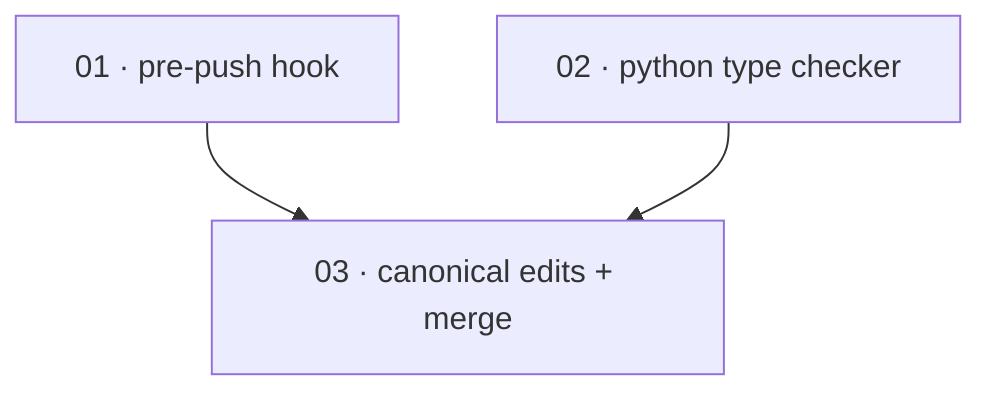

# Plan: Add local enforcement gates for the development guidelines

**Status:** Done · **Layout:** kanban · **Date:** 2026-06-29 · **Owner:** Ant Stanley · **Source spec:** [.specs/changes/2026-06-24-add_local_enforcement_gates.md](../../changes/merged/2026-06-24-add_local_enforcement_gates.md)

Wire the enforcement mechanisms the development guidelines adopt as rules but do not yet
mechanise: a committed pre-push hook that runs the format/lint/test gate locally, a Python
strict type checker (mypy) in `bindings/python` plus CI, and a resolution of the function-size
and assertion-density limit lints. The decomposition is two independent tooling slices (the
hook, the type checker) followed by a single canonical-edits-and-merge slice that records the
landed gates as facts on the guidelines page and performs the change-spec merge housekeeping.
The two tooling tasks have no inter-dependency and can build in parallel; the canonical-edits
task is reviewed *through* them, so it lands last.

---

## Source and definition-of-done baseline

- **Spec.** The change spec [.specs/changes/2026-06-24-add_local_enforcement_gates.md](../../changes/merged/2026-06-24-add_local_enforcement_gates.md)
  (Motivation, Proposed changes, Implementation notes, Merge plan). It targets one canonical
  page, [.specs/development-guidelines.md](../../development-guidelines.md) (Toolchain table,
  Repository hygiene, Open questions).
- **Already built.** CI (`.github/workflows/ci.yml`) already runs the Rust lint/test jobs, the
  Node.js binding job, and a Python binding job (`uv run ruff check/format`, `pytest`). The
  guidelines page already records the 70-lines-per-function limit and the two-assertions rule as
  *review gates*. There is no pre-push hook, no Python type checker, and no `clippy.toml`.
  Established by reading the workspace tree and the CI workflow on this branch.
- **Definition of done.** [.specs/development-guidelines.md](../../development-guidelines.md)
  §Definition of done and §Limits and bounds set the per-task bar. These tasks are tooling and
  documentation rather than service code, so the language-specific "two assertions per function"
  and "named-constant limit" clauses apply only where a task adds executable code (the hook
  script, the mypy config's effect on the Python sources); the format/lint/test-pass clauses
  apply per language each task touches.

---

## Task graph

The dependency table is the **source of truth**; the Mermaid graph visualizes it. If the two
disagree, the table wins.

| Task | Depends on | Edge kind | Produces (reviewable artifact) |
|---|---|---|---|
| 01 · pre-push hook | — | — | a committed `.githooks/pre-push` that runs the per-language format/lint/test gate, documented in `CONTRIBUTING.md` |
| 02 · python type checker | — | — | strict `mypy` configured in `bindings/python` and a `python-typecheck` CI step that passes |
| 03 · canonical edits + merge | 01, 02 | review | the guidelines page records the landed gates as facts, the limit lints are resolved, and the change spec is merged into `.specs/changes/merged/` |

`Depends on` references lower numbers only. Task 03's edges are **review** edges: the guidelines
page can only be reviewed as *accurate* once the gates it describes exist, and the merge-plan
housekeeping (Status→Merged, move to `merged/`) is correct only after every gate in the spec has
shipped.

---

## Implementation order and milestones

**Order:** `01, 02, 03` — the two tooling slices (01, 02) are independent and carry no edges
between them, so they build first (in parallel where the builder allows); 03 is the documentation
and merge slice that is reviewed *through* the gates the other two land, so it is sequenced last
even though it is the smallest. Within 01 and 02, order is arbitrary; numbering follows the spec's
Implementation-notes order (hook, then type checker).

**Milestones:**

| Milestone | Tasks | Demonstrable when complete | Review gate |
|---|---|---|---|
| M1 — gates wired | 01, 02 | a contributor can install the committed hook and run the full per-language gate locally; `uv run mypy` and the new CI step type-check `bindings/python` clean | both tooling tasks pass their done certificates; `cargo nextest run --workspace` green |
| M2 — spec reconciled | 03 | the guidelines page lists mypy in the Toolchain table and the pre-push hook in Repository hygiene, the resolved Open questions are gone, the limit lints are documented as review gates, and the change spec sits in `.specs/changes/merged/` with `Status: Merged` | the canonical edits match what shipped in M1; `.specs/README.md` Change-specs table updated |

---

## Assumptions and open questions

**Assumptions**

- Contributors install the committed hook locally (`git config core.hooksPath .githooks`); CI
  remains the backstop for anyone who does not, per the change spec's own assumption.
- jj's Git backend does **not** run git hooks on `jj git push`, so the hook is a convenience for
  contributors who push via the git backend or who run it manually. The plan does not attempt to
  make jj run the hook.
- The integration revision for the build is the plan commit that `change/add-local-enforcement-gates`
  points at; tasks merge into it in dependency order.

**Decisions**

- *Pre-push hook framework.* **A committed POSIX script under `.githooks/` wired via
  `core.hooksPath`** — the simplest, dependency-free option the change spec lists, and the one that
  needs no extra tool install. `lefthook`/`pre-commit` were rejected as added dependencies for no
  gain on a repo this size.
- *Python type checker.* **mypy in strict mode**, configured in `bindings/python/pyproject.toml`
  and run in CI. mypy is the de-facto reference checker and integrates with `uv` without extra
  tooling; the change spec lists it first and leaves the mypy-vs-pyright choice open — we close it
  on mypy.
- *Function-size lint.* **Kept as a documented review gate, not enabled as a hard clippy lint.** A
  probe (`clippy::too_many_lines` at threshold 70 over the workspace) found seven existing
  functions over the limit (up to 134 lines), including production library code in
  `oidc-exchange-core`, `oidc-exchange-adapters`, and the server crate. Enabling the lint under
  `-D warnings` would break the build, and the change spec sanctions keeping an impractical limit
  lint as a documented review gate rather than forcing a large refactor. No `clippy.toml`
  `too_many_lines` row is added.
- *Assertion-density gate.* **Kept as a review gate**, per the change spec — it is not lintable off
  the shelf, so it stays documented as a review-only gate.
- *Hook activation.* **The hook is committed and documented but not activated in the live repo
  config.** Activation (`git config core.hooksPath .githooks`) is a contributor step; wiring it in
  the live config could block pushes for the build agents, so the plan stops at committed +
  documented.

**Open questions**

- *Hook reviewability under a headless validator.* The change spec's "a failing hook blocks the
  push" outcome requires a live `git push` to exercise. A headless done-certificate validator
  cannot drive that, so that single obligation is expected to land `UNVERIFIED` and is surfaced for
  manual review rather than treated as a failure.
- *clippy pedantic ruleset.* Whether to commit a `clippy.toml` pedantic-adjacent ruleset is a
  separate, still-open guidelines question and is **out of scope** here — it is left in the
  guidelines page's Open questions untouched.
