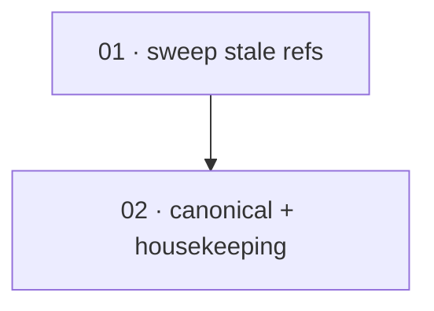

# Plan: Remove stale CloudTrail and atproto-as-shipped references

**Status:** Done · **Layout:** kanban · **Date:** 2026-06-29 · **Owner:** Ant Stanley · **Source spec:** [.specs/changes/merged/2026-06-24-cleanup_stale_references.md](../../changes/merged/2026-06-24-cleanup_stale_references.md)

Bring the non-spec prose docs, example configs, and inline comments into line with the
implemented `noop`/`stdout`/`sqs` audit adapters and `oidc`/`apple` providers, then close the
loop on the canonical spec and the change-spec lifecycle. The work is a documentation/config
sweep with no Rust change. It splits into two tasks: a single broad sweep of all non-spec
material (so no two tasks edit the same file), followed by the canonical-spec edit plus the
merge-plan housekeeping that the sweep unblocks.

---

## Source and definition-of-done baseline

- **Spec.** The change spec [2026-06-24-cleanup_stale_references.md](../../changes/merged/2026-06-24-cleanup_stale_references.md)
  (Motivation, Affected spec pages, Proposed changes, Implementation notes, Merge plan). The one
  canonical page it touches is [service/specs/06-configuration.md](../../service/specs/06-configuration.md)
  §Open questions. The implemented adapters/providers it aligns docs to are recorded in
  [06-configuration.md](../../service/specs/06-configuration.md) §`[audit]` and §`[providers.<name>]`
  and in [00-overview.md](../../service/specs/00-overview.md).
- **Already built.** The code is already correct and is **not** touched by this plan: the audit
  adapters are `noop`/`stdout`/`sqs` (`crates/server/src/bootstrap.rs` build_audit_log) and the
  providers are `oidc`/`apple` (`crates/server/src/bootstrap.rs` build_provider); the CloudTrail
  audit adapter was removed in commit `407460c`; no atproto provider exists on `main`. The
  canonical spec already describes the correct set. `config/default.toml` has no stale audit-adapter
  comment (Implementation note 3 is already satisfied — verified, nothing to change there), and there
  are no `adapter = "file"`/`"webhook"` TOML hits.
- **Definition of done.** [.specs/development-guidelines.md](../../development-guidelines.md)
  §Definition of done and §Limits and bounds. This change is docs/examples/config only, so the
  test/assertion obligations are not applicable; the live obligations are: format/lint passes for
  every language a file is touched in (TypeScript via `pnpm fmt:check`/`pnpm lint` for the edited
  CDK example, TOML stays parseable, the Astro site still builds), and the change description states
  the why. Each task adds its task-specific reviewable acceptance on top.

---

## Task graph

The dependency table is the **source of truth**; the Mermaid graph visualizes it.

| Task | Depends on | Edge kind | Produces (reviewable artifact) |
|---|---|---|---|
| 01 · sweep stale refs | — | — | docs/examples/config/README carry no stale `cloudtrail` audit-adapter or atproto-as-shipped references; every example `[audit]` block selects a real adapter |
| 02 · canonical + housekeeping | 01 | review | the resolved Open question is gone from 06-configuration, and the change spec is marked Merged, moved to `changes/merged/`, and re-pointed in `.specs/README.md` |

Edge kind is **review**: the canonical Open question removal and the change-spec "Merged" stamp are
only truthful once the sweep they describe has actually been applied, so task 02 follows task 01.

---

## Implementation order and milestones

**Order:** `01, 02` — the sweep leads because the canonical edit and the merge-plan housekeeping in
task 02 both assert that the sweep is complete ("resolved by this change", `Status: Merged`); doing
them before the sweep would record a claim that is not yet true.

**Milestones:**

| Milestone | Tasks | Demonstrable when complete | Review gate |
|---|---|---|---|
| M1 — docs aligned to code | 01 | `rg` for `adapter = "cloudtrail"`, `[audit.cloudtrail]`, `adapter = "atproto"`, `[providers.atproto]` over `docs/ examples/ config/ apps/ README.md` returns nothing; every example audit block uses `noop`/`stdout`/`sqs`; remaining atproto mentions read as planned | sweep reviewed; no stale audit-adapter or shipped-atproto wording remains |
| M2 — lifecycle closed | 02 | 06-configuration has no stale Open question and a bumped Date; the change spec is `Merged`, lives under `changes/merged/`, and `.specs/README.md` reflects both | canonical + housekeeping reviewed against the change spec's Merge plan |

---

## Assumptions and open questions

**Assumptions**

- The canonical spec is already correct (audit adapters `noop`/`stdout`/`sqs`, providers
  `oidc`/`apple`); this plan changes only non-spec material plus the one resolved Open question, and
  must not contradict the canonical bodies.
- No deployment relies on `adapter = "cloudtrail"` resolving to a real backend — it does not, so
  switching example configs to `stdout`/`sqs` changes nothing operational.

**Decisions**

- *One sweep task, not one per token.* **CloudTrail and atproto are swept in a single task (01).**
  The two token families overlap in several files (`docs/architecture/overview.md`,
  `docs/guides/configuration.md`, `README.md`); splitting them into parallel tasks would have two
  agents editing the same files and conflict on merge. A single sequential sweep is both
  proportionate and conflict-free.
- *AWS examples move to `sqs`, the reference doc gets `stdout`.* **The deployment guide
  (`docs/deployment/aws-lambda.md`) and the `aws-web` example (config + CDK stack) switch the former
  `cloudtrail` block to `adapter = "sqs"` with a real `[audit.sqs]`/SQS queue; the
  `docs/architecture/adapters.md` "CloudTrail Lake" section is replaced with a "Stdout/Stderr"
  section.** This keeps each AWS example a coherent "durable audit sink" demonstration on an adapter
  that exists, while making the architecture page enumerate the real trio noop/stdout/sqs. Plain
  `stdout` is the acceptable fallback anywhere the surrounding infra would otherwise need rework.
- *atproto reworded to planned, not deleted wholesale.* **Provider-list prose keeps atproto but
  qualifies it as planned / not-yet-implemented; runnable example blocks that select
  `adapter = "atproto"` are removed** (they would fail provider construction), pointing readers at
  the [atproto change spec](../../changes/2026-06-24-add_atproto_provider.md).

**Open questions**

- *CloudTrail migration note.* The change spec leaves undecided whether to add a thin migration note
  for operators who had `cloudtrail` configured (pointing to `sqs` + downstream CloudTrail
  ingestion). This plan does **not** add one — it is out of scope for a stale-reference sweep; if the
  team wants it, it is a follow-up doc edit, not a blocker.
