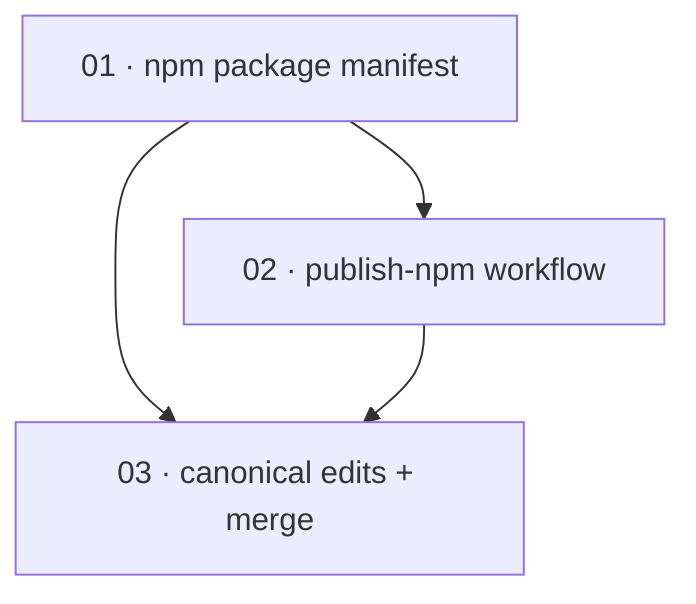

# Plan: Publish `@oidc-exchange/node` to npm via trusted publishing

**Status:** Draft · **Layout:** kanban · **Date:** 2026-06-30 · **Owner:** Ant Stanley · **Source spec:** [.specs/changes/2026-06-29-add_npm_trusted_publishing.md](../../changes/2026-06-29-add_npm_trusted_publishing.md)

Ship `@oidc-exchange/node` together with its four platform packages through a hardened npm
publish job authenticated by GitHub OIDC trusted publishing (no `NPM_TOKEN`), with provenance.
The decomposition is a thin reviewability spine: first the **package manifest** (the
`optionalDependencies` + `publishConfig` + `.npmrc` that make the published package resolvable
and provenance-ready), then the **`publish-npm` workflow** that builds, validates, and publishes
it under a restricted GitHub Environment, and finally the **canonical-edits-and-merge** slice
that records the landed pipeline as fact on the spec pages and performs the change-spec merge
housekeeping. The manifest leads because the publish job validates and publishes what it
declares; the canonical edits land last because they can only be reviewed as *accurate* once the
manifest and workflow they describe exist.

---

## Source and definition-of-done baseline

- **Spec.** The change spec [.specs/changes/2026-06-29-add_npm_trusted_publishing.md](../../changes/2026-06-29-add_npm_trusted_publishing.md)
  (Motivation, Proposed changes, Implementation notes, Merge plan). It targets two canonical
  pages — [.specs/bindings/specs/05-distribution.md](../../bindings/specs/05-distribution.md)
  (Release pipeline, Artifacts, Assumptions / Decisions) and
  [.specs/bindings/specs/02-nodejs.md](../../bindings/specs/02-nodejs.md) (Distribution).
- **Already built.** `release.yml` already has a `build-nodejs` matrix job that builds a
  per-target `.node` with `napi build --release --target <triple>` and uploads it as artifact
  `nodejs-<triple>`. The four platform packages exist as scaffolding under
  `bindings/nodejs/npm/{linux-x64-gnu,linux-arm64-gnu,win32-x64-msvc,darwin-arm64}/` with correct
  `os`/`cpu`/`main`/`files`, and `index.js` is a platform-aware loader that resolves the matching
  `@oidc-exchange/<triple>` package with a local `oidc-exchange.node` fallback. What does **not**
  exist: `optionalDependencies` / `publishConfig` in the root `package.json`, a
  `bindings/nodejs/.npmrc`, and any trusted-publishing publish path — `publish-nodejs` publishes
  only the root package (never the four platform packages, which never receive their `.node`) with
  a long-lived `NPM_TOKEN`. Established by reading `release.yml`, `bindings/nodejs/package.json`,
  `bindings/nodejs/index.js`, and `bindings/nodejs/npm/*/package.json` on this branch.
- **Definition of done.** [.specs/development-guidelines.md](../../development-guidelines.md)
  §Definition of done and §Limits and bounds set the per-task bar. These tasks are packaging, CI,
  and documentation rather than service code, so the language-specific "two assertions per
  function" and "named-constant limit" clauses apply only where a task adds executable logic
  (none do here — the loader and wrappers are unchanged); the format/lint/typecheck clauses apply
  per language each task touches, and the change adds its own CI-shaped acceptance (the package
  validates under `publint` + `@arethetypeswrong/cli`; the workflow parses and pins every action
  to a SHA; version parity across the three manifests is preserved).

---

## Task graph

The dependency table is the **source of truth**; the Mermaid graph visualizes it. If the two
disagree, the table wins.

| Task | Depends on | Edge kind | Produces (reviewable artifact) |
|---|---|---|---|
| 01 · npm package manifest | — | — | `bindings/nodejs/package.json` declares the four platform packages as `optionalDependencies` at the workspace version plus `publishConfig: { provenance, access: public }`, and `bindings/nodejs/.npmrc` sets `ignore-scripts=true`; the platform packages stay version-parity-aligned and `npm pack` of the root yields the curated `index.js`+`index.d.ts` payload |
| 02 · publish-npm workflow | 01 | build, contract | `release.yml` replaces `publish-nodejs` with a `publish-npm` job that `needs: [build-nodejs]`, holds `permissions: { id-token: write, contents: read }`, runs in the `publish` Environment, runs `napi artifacts` to place each `.node` into its `npm/<triple>` package, validates with `publint` + `@arethetypeswrong/cli`, and publishes the four platform packages and the root with `npm publish --provenance --access public` under OIDC trusted publishing — no `NPM_TOKEN` — with every `uses:` SHA-pinned and the `@oidc-exchange/lambda` publish preserved |
| 03 · canonical edits + merge | 01, 02 | review | [05-distribution.md](../../bindings/specs/05-distribution.md) Release pipeline / Artifacts / Assumptions-Decisions and [02-nodejs.md](../../bindings/specs/02-nodejs.md) Distribution record the landed pipeline as fact, and the change spec is flipped to Merged and moved to `.specs/changes/merged/` with `.specs/README.md` updated |

`Depends on` references lower numbers only. Task 02's edges are **build/contract**: the publish
job validates and publishes exactly the manifest (optionalDependencies, publishConfig,
`.npmrc`) that task 01 defines, so it cannot be written correctly until that manifest exists.
Task 03's edges are **review**: the canonical pages can only be reviewed as *accurate* once the
manifest (01) and the workflow (02) they describe exist, and the merge-plan housekeeping
(Status→Merged, move to `merged/`) is correct only after every change in the spec has shipped.

---

## Implementation order and milestones

**Order:** `01, 02, 03` — the manifest leads even though it has no dependency of its own because
the publish job is *reviewed through* it: `publint`, `@arethetypeswrong/cli`, and
`npm publish --provenance` all act on the manifest task 01 produces, so building it first lets
the workflow be reviewed end to end against a real, correct package. The canonical edits land
last because a spec page that describes a pipeline is only reviewable as accurate once that
pipeline exists.

**Milestones:**

| Milestone | Tasks | Demonstrable when complete | Review gate |
|---|---|---|---|
| M1 — publishable package + pipeline | 01, 02 | A reviewer can `npm pack` the root and run `publint` / `@arethetypeswrong/cli --pack` against it to confirm the `optionalDependencies` + provenance config are correct, and can read the `publish-npm` job to confirm it declares `id-token: write`, runs in the `publish` Environment, holds no `NPM_TOKEN` for the native package, SHA-pins every action, and publishes the four platform packages plus the root with `--provenance` | `publint` clean on the packed root; the workflow parses (actionlint/`pnpm`/YAML) and version parity across the three manifests is preserved |
| M2 — spec reconciled + merged | 03 | A reviewer reads 05-distribution.md and 02-nodejs.md and confirms they describe the shipped `build-nodejs` → `publish-npm` pair, the published platform-package set, provenance, and OIDC trusted publishing — with no surviving `NPM_TOKEN`/secret assumption — and that the change spec now lives under `merged/` and is listed in `.specs/README.md` | the change spec's own Merge plan is fully discharged and every Proposed-changes block is reflected on its canonical page |

---

## Assumptions and open questions

**Assumptions**

- The `@oidc-exchange` npm organisation exists and the four platform package names plus
  `@oidc-exchange/node` and `@oidc-exchange/lambda` are owned (or available) so they can be
  registered as trusted publishers. Registering the trusted publishers and creating the `publish`
  GitHub Environment are one-time, out-of-repo steps the workflow assumes are in place; they are
  not tasks in this plan (see Open questions).
- The native binary `napi build --release --target <triple>` emits is named
  `oidc-exchange.<triple>.node`, matching each platform package's `main` and the `index.js`
  loader's fallback, so `napi artifacts` places each `.node` into its `npm/<triple>` package
  without a rename.
- The release `validate` job continues to enforce version parity across `Cargo.toml`,
  `bindings/nodejs/package.json`, and `bindings/python/pyproject.toml`; pinning
  `optionalDependencies` to the workspace version keeps that invariant true.

**Decisions**

- *Three tasks, manifest-first.* **The work splits into manifest (01), workflow (02), and
  canonical-edits-and-merge (03), in that order.** Mirrors the repo's existing change-spec plans
  (e.g. `2026-06-29-add_local_enforcement_gates`): two implementation slices then a single
  spec-reconciliation slice reviewed *through* them. Manifest leads because the publish job
  validates and publishes exactly what it declares.
- *Preserve and convert the `@oidc-exchange/lambda` publish.* **Task 02 keeps the existing
  `@oidc-exchange/lambda` publish (today it rides inside `publish-nodejs` on `NPM_TOKEN`) and
  moves it onto the same trusted-publishing path so `NPM_TOKEN` can be removed entirely.** The
  change spec's goal is to drop the long-lived secret; leaving lambda on `NPM_TOKEN` would block
  that, so lambda is carried along rather than dropped or left behind. Lambda's own
  trusted-publisher registration is an out-of-repo assumption (see Open questions).
- *Loader and wrappers unchanged.* **`index.js` and `index.d.ts` stay hand-maintained and ship
  as-is; the publish path emits only `.node` binaries and never regenerates the wrappers.** The
  existing loader already resolves the `optionalDependencies` set task 01 adds, so no code change
  is needed to make the platform packages load.

**Open questions**

- *External trusted-publisher setup.* Registering `@oidc-exchange/node`, its four platform
  packages, and `@oidc-exchange/lambda` as trusted publishers on npmjs (bound to
  `antstanley/oidc-exchange` / `release.yml`) and creating the restricted `publish` GitHub
  Environment are one-time human steps outside the repo. They block the *first live publish* but
  not any task here; the workflow is authored to assume them. Flagged for the owner.
- *Staged-publish approval.* npm trusted publishing may stage the publish and require a one-time
  approval at `npmjs.com/.../staged-packages`; whether to keep staging on for every release or
  auto-approve in the workflow is deferred to the first live publish, per the change spec.
- *Workflow scaffolding source.* Whether to adopt `@e18e/setup-publish` to scaffold the job or
  hand-write it against the existing `release.yml` is left to task 02's implementer; the DoD
  fixes the required properties (trusted publishing, separate publish job, SHA pins, validation),
  not the scaffolding route.
