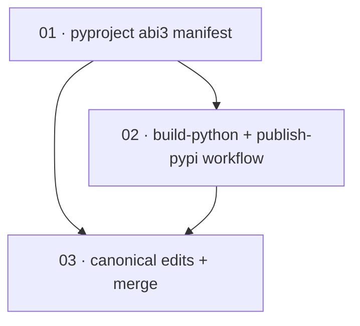

# Plan: Publish `oidc-exchange` wheels to PyPI via trusted publishing

**Status:** Draft · **Layout:** kanban · **Date:** 2026-06-30 · **Owner:** Ant Stanley · **Source spec:** [.specs/changes/2026-06-29-add_pypi_trusted_publishing.md](../../changes/2026-06-29-add_pypi_trusted_publishing.md)

Ship `oidc-exchange` to PyPI as `abi3` `manylinux_2_28` / macOS / Windows wheels plus an sdist,
through a publish job authenticated by GitHub OIDC PyPI Trusted Publishing (no `PYPI_TOKEN`). The
decomposition is a thin reviewability spine that mirrors the sibling npm plan: first the **abi3
wheel contract** in `pyproject.toml` (the `pyo3/abi3-py310` maturin feature that lets one wheel per
platform span Python 3.10–3.13), then the **`build-python` → `publish-pypi` workflow** that builds
manylinux wheels + an sdist and uploads them with `pypa/gh-action-pypi-publish` under a restricted
GitHub Environment, and finally the **canonical-edits-and-merge** slice that records the landed
pipeline as fact on the spec pages and performs the change-spec merge housekeeping. The manifest
leads because the build job's one-wheel-per-platform claim is only correct if the abi3 feature is
locked in; the canonical edits land last because they can only be reviewed as *accurate* once the
manifest and workflow they describe exist.

---

## Source and definition-of-done baseline

- **Spec.** The change spec [.specs/changes/2026-06-29-add_pypi_trusted_publishing.md](../../changes/2026-06-29-add_pypi_trusted_publishing.md)
  (Motivation, Proposed changes, Implementation notes, Merge plan). It targets two canonical
  pages — [.specs/bindings/specs/05-distribution.md](../../bindings/specs/05-distribution.md)
  (Release pipeline, Assumptions / Decisions) and
  [.specs/bindings/specs/03-python.md](../../bindings/specs/03-python.md) (Distribution).
- **Already built.** `bindings/python/Cargo.toml:12` already pins `pyo3` with
  `features = ["extension-module", "abi3-py310"]`, so the compiled extension is *already* abi3 and
  maturin already tags the wheel `cp310-abi3`. The change spec's Motivation claim that the wheel is
  "non-`abi3`" is therefore stale against `Cargo.toml`; what does **not** yet hold is: (a)
  `pyproject.toml:32` `[tool.maturin] features = ["pyo3/extension-module"]` omits the abi3 feature,
  so the abi3 contract is implicit (declared only in `Cargo.toml`) and unverified; (b) `build-python`
  runs `uvx maturin build --release --target <triple>` on a bare `ubuntu-latest`, emitting a plain
  `linux_x86_64` wheel that PyPI rejects — no `manylinux_2_28` container; (c) no sdist is built; and
  (d) `publish-python` uploads with `uvx twine upload` and a long-lived `PYPI_TOKEN` secret rather
  than OIDC trusted publishing. Established by reading `release.yml` (`build-python` at `:238`,
  `publish-python` at `:272`), `bindings/python/pyproject.toml`, and `bindings/python/Cargo.toml` on
  this branch.
- **Definition of done.** [.specs/development-guidelines.md](../../development-guidelines.md)
  §Definition of done and §Limits and bounds set the per-task bar. These tasks are packaging, CI,
  and documentation rather than service code, so the "negative-space tests" and "two assertions per
  function" / "named-constant limit" clauses apply only where a task adds executable logic (none do
  here — no Python or Rust source changes); the per-language format/lint/typecheck clauses apply per
  language each task touches, and the change adds its own CI-shaped acceptance (a locally built wheel
  is tagged `cp310-abi3`; the workflow parses, builds `manylinux_2_28` wheels + an sdist, and pins
  every action to a SHA; version parity across the three manifests is preserved).

---

## Task graph

The dependency table is the **source of truth**; the Mermaid graph visualizes it. If the two
disagree, the table wins.

| Task | Depends on | Edge kind | Produces (reviewable artifact) |
|---|---|---|---|
| 01 · pyproject abi3 manifest | — | — | `bindings/python/pyproject.toml` `[tool.maturin] features` declares `pyo3/abi3-py310` alongside `pyo3/extension-module` (parity-confirmed against `Cargo.toml`, which already enables it), so a local `maturin build` emits a single `cp310-abi3` wheel; the `pyproject.toml` `version` stays parity-aligned with `Cargo.toml` / `bindings/nodejs/package.json` |
| 02 · build-python + publish-pypi workflow | 01 | build, contract | `release.yml` rebuilds `build-python` as a `PyO3/maturin-action` matrix producing `manylinux_2_28` abi3 wheels for the Linux targets, native abi3 wheels for macOS/Windows, and one `maturin sdist`, all uploaded as artifacts; it replaces `publish-python` with a `publish-pypi` job that `needs: [build-python]`, holds `permissions: { id-token: write }`, runs in the `pypi` Environment, downloads every wheel + the sdist, and uploads them with `pypa/gh-action-pypi-publish` under PyPI Trusted Publishing — no `PYPI_TOKEN` — with every `uses:` SHA-pinned and `create-release`'s `needs` updated from `publish-python` to `publish-pypi` |
| 03 · canonical edits + merge | 01, 02 | review | [05-distribution.md](../../bindings/specs/05-distribution.md) Release pipeline / Assumptions-Decisions and [03-python.md](../../bindings/specs/03-python.md) Distribution record the landed pipeline as fact (manylinux abi3 wheels + sdist, trusted publishing, no `PYPI_TOKEN`), and the change spec is flipped to Merged and moved to `.specs/changes/merged/` with `.specs/README.md` updated |

`Depends on` references lower numbers only. Task 02's edges are **build/contract**: the build job's
"one wheel per platform spans 3.10–3.13" claim is only correct because task 01 locks in the abi3
feature, so the workflow cannot be reviewed as correct until that contract exists. Task 03's edges
are **review**: the canonical pages can only be reviewed as *accurate* once the manifest (01) and
the workflow (02) they describe exist, and the merge-plan housekeeping (Status→Merged, move to
`merged/`) is correct only after every change in the spec has shipped.

---

## Implementation order and milestones

**Order:** `01, 02, 03` — the manifest leads even though it has no dependency of its own because
the build job is *reviewed through* it: the manylinux matrix and the "single wheel per platform"
claim only hold if the abi3 feature is locked in, so building (and verifying) the abi3 contract
first lets the workflow be reviewed end to end against a real `cp310-abi3` wheel. The canonical
edits land last because a spec page that describes a pipeline is only reviewable as accurate once
that pipeline exists.

**Milestones:**

| Milestone | Tasks | Demonstrable when complete | Review gate |
|---|---|---|---|
| M1 — abi3 wheel + manylinux pipeline | 01, 02 | A reviewer runs `maturin build` (or `uvx maturin build`) in `bindings/python` and confirms the emitted wheel filename carries the `cp310-abi3` tag, and reads the `build-python` / `publish-pypi` jobs to confirm the manylinux_2_28 Linux build, the macOS/Windows native builds, the `maturin sdist`, the `id-token: write` permission scoped to `publish-pypi` only, the `pypi` Environment gate, the `pypa/gh-action-pypi-publish` upload with no `PYPI_TOKEN`, and the SHA pins | a local `maturin build` yields a `cp310-abi3` wheel; the workflow parses (actionlint/YAML) and version parity across the three manifests is preserved |
| M2 — spec reconciled + merged | 03 | A reviewer reads 05-distribution.md and 03-python.md and confirms they describe the shipped `build-python` (manylinux abi3 wheels + sdist) → `publish-pypi` (trusted publishing) pipeline — with no surviving `PYPI_TOKEN`/secret assumption — and that the change spec now lives under `merged/` and is listed in `.specs/README.md` | the change spec's own Merge plan is fully discharged and every Proposed-changes block is reflected on its canonical page |

---

## Assumptions and open questions

**Assumptions**

- The `oidc-exchange` project name is owned (or available) on PyPI so it can be registered as a
  trusted publisher. Registering the trusted publisher and creating the `pypi` GitHub Environment
  are one-time, out-of-repo steps the workflow assumes are in place; they are not tasks in this
  plan (see Open questions).
- `bindings/python/Cargo.toml` already enables `pyo3/abi3-py310`, so the compiled extension is
  abi3 today; task 01 makes the maturin-level feature explicit and *verifies* the abi3 tag rather
  than enabling abi3 from scratch.
- The four target platforms in the canonical spec — `manylinux_2_28_{x86_64,aarch64}`,
  `win_amd64`, `macosx_11_0_arm64` — are the supported set; no 32-bit or musllinux wheels are in
  scope, and the macOS/Windows abi3 builds work on the native GitHub runners under
  `PyO3/maturin-action`.
- The release `validate` job continues to enforce version parity across `Cargo.toml`,
  `bindings/nodejs/package.json`, and `bindings/python/pyproject.toml`; this plan changes only the
  maturin `features` list, not `pyproject.toml` `version`, so the invariant holds.

**Decisions**

- *Three tasks, manifest-first.* **The work splits into abi3 manifest (01), workflow (02), and
  canonical-edits-and-merge (03), in that order.** Mirrors the sibling
  `2026-06-30-add_npm_trusted_publishing` plan and the repo's existing change-spec plans: one or
  two implementation slices then a single spec-reconciliation slice reviewed *through* them. The
  abi3 manifest leads because the build job's single-wheel claim is validated against it.
- *Keep abi3 as a distinct task despite the small diff.* **Task 01 is a near-one-line
  `pyproject.toml` edit (Cargo.toml already enables abi3), but it stays its own task because its
  reviewable artifact — a locally built `cp310-abi3` wheel — is a different contract from the CI
  workflow and is what makes the manylinux matrix's "one wheel per platform" claim true.** Folding
  it into task 02 would bury the abi3 contract inside a CI review.
- *abi3 single wheel per platform.* **One stable-ABI wheel per platform spans 3.10–3.13.** Matches
  the abi3 claim the spec already makes and keeps the build matrix to one Python per platform; the
  manylinux container makes the Linux wheels PyPI-acceptable.

**Open questions**

- *External trusted-publisher setup.* Registering `oidc-exchange` as a trusted publisher on PyPI
  (bound to `antstanley/oidc-exchange` / `release.yml` / the `pypi` environment) and creating the
  restricted `pypi` GitHub Environment are one-time human steps outside the repo. They block the
  *first live publish* but not any task here; the workflow is authored to assume them. Flagged for
  the owner.
- *Shared `release.yml` with the npm plan.* This plan and `2026-06-30-add_npm_trusted_publishing`
  both edit `.github/workflows/release.yml` (`create-release`'s `needs` list) and
  `.specs/bindings/specs/05-distribution.md` (Release pipeline, Assumptions/Decisions). When both
  plans are built together, task 02 here must leave `create-release.needs` listing *both*
  `publish-npm` and `publish-pypi`, and task 03's 05-distribution.md edits are complementary to the
  npm plan's (npm touches the npm artifact row/decision, PyPI touches the PyPI row/decision). The
  builder must merge the two plans' overlapping edits rather than overwrite. Flagged so neither
  plan silently reverts the other.
- *TestPyPI dry-run.* Whether to publish to TestPyPI first (a `testpypi` environment + a dry-run
  upload) before the production upload is deferred to task 02's implementer, per the change spec;
  the DoD fixes the production trusted-publishing path, not a staging step.
