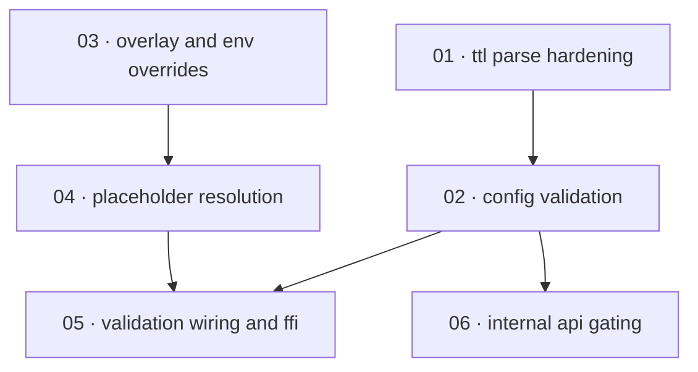

# Plan: Complete config loading and startup validation

**Status:** Accepted · **Layout:** kanban · **Date:** 2026-07-02 · **Owner:** Ant Stanley · **Source spec:** [.specs/changes/2026-07-01-complete_config_loading.md](../../changes/2026-07-01-complete_config_loading.md)

This plan finishes the four-step config loading order that spec 06 already documents and adds
fail-closed startup validation, so misconfiguration is rejected once at load instead of failing
open or panicking per request. The work splits into a validation core built and unit-tested in
`crates/core` (harden TTL parsing, then author `AppConfig::validate()`), a config-assembly
pipeline in `crates/server::bootstrap` (deep-merge overlay + `OIDC_EXCHANGE__` env overrides,
then fail-closed `${VAR}` placeholder resolution), and two wiring slices that make the whole
thing fire at every entry point (validate() called from `load_config` and the FFI `parse_config`
path; internal routes gated on `internal_api.enabled` with a non-empty secret). The
reviewability spine leads with the validation primitives (`validate()` is reviewed-through by
the wiring and gating tasks), then the assembly pipeline, then the startup/FFI/routing slices
that exercise it end to end.

---

## Source and definition-of-done baseline

- **Spec.** Change spec [.specs/changes/2026-07-01-complete_config_loading.md](../../changes/2026-07-01-complete_config_loading.md),
  which targets canonical pages [06-configuration.md](../../service/specs/06-configuration.md)
  (Loading order, new Validation at load, `[internal_api]`),
  [04-http-api.md](../../service/specs/04-http-api.md) (Routes → Internal, Service roles,
  Middleware stack, Bootstrap), and [01-ffi-core.md](../../bindings/specs/01-ffi-core.md)
  (Responsibilities). The spec is ahead of the code: the loading order and bootstrap prose already
  read for the end state, so these tasks bring the code up to the documented behaviour.
- **Already built (preconditions, not tasks).** These exist and are relied on:
  - `AppConfig` and every nested config struct with `#[serde(default)]`, plus redacted `Debug`
    for `InternalApiConfig.shared_secret` and `WebhookConfig.secret` (`crates/core/src/config.rs`).
  - `bootstrap::load_config`/`parse_config` and the `build_service`/`build_router` adapter wiring
    (`crates/server/src/bootstrap.rs`); the `config` crate is already a declared dependency
    (`crates/server/Cargo.toml:20`) but unused.
  - `parse_duration_secs` (`crates/core/src/service/mod.rs:168`) — exists but panics on a
    multi-byte final char and multiplies unchecked.
  - `matches_domain_allowlist` (`crates/core/src/service/exchange.rs:23`) — already matches exact
    and `*.domain` entries correctly; only the *acceptance* of malformed entries (`*`, `*example.com`)
    is unhandled, which this plan fixes at validation time.
  - `internal_auth_layer` constant-time Bearer check (`crates/server/src/middleware/internal_auth.rs`);
    `OidcExchange::new`/`from_file` FFI constructors (`crates/ffi/src/lib.rs:51`).
- **Definition of done.** Every task inherits the repo baseline from
  [.specs/development-guidelines.md](../../development-guidelines.md) §"Definition of done"
  (behaviour exercised by a test; negative-space test for every new validation path; ≥2 meaningful
  assertions per touched function; `cargo fmt`, `cargo clippy --workspace -- -D warnings`,
  `cargo nextest run --workspace` green) and §"Limits and bounds" (every new bound a named
  constant). Task files add only task-specific acceptance on top.

---

## Task graph

The dependency table is the **source of truth**; the Mermaid graph visualizes it. If the two
ever disagree, the table wins — fix the graph to match.

| Task | Depends on | Edge kind | Produces (reviewable artifact) |
|---|---|---|---|
| 01 · ttl parse hardening | — | — | `parse_duration_secs` cannot panic and cannot overflow silently; rejects bad input as `ConfigError` |
| 02 · config validation | 01 | build | `AppConfig::validate()` rejects bad role, TTL, allowlist shape, and served-but-empty internal secret |
| 03 · overlay and env overrides | — | — | `load_config` deep-merges the env TOML over the default and applies `OIDC_EXCHANGE__…` overrides |
| 04 · placeholder resolution | 03 | build | `${VAR}` placeholders resolve fail-closed (unset → error); `$${` escapes to a literal `${` |
| 05 · validation wiring and ffi | 02, 04 | build | `load_config` and the FFI `parse_config` path both run `validate()`; invalid config is rejected at startup and at FFI construction |
| 06 · internal api gating | 02 | build | internal routes mount only when `internal_api.enabled = true`; a `role = "admin"` instance with the flag off serves only `/health` |

Each row keys a task by number and title, not a path link — a task file moves between subfolders
as it is built, so find it by globbing its number (`*/NN-*.md`). Every `Depends on` references a
lower number, a property of numbering in implementation order.

---

## Implementation order and milestones

**Order:** `01, 02, 03, 04, 05, 06`. The validation primitives lead (`01` TTL hardening, then
`02` `validate()`) because `02` is reviewed-through by both wiring tasks — every startup/FFI/route
decision downstream is judged against it. The config-assembly pipeline (`03` overlay/env, `04`
placeholders) is independent of the validation core and could run in parallel, but is sequenced
after it so the first reviewable milestone is a self-contained, unit-tested validation surface.
`05` and `06` come last because they wire the earlier pieces into `load_config`, the FFI
constructors, and the router — they can only be exercised once both `02` and the pipeline exist.

**Milestones:**

| Milestone | Tasks | Demonstrable when complete | Review gate |
|---|---|---|---|
| M1 — validation core | 01, 02 | `cargo nextest` unit tests show `parse_duration_secs` rejecting multi-byte/overflow input and `AppConfig::validate()` rejecting each malformed field | `validate()` unit tests (positive + negative per rule) green under `-D warnings` |
| M2 — assembly pipeline | 03, 04 | a TOML with an env overlay, an `OIDC_EXCHANGE__` override, and `${VAR}`/`$${` placeholders loads to the expected merged/resolved config; an unset `${VAR}` errors | merge/override/placeholder tests green; no `${…}` literal ever reaches a live secret |
| M3 — wired and gated | 05, 06 | starting the server with a bad role/TTL/allowlist/empty-secret config aborts; `OidcExchange::new` rejects the same; an `admin` instance with `enabled = false` serves only `/health`; with `enabled = true` and a secret the internal routes mount behind Bearer auth | end-to-end startup + FFI construction + router-mount tests green |

---

## Assumptions and open questions

**Assumptions**

- Config files (`config/*.toml`) stay relative to the process working directory; deployments
  already arrange this (carried from the change spec).
- Shipped example configs contain only well-formed allowlist entries and TTLs, so the new
  validation breaks no committed example.
- The already-declared `config` crate (`0.15`) provides a layered builder plus an `Environment`
  source (prefix `OIDC_EXCHANGE`, separator `__`) sufficient for steps 1–3; if it cannot express
  deep-merge-over-default cleanly, task 03 falls back to a `toml::Value` deep-merge (recorded in
  that task's Open questions).

**Decisions**

- *Validation core leads.* **`01`→`02` are scheduled before the pipeline even though the pipeline
  has no dependency on them.** `validate()` is the artifact every downstream task is reviewed
  through, so it is built and unit-tested first, giving M1 a self-contained review surface.
- *Placeholder resolution is its own task.* **`04` is split from the merge/override work in `03`.**
  Fail-closed `${VAR}` resolution is the change spec's headline security fix (a literal placeholder
  must never become a live credential); it earns a focused review with its own negative tests
  rather than being folded into config assembly.
- *FFI validation rides the `parse_config` wiring.* **`05` covers both `load_config` and the FFI
  path in one slice** because the FFI constructors already route through `parse_config`
  (`crates/ffi/src/lib.rs:52`); wiring `validate()` into `parse_config` makes construction validate
  identically, so a separate FFI task would be a one-line change better folded here.
- *Gating is separate from validation.* **`06` (router mount + middleware hardening) is split from
  `02` (the `validate()` rule that requires a non-empty served secret).** The two touch different
  crates and are reviewed against different spec pages (04-http-api vs 06-configuration), so they
  are independent slices sharing only the dependency edge.

**Open questions**

- (None at this stage.)
