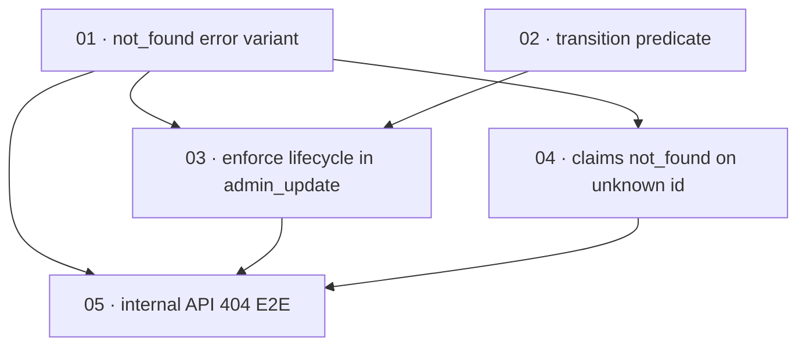

# Plan: Enforce user lifecycle transitions in admin update

**Status:** In progress · **Layout:** kanban · **Date:** 2026-07-02 · **Owner:** Ant Stanley · **Source spec:** [.specs/changes/2026-07-01-enforce_user_lifecycle_transitions.md](../../changes/2026-07-01-enforce_user_lifecycle_transitions.md)

This plan makes `admin_update_user` enforce the user-status state machine from the domain model: `Deleted` becomes strictly terminal, a status patch that enters `Suspended` or `Deleted` revokes all the user's sessions, off-diagram transitions are rejected, and an update, delete, or claims operation on an unknown user id returns a new `NotFound` domain error rendered as HTTP 404 `not_found` instead of a 500. The decomposition puts the two enablers first — the `NotFound` error variant with its 404 mapping (reviewed-through by every not-found path) and the pure `UserStatus::can_transition_to` predicate (reviewed-through by the service change) — then the service enforcement that consumes both, then the claims not-found switch, and finally the server E2E that proves the 404 behaviour through the full HTTP stack. The reviewability spine is enabler-first so each later slice is exercised end to end.

---

## Source and definition-of-done baseline

- **Spec.** Change spec [.specs/changes/2026-07-01-enforce_user_lifecycle_transitions.md](../../changes/2026-07-01-enforce_user_lifecycle_transitions.md), targeting canonical pages [01-domain-model.md](../../service/specs/01-domain-model.md) (Lifecycles → User status / Session, Decisions), [03-service-flows.md](../../service/specs/03-service-flows.md) (Admin operations), and [04-http-api.md](../../service/specs/04-http-api.md) (Routes → Internal, Error mapping).
- **Already built.** These are preconditions, not tasks: `admin_delete_user` already patches `status = Deleted` and calls `revoke_all_user_sessions` (`crates/core/src/service/user_admin.rs:66-82`); the claims operations already pre-check the user with `get_user_by_id` (currently returning `InvalidRequest` on miss, `user_admin.rs:87-97`, `:100-111`, `:127-138`, `:157-164`); the three adapters map an unknown id in `update_user` to `StoreError { "user not found" }` (`crates/adapters/src/{dynamo,postgres,sqlite}/mod.rs`), which stay as an unreachable backstop; `map_domain_error` already renders every existing variant (`crates/server/src/error.rs:51-108`); the internal GET route already hand-rolls a 404 for a missing user (`crates/server/src/routes/internal.rs:82-89`). The FFI layer proxies HTTP responses via `router.oneshot` and carries **no** domain-error mapping table (`crates/ffi/src/lib.rs` — `FfiError` covers only config/runtime/method-parse), so the change spec's "any FFI error tables" resolves to none. Established by the Phase 1 code read.
- **Definition of done.** Each task inherits [.specs/development-guidelines.md](../../development-guidelines.md) §"Definition of done" and §"Limits and bounds": behaviour exercised by a test, negative-space tests for every new validation path, at least two meaningful assertions per touched function, every new bound a named constant, and `cargo fmt` / `cargo clippy --workspace -- -D warnings` / `cargo nextest run --workspace` clean. Task files add only task-specific acceptance on top.

---

## Task graph

The dependency table is the **source of truth**; the Mermaid graph visualizes it. If the two disagree, the table wins.

| Task | Depends on | Edge kind | Produces (reviewable artifact) |
|---|---|---|---|
| 01 · not_found error variant | — | — | `Error::NotFound` renders as HTTP 404 `not_found` |
| 02 · transition predicate | — | — | `UserStatus::can_transition_to` with a full transition truth-table test |
| 03 · enforce lifecycle in admin_update | 01, 02 | build | `admin_update_user` validates transitions, revokes on suspend/delete, 404s unknown ids; `admin_delete_user` routes the same validated path |
| 04 · claims not_found on unknown id | 01 | build | unknown-id claims operations return `NotFound` (404) matching GET |
| 05 · internal API 404 E2E | 01, 03, 04 | review | PATCH/DELETE/claims on a typo'd id return 404 `not_found`, not 500, through the full HTTP stack |

Each row keys a task by its **number and title**, not a path link — the file is found by globbing its number across the kanban subfolders (`*/NN-*.md`). Every `Depends on` references a lower task number. Edge kind names why the dependency exists (build / data / contract / review).

---

## Implementation order and milestones

**Order:** `01, 02, 03, 04, 05`. The two enablers lead: `01` (the `NotFound` variant and its 404 mapping) is reviewed-through by the service change, the claims switch, and the E2E, so it precedes the equally dependency-free `02` (the transition predicate), which is reviewed-through only by the service change. `03` consumes both, `04` consumes `01`, and `05` is the integration checkpoint that exercises `01`, `03`, and `04` end to end.

**Milestones:**

| Milestone | Tasks | Demonstrable when complete | Review gate |
|---|---|---|---|
| M1 — foundations | 01, 02 | `map_domain_error(Error::NotFound { .. })` returns `(404, "not_found")` under a unit test, and the `UserStatus::can_transition_to` truth-table test covers every ordered status pair | Both crates compile; the predicate and mapping unit tests pass under `cargo nextest run --workspace` |
| M2 — enforcement | 03, 04 | core service tests show revoke-on-suspend, no surviving sessions after reactivation, suspend-then-delete, `Suspended → Suspended` no re-revoke, `Deleted → Active` / `Deleted → Deleted` / second-delete rejected, and unknown-id update/delete/claims returning `NotFound` | Core `user_admin` tests pass; no regression in the existing admin/delete/claims tests |
| M3 — API surface | 05 | a typo'd id on PATCH `/internal/users/{id}`, DELETE, and the four claims routes returns HTTP 404 `not_found` (not 500) | Server E2E internal-API tests pass under `cargo nextest run --workspace` |

---

## Assumptions and open questions

**Assumptions**

- The transition check lives in core (domain predicate + service), not the adapters; the repositories stay dumb writes. The read-then-write race in `update_user` is out of scope here (handled by [2026-07-01-fix_user_creation_race_and_dynamo_integrity.md](../../changes/2026-07-01-fix_user_creation_race_and_dynamo_integrity.md)).
- The canonical pages (01/03/04) are edited to their target text by the change spec's merge plan, owned by the orchestrator; this plan implements the code against that target and references those pages under `Implements`.
- The FFI layer has no domain-error mapping table to update (it proxies HTTP responses), so no FFI task is scheduled.

**Decisions**

- *Two enablers before the service change.* **`01` and `02` are split from `03` even though each is small.** The `NotFound` variant plus 404 mapping and the `can_transition_to` truth-table are each independently reviewable units with their own negative-space tests; folding them into the service task would hide a transition-matrix test surface and an HTTP-mapping assertion inside a larger orchestration diff.
- *Predicate lives with the type.* **`can_transition_to` is authored on `UserStatus` in `crates/core/src/domain/user.rs`, not in the service.** The rules live with the data they constrain, so both `admin_update_user` and `admin_delete_user` share one source of truth.
- *`01` leads `02`.* **The `NotFound` variant is built first because three downstream tasks are reviewed through it** (service not-found, claims switch, E2E), against the predicate's one.
- *E2E is its own slice.* **The HTTP 404 verification is task `05`, not folded into `03`/`04`.** It proves the mapping end to end across all six internal routes at once — a single reviewable checkpoint distinct from the service-level unit tests each producer already carries.

**Open questions**

- (None at this stage.)
