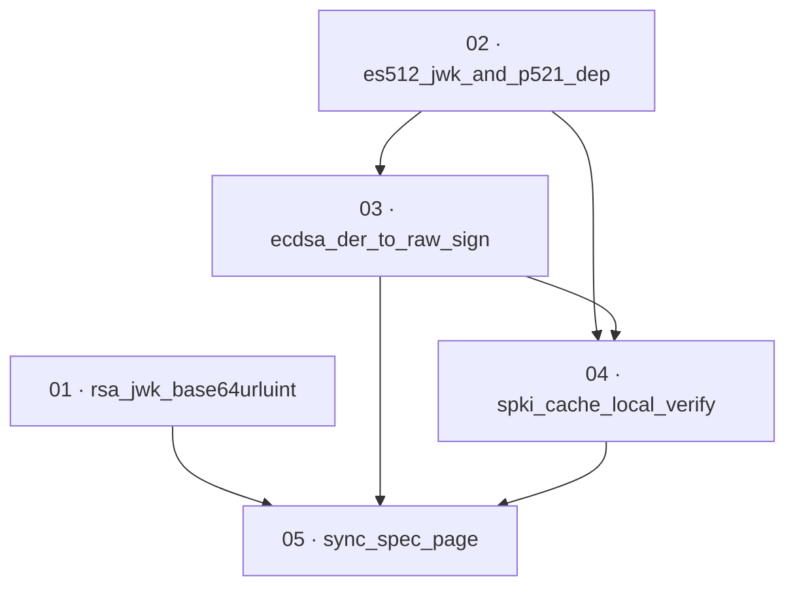

# Plan: Fix KMS ECDSA signature encoding and JWK output

**Status:** Accepted · **Layout:** kanban · **Date:** 2026-07-02 · **Owner:** Ant Stanley · **Source spec:** [.specs/changes/2026-07-01-fix_kms_ecdsa_and_jwk_encoding.md](../../changes/2026-07-01-fix_kms_ecdsa_and_jwk_encoding.md)

This plan makes the AWS KMS `KeyManager` adapter (`crates/adapters/src/kms/mod.rs`) produce JWS-valid output and describe every algorithm it signs with. The work splits into two concerns cut as vertical slices over one file: the JWK output at `/keys` (RFC 7518-compliant RSA `n`/`e`, plus a published ES512/P-521 key) and the signature path (DER→raw `r || s` on `sign`, and a local in-process `verify` against the cached SPKI that drops the KMS Verify round-trip). The reviewability spine leads with the two JWK fixes because they are self-contained and independently exercisable, then adds the `p521` dependency once (folded into the ES512 JWK task), then the `sign` conversion, then the local `verify` that consumes the raw form `sign` now produces, and closes by syncing the canonical spec page to the shipped behaviour.

---

## Source and definition-of-done baseline

- **Spec.** Change spec [.specs/changes/2026-07-01-fix_kms_ecdsa_and_jwk_encoding.md](../../changes/2026-07-01-fix_kms_ecdsa_and_jwk_encoding.md); it targets one canonical page, [.specs/service/specs/02-ports-and-adapters.md](../../service/specs/02-ports-and-adapters.md) (KeyManager trait note and the KMS row of the Adapter inventory). All implementation notes point at `crates/adapters/src/kms/mod.rs` and `crates/adapters/Cargo.toml`.
- **Already built.** The KMS adapter exists and is wired: `signing_algorithm()` maps all nine RS/PS/ES 256/384/512 strings (`kms/mod.rs:38-53`), `fetch_public_jwk` performs a single `GetPublicKey` (`:56-75`), `parse_spki_to_jwk` handles RSA and ES256/ES384 (`:81-146`), `sign` calls KMS Sign and returns the bytes verbatim (`:150-175`), `verify` round-trips through KMS Verify (`:177-195`), and the JWK is cached on a `tokio::sync::OnceCell` (`:18`). Dependencies `rsa`, `p256`, `p384`, `sha2` are already in `crates/adapters/Cargo.toml`; the generic `ecdsa`/`signature` crates are in the tree via `p256`/`p384`. These are preconditions, not tasks. The bugs to fix: `sign` returns DER not raw `r || s`; `verify` needlessly hits KMS; RSA `n`/`e` are encoded with leading zero octets; ES512 has no JWK arm. Only `p521` is a new dependency.
- **Definition of done.** Each task inherits [.specs/development-guidelines.md](../../development-guidelines.md) §"Definition of done" and §"Limits and bounds": behaviour exercised by a test, negative-space tests for every new validation path, at least two meaningful assertions per touched function, every new bound a named constant, and `cargo fmt` / `cargo clippy --workspace -- -D warnings` / `cargo nextest run --workspace` clean. Task files add only task-specific acceptance on top.

---

## Task graph

The dependency table is the **source of truth**; the Mermaid graph visualizes it. If the two ever disagree, the table wins.

| Task | Depends on | Edge kind | Produces (reviewable artifact) |
|---|---|---|---|
| 01 · rsa_jwk_base64urluint | — | — | RSA JWK at `/keys` with `e == "AQAB"` and no leading zero octets in `n`/`e` |
| 02 · es512_jwk_and_p521_dep | — | — | a P-521 JWK for ES512, so every algorithm the adapter signs with has a published JWK |
| 03 · ecdsa_der_to_raw_sign | 02 | build | `sign` returns raw fixed-width `r \|\| s` (64/96/132 bytes) for ES256/384/512 |
| 04 · spki_cache_local_verify | 02, 03 | build, review | `verify` validates locally against the cached SPKI with no KMS round-trip |
| 05 · sync_spec_page | 01, 03, 04 | review | canonical page 02-ports-and-adapters.md matches the shipped adapter behaviour |

Each row keys a task by number and title, not a path link — the file moves between kanban subfolders and is found by globbing `*/NN-*.md`. Every `Depends on` references a lower number. Edge kinds: **build** (02 adds the `p521` dependency and P-521 curve type that 03's ES512 conversion and 04's ES512 verify need; 03 must land before 04 because `verify`'s round-trip test consumes the raw `r || s` form `sign` produces); **review** (05 documents behaviour only demonstrable once 01/03/04 land; 04 is best reviewed once `sign` produces the raw form it verifies).

---

## Implementation order and milestones

**Order:** `01, 02, 03, 04, 05`. The two JWK fixes (01, 02) lead because they are self-contained, have the smallest surface, and are independently exercisable at `/keys` without touching the signature path — 01 needs no new dependency, 02 introduces the only new one (`p521`). The signature path follows: 03 (`sign` DER→raw) before 04 (local `verify`) so the raw wire form is defined and demonstrable before the verifier that consumes it, making the full adapter sign→verify round-trip the reviewable state at the end of M2. 05 syncs the spec last, once every behaviour it describes has shipped.

**Milestones:**

| Milestone | Tasks | Demonstrable when complete | Review gate |
|---|---|---|---|
| M1 — standards-compliant JWKs | 01, 02 | `/keys` emits RFC 7518 RSA JWKs (`e == "AQAB"`) and a P-521 JWK for ES512, so every signing algorithm has a published key | `parse_spki_to_jwk` unit tests (RSA `e`/`n` and P-521) pass; `cargo clippy -D warnings` clean |
| M2 — JWS-valid signatures, local verify | 03, 04 | the adapter signs ES\* as raw `r \|\| s` a standard JWT library verifies against the JWKS, and `verify` validates in-process with no KMS Verify call | DER→raw per-curve vectors and local verify (accept-valid / reject-tampered) tests pass; `cargo nextest run --workspace` clean |
| M3 — spec sync | 05 | canonical page 02-ports-and-adapters.md describes DER→raw sign, local verify, and RFC 7518 JWK coverage of P-256/384/521 | spec page diff matches the change spec's Proposed changes blocks |

---

## Assumptions and open questions

**Assumptions**

- KMS returns ECDSA signatures DER-encoded for every `ECDSA_SHA_*` signing algorithm (per AWS docs), so the DER→raw conversion in `sign` is unconditional for ES\*.
- No deployment depends on the current (broken) DER `sign` output or on the KMS-Verify path, so neither change is treated as breaking — the change spec states this.
- The `p521` crate is available on the same `0.14.0-rc` release line as `p256`/`p384` with an `ecdsa` feature, as the change spec's Implementation notes assert.
- The orchestrator owns all version control and the `.specs/README.md` index and the change spec's own status flip / merge move; this plan authors only the plan folder and the canonical spec-page edit in task 05.

**Decisions**

- *JWK fixes lead the order.* **Tasks 01 and 02 come before the signature path** because they are the smallest, dependency-light slices and are exercisable at `/keys` on their own, giving an early reviewable milestone; a naive dependency-only sort would leave them unordered, so the reviewability bias fixes their position first.
- *`p521` dependency folded into task 02.* **Adding `p521` to `crates/adapters/Cargo.toml` is not its own task** — it is a one-line manifest change, folded into the first task that consumes it (the ES512 JWK arm), per the decomposition sizing rule; tasks 03 and 04 then depend on 02 for the P-521 curve type.
- *`sign` before `verify`.* **Task 03 precedes 04** even though a local `verify` could be built against a locally-signed key without the adapter's `sign`; sequencing `sign` first defines the raw `r || s` wire form and makes the adapter's own sign→verify round-trip the reviewable state, and keeps the pair coherent.
- *SPKI caching merged into local verify.* **Caching the SPKI DER (change-spec note 3) is part of task 04, not a separate task**, because nothing but the local `verify` consumes it — a standalone caching task would not be independently reviewable.
- *Spec sync is its own task.* **Task 05 edits the canonical page separately** so the code slices stay reviewable on their own and the documentation reflects the union of shipped behaviour; it excludes the `.specs/README.md` index and the change-spec status flip, which the orchestrator owns.

**Open questions**

- (None at this stage.)
