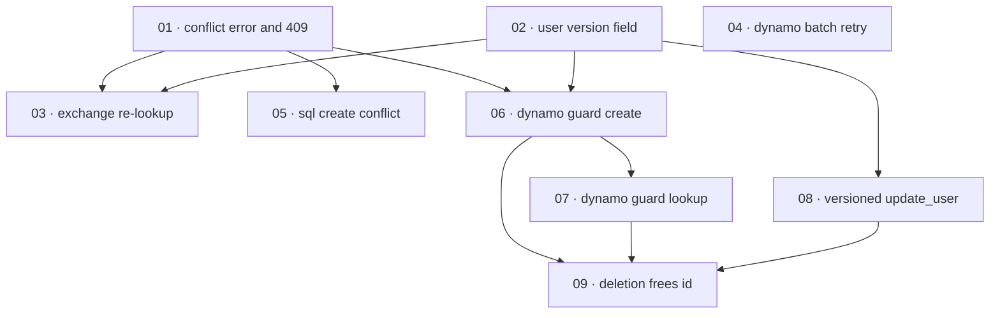

# Plan: Fix user-creation races and DynamoDB write integrity

**Status:** Done · **Layout:** kanban · **Date:** 2026-07-02 · **Owner:** Ant Stanley · **Source spec:** [.specs/changes/merged/2026-07-01-fix_user_creation_race_and_dynamo_integrity.md](../../changes/merged/2026-07-01-fix_user_creation_race_and_dynamo_integrity.md)

This plan enforces the `(provider, external_id)` uniqueness invariant across all three durable
backends and closes the DynamoDB write-integrity gaps the change spec names. It opens with two
enablers — a first-class `Error::Conflict` port variant wired to a 409 `conflict` wire code, and
a store-managed integer `version` counter on `User` — because every later slice is reviewed
through them. The headline user-visible fix (a first login under a lookup-then-create race
returns a token instead of a 500) lands third, exercised through the in-memory mock. The
remaining slices harden each adapter: DynamoDB gains a transactional uniqueness-guard item that
also becomes the strongly-consistent lookup path (retiring the GSI1 user entry), the SQL
backends map their native unique-violation codes to `Conflict`, `BatchWriteItem` unprocessed
items are retried so revoke-all and cleanup actually drain, `update_user` becomes
version-conditional on every backend, and a delete frees the external id for re-registration
(guard delete on DynamoDB, partial unique index plus deleted-row exclusion on SQL).

---

## Source and definition-of-done baseline

- **Spec.** The change spec [2026-07-01-fix_user_creation_race_and_dynamo_integrity.md](../../changes/merged/2026-07-01-fix_user_creation_race_and_dynamo_integrity.md)
  and the canonical pages it targets: [01-domain-model.md](../../service/specs/01-domain-model.md),
  [02-ports-and-adapters.md](../../service/specs/02-ports-and-adapters.md),
  [03-service-flows.md](../../service/specs/03-service-flows.md),
  [04-http-api.md](../../service/specs/04-http-api.md),
  [08-persistence.md](../../service/specs/08-persistence.md), the two
  `canonical-types.schema.json` files, `schemas/datamodel.schema.json`, and
  `schemas/dynamodb/table-design.json`.
- **Already built (preconditions, not tasks).** The six port traits and the adapter inventory
  ([02-ports-and-adapters.md](../../service/specs/02-ports-and-adapters.md)); the DynamoDB
  single-table adapter with GSI1, `put_item`-based `create_user`, GSI1-`Query`
  `get_user_by_external_id`, and paginated `BatchWriteItem` deletes
  (`crates/adapters/src/dynamo/mod.rs`); the Postgres and SQLite adapters with a full unique
  index on `(external_id, provider)` and read-modify-write `update_user`
  (`crates/adapters/src/{postgres,sqlite}/mod.rs`); the `Error` enum
  (`crates/core/src/error.rs`) and its HTTP mapping (`crates/server/src/error.rs`); the exchange
  flow's lookup-then-create (`crates/core/src/service/exchange.rs:84-139`); and `MockRepository`
  (`crates/test-utils/src/lib.rs`). None of these enforce non-deleted uniqueness, carry a
  `version`, or handle a create conflict — that is the gap this plan closes. The FFI boundary
  (`crates/ffi/src/lib.rs`) drives the axum router via `oneshot`, so a `Conflict` renders through
  the same HTTP body as any other domain error; it has no separate domain-error table to extend.
- **Definition of done.** Each task inherits [.specs/development-guidelines.md](../../development-guidelines.md)
  §"Definition of done" (behaviour exercised by a test; negative-space tests for every new
  validation path; ≥2 meaningful assertions per new/touched function; every new bound a named
  constant; `cargo fmt`, `cargo clippy --workspace -- -D warnings`, `cargo nextest run
  --workspace` clean; domain-type changes update the schema and prose together) and §"Limits and
  bounds" (every retry/loop bound is a named constant). Task files add only task-specific
  acceptance on top.

---

## Task graph

The dependency table is the **source of truth**; the Mermaid graph visualizes it. If the two
disagree, the table wins.

| Task | Depends on | Edge kind | Produces (reviewable artifact) |
|---|---|---|---|
| 01 · conflict error and 409 | — | — | a `Conflict` domain error renders `409 {"error":"conflict"}`; the port contract and error enum name it |
| 02 · user version field | — | — | `User` carries a store-managed `version` that starts at 1 and round-trips on every backend and schema |
| 03 · exchange re-lookup | 01, 02 | build, data | a first login racing another returns a token, not a 500, via re-lookup on `Conflict` |
| 04 · dynamo batch retry | — | — | revoke-all and cleanup retry `unprocessed_items` to a named bound, so a success drains every targeted session |
| 05 · sql create conflict | 01 | contract | a duplicate `(provider, external_id)` insert on Postgres/SQLite returns `Conflict`, not `StoreError` |
| 06 · dynamo guard create | 01, 02 | build, contract | `create_user` is a two-item transaction with a uniqueness-guard item; a duplicate cancels to `Conflict` |
| 07 · dynamo guard lookup | 06 | data | `get_user_by_external_id` resolves via two strongly-consistent `GetItem`s; the GSI1 user entry is retired |
| 08 · versioned update_user | 02 | data | `update_user` is version-conditional and retried on every backend; a lost update cannot silently revert a status change |
| 09 · deletion frees id | 06, 07, 08 | build, data | after a delete, the identity re-registers as a fresh user and lookup never returns a deleted user, on all three backends |

Each row keys a task by its **number and title**, not a path link — a task file is found by
globbing its number across the kanban subfolders (`*/NN-*.md`). Every `Depends on` references a
**lower** task number, the property of numbering in implementation order.

---

## Implementation order and milestones

**Order:** `01, 02, 03, 04, 05, 06, 07, 08, 09`. The two enablers lead — `01` (the `Conflict`
variant and its 409 wire code, reviewed through by every create path) and `02` (the `version`
field, reviewed through by every `update_user`). `03` follows immediately so the headline bug
(first login returns 500 under a race) is demonstrable early through the mock, before any adapter
work. `04` (batch-retry) is independent and slots in next as a self-contained integrity fix. The
DynamoDB slices are ordered by construction: the guard must be written (`06`) before it can back
a lookup (`07`), and both must exist before a delete can remove it (`09`); `08` (versioned
update) precedes `09` because a DynamoDB delete is a transactional versioned status write plus a
guard delete.

**Milestones:**

| Milestone | Tasks | Demonstrable when complete | Review gate |
|---|---|---|---|
| M1 — contract and type foundations | 01, 02 | a `Conflict` renders `409 {"error":"conflict"}` and validates against the envelope schema; `create_user` returns a `User` whose `version == 1` and round-trips on Dynamo/Postgres/SQLite | schemas validate; `cargo nextest run --workspace` green; clippy clean |
| M2 — race resolved on the hot path | 03 | a core test drives two concurrent first logins for one subject through the mock and both return a token (one via re-lookup), never a 500 | core exchange tests green |
| M3 — store integrity hardening | 04, 05, 06, 07, 08 | batch deletes drain under injected throttling; a duplicate create yields exactly one `Conflict` on each backend; DynamoDB uniqueness is guard-enforced and the guard backs the lookup; a racing suspend + claims patch ends `Suspended` | adapter integration + unit tests green (Dynamo Local where available; retry loop unit-tested) |
| M4 — identity re-registration | 09 | delete then re-login creates a brand-new user with no claims or sessions, and `get_user_by_external_id` never returns a deleted user, on all three backends | full-backend re-registration tests green |

---

## Assumptions and open questions

**Assumptions**

- The change spec's own assumptions hold: the DynamoDB table's write capacity tolerates
  `create_user` becoming a two-item transaction, and existing production tables contain no
  duplicate `(provider, external_id)` users (dedup is a manual migration before the guard
  backfill, out of scope for this plan).
- The composing change spec [2026-07-01-wire_audit_event_emission.md](../../changes/merged/2026-07-01-wire_audit_event_emission.md)
  owns wiring the `UserCreated` audit emission; this plan only ensures the losing racer performs
  no second create and emits no duplicate event, and leaves the `(audited UserCreated)` annotation
  in the 03-service-flows bullet in place.
- The team reviews per milestone, signing off M1 before M3 adapter work begins.

**Decisions**

- *Two enablers before behaviour.* **`Conflict` (01) and `version` (02) are separate foundation
  tasks.** Both are contract/type changes reviewed through by many later slices; landing them
  first keeps each adapter slice a thin vertical cut (spec + code + test) rather than a wide type
  migration bundled with behaviour.
- *Headline fix third, via the mock.* **The exchange re-lookup (03) is sequenced right after the
  enablers and exercised against `MockRepository`.** The user-visible defect is the 500 on a
  legitimate first login; surfacing its fix early — before any DynamoDB or SQL work — gives the
  earliest reviewable proof the race is resolved. The real adapters' conflict behaviour is
  covered by 05/06.
- *DynamoDB slices split by construction dependency.* **Guard create (06), guard lookup (07),
  and guard delete (09) are three tasks, not one.** Each is independently reviewable, and the
  ordering (write the guard, then read through it, then delete it) makes every `Depends on`
  reference a lower number. The backfill of guard items for existing users is a one-off
  migration step carried inside 06 and gated before 07 ships, per the change spec's note 4.
- *Deletion-frees-id kept as one cross-backend task.* **Task 09 spans DynamoDB and SQL.** The
  change spec treats "a delete frees the external id" as one invariant with one test intent
  (delete then re-login yields a fresh user); splitting it per backend would fragment a single
  behaviour and its shared spec sentence.

**Open questions**

- (None at this stage.)
