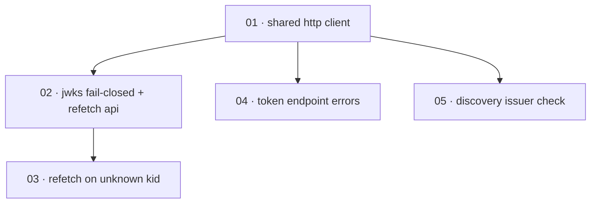

# Plan: Harden outbound provider HTTP (timeouts, status checks, key rotation)

**Status:** Accepted · **Layout:** kanban · **Date:** 2026-07-02 · **Owner:** Ant Stanley · **Source spec:** [.specs/changes/2026-07-01-harden_outbound_provider_http.md](../../changes/2026-07-01-harden_outbound_provider_http.md)

This plan hardens every outbound provider call (JWKS, discovery, token endpoint, revocation) in `crates/adapters/shared`, `crates/adapters/oidc`, and `crates/providers/apple`. It leads with a single shared, timed-out `reqwest::Client` (task 01) that every later task is reviewed through — once outbound HTTP goes through one client with connect/total timeouts and redirects disabled, the remaining tasks layer per-endpoint semantics on top: JWKS fail-closed caching plus a rate-limited refetch API (02), wiring that refetch into the two providers' unknown-`kid` paths (03), token-endpoint OAuth-error surfacing (04), and discovery issuer verification (05). Five thin vertical slices, each provable with a `wiremock` test.

---

## Source and definition-of-done baseline

- **Spec.** Change spec [`.specs/changes/2026-07-01-harden_outbound_provider_http.md`](../../changes/2026-07-01-harden_outbound_provider_http.md), targeting two canonical pages: [`02-ports-and-adapters.md` §Shared OIDC utilities](../../service/specs/02-ports-and-adapters.md) and [`05-provider-system.md` §OidcProvider behaviour / §Assumptions](../../service/specs/05-provider-system.md). No type change: `DiscoveryDocument` and `ProviderTokens` keep their shapes.
- **Already built.** The `shared` module already exists with `JwksCache` (TTL cache behind an `RwLock`, `new`/`with_ttl`/`get_keys`/`fetch_keys` at `crates/adapters/src/shared/jwks.rs`), `discovery::discover` (`discovery.rs`), and `token_endpoint::exchange_code` (`token_endpoint.rs`); the two providers already decode the JWT header, look up the JWK by `kid`, and validate with the JWK's algorithm (`oidc/mod.rs:82-167`, `apple.rs:210-290`). The `Error::ProviderError`/`Error::ProviderTimeout` variants already exist (`crates/core/src/error.rs`). `WebhookUserSync` already builds a `reqwest::Client` with a `timeout` via `Client::builder()` (`webhook/mod.rs:19-24`) — the reference pattern for the shared client. This code is a precondition; the plan changes its behaviour, it does not re-create it.
- **Definition of done.** Each task inherits [`.specs/development-guidelines.md`](../../development-guidelines.md) §"Definition of done" and §"Limits and bounds": behaviour exercised by a test, negative-space test for every new validation path, ≥2 meaningful assertions per new/touched function, every new bound a named constant, and `cargo fmt` / `cargo clippy --workspace -- -D warnings` / `cargo nextest run --workspace` clean. Task files add only task-specific acceptance on top of this baseline.

---

## Task graph

The dependency table is the **source of truth**; the Mermaid graph visualizes it. If the two disagree, the table wins.

| Task | Depends on | Edge kind | Produces (reviewable artifact) |
|---|---|---|---|
| 01 · shared http client | — | — | every outbound provider call goes through one client with a 5s connect / 10s total timeout and redirects disabled; a delayed provider response fails instead of stalling |
| 02 · jwks fail-closed + refetch api | 01 | build | a non-2xx JWKS response is an error and is never cached; a rate-limited forced-refetch API exists on `JwksCache` |
| 03 · refetch on unknown kid | 02 | build, contract | an unknown `kid` triggers one rate-limited JWKS refetch in both providers before the token is rejected, so key rotation is picked up without waiting out the TTL |
| 04 · token endpoint errors | 01 | build | a non-2xx token-endpoint response surfaces its OAuth `error`/`error_description`; a 2xx without `id_token` is an error, not an empty string |
| 05 · discovery issuer check | 01 | build | a discovery document whose `issuer` differs from the configured issuer is rejected (RFC 8414 §3.3) |

Each row keys a task by **number and title**, not a path link — find the file by globbing `*/NN-*.md` across the kanban subfolders. Every `Depends on` references a lower number.

---

## Implementation order and milestones

**Order:** `01, 02, 03, 04, 05`. Task 01 leads because it is the enabler every other task is reviewed through: once all five call sites share one timed-out client, 02/04/05 change that client's *usage* semantics and 03 builds on 02's refetch API. A naive dependency-only sort could start with any of the independent endpoint tasks, but none is reviewable end to end (a timeout test, a fail-closed test) until the shared client exists, so it is scheduled first. 02 precedes 03 because 03 consumes the refetch API 02 introduces.

**Milestones:**

| Milestone | Tasks | Demonstrable when complete | Review gate |
|---|---|---|---|
| M1 — timed-out transport | 01 | a `wiremock` server that delays past the total timeout makes an outbound call fail with a provider error rather than hang; a redirect response is not followed | `cargo nextest run -p oidc-exchange-adapters` green, including the new delayed-response test |
| M2 — JWKS resilience | 02, 03 | a JWKS 500 returns an error and is not cached; rotating the signing `kid` lets a token validate on the next call without waiting out the 1h TTL, and repeated unknown `kid`s do not hammer the JWKS endpoint | new JWKS unit tests plus both providers' `kid`-rotation tests green |
| M3 — endpoint semantics | 04, 05 | a token-endpoint `400 {"error":"invalid_grant"}` surfaces `invalid_grant` (not "Invalid JWT header"); a 200 without `id_token` errors; a discovery document with a mismatched `issuer` is rejected | token-endpoint and discovery negative-space tests green; full `cargo nextest run --workspace` clean |

---

## Assumptions and open questions

**Assumptions**

- The change spec's decisions are settled: timeouts are compile-time constants (5s connect / 10s total), the kid-miss forced-refetch interval is 30s, JWKS errors fail closed, and redirects are disabled — the plan implements these values as named constants without revisiting them.
- Merging the change spec's prose blocks into the two canonical pages (`02-ports-and-adapters.md`, `05-provider-system.md`) and flipping the change spec to `Merged` is handled by the change-spec merge process / orchestrator, not by a build task here. No domain type changes, so `canonical-types.schema.json` is untouched.
- One shared `reqwest::Client` per process is safe across providers (clients are cheap to clone and connection-pool per host), per the change spec's assumption.

**Decisions**

- *Client wiring leads as one task.* **Task 01 both adds `shared::http` and rewires all five call sites**, rather than folding each rewire into the task that later hardens that endpoint. This gives a single reviewable "timeouts everywhere" slice provable by one delayed-response test, and leaves 02/04/05 to change only endpoint semantics on an already-shared client.
- *JWKS refetch split from its wiring.* **Task 02 adds the fail-closed status check and the rate-limited refetch API on `JwksCache`; task 03 wires it into the two providers' `kid`-miss branches.** The cache-internal change (status + refresh guard) and the two-provider call-site change are distinct reviewable surfaces; 02's API is the contract 03 depends on.
- *Two endpoint tasks kept apart.* **Token-endpoint hardening (04) and discovery issuer verification (05) are separate tasks** even though both only depend on 01 — they touch different files (`token_endpoint.rs` vs `discovery.rs`), assert different behaviours, and each is a one-sitting review.

**Open questions**

- (None at this stage.)
