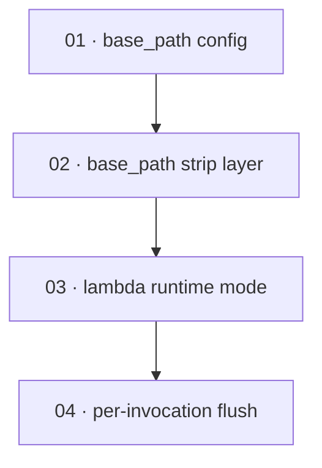

# Plan: Implement Lambda runtime mode in the server binary

**Status:** Accepted · **Layout:** kanban · **Date:** 2026-07-02 · **Owner:** Ant Stanley · **Source spec:** [.specs/changes/2026-07-01-implement_lambda_runtime.md](../../changes/2026-07-01-implement_lambda_runtime.md)

Make the `oidc-exchange` server binary actually run as an AWS Lambda: when `AWS_LAMBDA_RUNTIME_API`
is present, serve the same axum router through `lambda_http` instead of logging "not yet
implemented" and exiting 0. The change decomposes into two convergent slices behind a shared
router. The first slice adds an optional `server.base_path` prefix that both runtimes strip
before routing (the config field, then the shared tower layer) — a small, self-contained enabler
reviewable in plain server mode. The second slice wires Lambda mode itself (`lambda_http::run`
over the built router) and then the per-invocation synchronous flush the freeze semantics demand.
Building the base-path slice first lets Lambda mode be reviewed as "the identical, base-path-
stripped router served through `lambda_http`", which is the change spec's headline decision.

---

## Source and definition-of-done baseline

- **Spec.** Change spec [.specs/changes/2026-07-01-implement_lambda_runtime.md](../../changes/2026-07-01-implement_lambda_runtime.md),
  targeting canonical pages [service/specs/04-http-api.md](../../service/specs/04-http-api.md)
  §Bootstrap (step 6) and [service/specs/06-configuration.md](../../service/specs/06-configuration.md)
  §Sections → `[server]`. [service/specs/00-overview.md](../../service/specs/00-overview.md)
  ("axum server or AWS Lambda from one binary") is already correct for the end state and takes no
  delta. The TypeScript [`@oidc-exchange/lambda`](../../bindings/specs/04-lambda.md) binding is a
  separate mechanism and is out of scope.
- **Already built.** The shared router path is complete and is a precondition, not a task:
  `bootstrap::build_router` (`crates/server/src/bootstrap.rs:109-138`) assembles the role-based
  router, middleware (request-id, audit-context, catch-panic) and `AppState`; `main.rs`
  (`crates/server/src/main.rs:24-38`) already loads config, inits telemetry, builds the service
  and router, and binds hyper in server mode — only the Lambda branch (`main.rs:29-33`) is a
  log-and-return stub. `ServerConfig` (`crates/core/src/config.rs:23-41`) exists with
  `host`/`port`/`issuer`/`role`. The E2E harness in `crates/server/tests/` (`routes.rs`, `e2e.rs`)
  drives the real router via `tower::ServiceExt::oneshot`. No audit adapter buffers today
  (`SqsAuditLog::emit` awaits `send_message` per event; `AuditLog` has no `flush`) and telemetry is
  still stdout JSON (`crates/server/src/telemetry.rs`): the per-invocation flush (Task 04) builds
  the seam, which the telemetry-exporters change fills.
- **Definition of done.** Each task inherits [.specs/development-guidelines.md](../../development-guidelines.md)
  §"Definition of done" and §"Limits and bounds": behaviour exercised by a test, negative-space
  test for every new validation path, ≥2 meaningful assertions per new/touched function, every new
  bound a named constant, and `cargo fmt` / `cargo clippy --workspace -- -D warnings` /
  `cargo nextest run --workspace` clean. Task files add only task-specific acceptance on top.

---

## Task graph

The dependency table is the **source of truth**; the Mermaid graph visualizes it. If the two ever
disagree, the table wins — fix the graph to match.

| Task | Depends on | Edge kind | Produces (reviewable artifact) |
|---|---|---|---|
| 01 · base_path config | — | — | `server.base_path` TOML key deserializes into `ServerConfig` as `Option<String>` (default `None`) |
| 02 · base_path strip layer | 01 | build, data | a request to `/prod/health` routes to the health handler when `base_path = "/prod"`, in plain server mode |
| 03 · lambda runtime mode | 02 | review | the binary serves the identical router through `lambda_http` when `AWS_LAMBDA_RUNTIME_API` is set |
| 04 · per-invocation flush | 03 | build | telemetry (and buffered audit, when present) force-flushes synchronously after each Lambda invocation's response |

Each row keys a task by **number and title**, not a path link — the file moves between kanban
subfolders, so it is found by globbing its number (`*/NN-*.md`). Every `Depends on` references a
**lower** number. Edge kinds: **build** (02 needs the config field to compile the layer), **data**
(the layer reads `server.base_path`), **review** (03's claim "identical, base-path-stripped router
through `lambda_http`" cannot be reviewed end to end until the base-path layer of 02 is in
`build_router`).

---

## Implementation order and milestones

**Order:** `01, 02, 03, 04`. The base-path slice leads even though Lambda mode is the headline:
it is the smaller, self-contained enabler that both runtimes share, and building it first lets
Lambda mode (03) be reviewed as the same base-path-stripped router served through `lambda_http`,
matching the change spec's "one router, two runtimes" decision. 04 follows 03 because the flush
seam wraps the Lambda run path 03 establishes. A naive dependency-only sort could place 03 before
the base-path work (Lambda mode compiles against today's `build_router`); the review edge from 02
promotes the shared layer ahead of it so the convergent end state is reviewable.

**Milestones:**

| Milestone | Tasks | Demonstrable when complete | Review gate |
|---|---|---|---|
| M1 — shared base-path prefix | 01, 02 | with `server.base_path = "/prod"`, the running server routes `/prod/health` to the health handler and leaves paths unchanged when the key is unset | `cargo nextest run -p oidc-exchange-core` and the server-crate E2E base-path test pass; clippy/fmt clean |
| M2 — Lambda runtime | 03, 04 | the binary, with `AWS_LAMBDA_RUNTIME_API` set, serves the same router through `lambda_http` (API Gateway / Function URL / ALB events) and force-flushes per invocation; `examples/aws-web` `/token` and `/keys` work through API Gateway | the Lambda integration test and the flush test pass; the aws-web example acceptance is exercised; clippy/fmt clean |

---

## Assumptions and open questions

**Assumptions**

- `lambda_http`'s current release accepts an axum 0.8 `Router` directly as the tower `Service`
  it drives; no compatibility shim is needed (change spec Assumptions).
- The deployment packages the binary as `bootstrap` for `provided.al2023`, as
  `examples/aws-web/infra/lib/stack.ts:52-68` already does.
- The canonical spec-page edits in the change spec's Merge plan (04-http-api §Bootstrap step 6,
  06-configuration §`[server]`) are applied by the merge step the orchestrator runs, not by this
  build plan; each task's `Implements` maps to the target section so coverage stays checkable.
- The `examples/aws-web` API Gateway acceptance in M2 is exercised by a reviewer against a
  deployed stack; the in-repo CI proof is the Lambda integration test that drives an API Gateway
  event through the router.

**Decisions**

- *Base path before Lambda.* **The `base_path` slice (01, 02) is numbered ahead of Lambda mode
  (03).** It is the smaller shared enabler both runtimes strip through, and building it first makes
  Lambda mode reviewable as the same base-path-stripped router — the review edge 02 → 03.
- *Config field and layer split.* **The `base_path` field (01) and the strip layer (02) are two
  tasks.** The field is a `crates/core` type/deserialization change with its own negative-space
  test; the layer is a `crates/server` routing change exercised through the real router. Splitting
  keeps each reviewable in one sitting and lets the field land as data for the layer to consume.
- *Flush as a seam, built now.* **Task 04 wraps the Lambda run path with a per-invocation
  synchronous flush hook even though nothing buffers today.** The change spec commits to
  synchronous flush "before each invocation's response is returned"; the wrapper is buildable and
  testable now (inject a flush spy), and it is the defined point where the tracer-provider
  `force_flush` lands when the telemetry-exporters change ships. See the open question.

**Open questions**

- *Telemetry force-flush wiring.* The full tracer-provider `force_flush` in Task 04 depends on the
  OTLP/X-Ray exporters landing via
  [changes/2026-06-24-complete_telemetry_exporters.md](../../changes/2026-06-24-complete_telemetry_exporters.md);
  under the current stdout-JSON pipeline the flush hook is a safe no-op. Does this plan build the
  seam now (assumed here) or defer Task 04 until the exporters change merges? Building the seam now
  keeps the Lambda freeze semantics correct-by-construction and gives the exporters change a single
  integration point.
