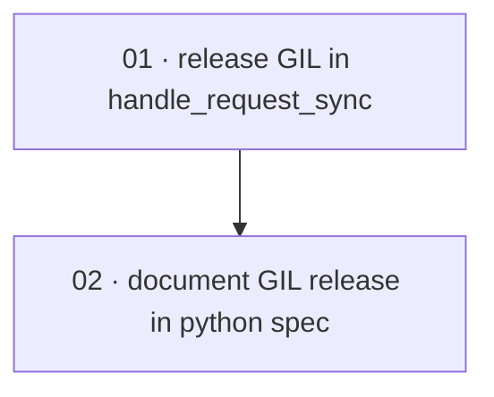

# Plan: Release the GIL around the blocking FFI call in the Python binding

**Status:** Done · **Layout:** kanban · **Date:** 2026-07-02 · **Owner:** Ant Stanley · **Source spec:** [.specs/changes/merged/2026-07-01-release_gil_in_python_binding.md](../../changes/merged/2026-07-01-release_gil_in_python_binding.md)

The change makes the PyO3 binding's `handle_request_sync` release the GIL around the blocking
FFI `handle_request` call, so the executor thread no longer freezes the asyncio event loop and
every other Python thread while a request is in flight. The work is two thin slices: a Rust
slice that wraps the FFI call in `py.allow_threads` and proves the release with a concurrency
regression test (the reviewability spine — this is the behaviour change), followed by a spec
slice that syncs the canonical `03-python.md` Implementation bullet to the shipped behaviour.

---

## Source and definition-of-done baseline

- **Spec.** Change spec [.specs/changes/merged/2026-07-01-release_gil_in_python_binding.md](../../changes/merged/2026-07-01-release_gil_in_python_binding.md); the single affected canonical page is [.specs/bindings/specs/03-python.md](../../bindings/specs/03-python.md). In scope: the GIL release in `handle_request_sync`, a regression test that proves it, and the `03-python.md` Implementation-bullet update.
- **Already built (preconditions, not tasks).** The whole binding exists and works: `#[pyclass] OidcExchange` with `#[new]` and `handle_request_sync` extracting method/path/headers/body and building the response `PyDict` (`bindings/python/src/lib.rs:46-104`); the FFI `OidcExchange::handle_request(method, path, headers: Vec<(String,String)>, body: Vec<u8>) -> Result<FfiResponse, FfiError>` taking only owned/`Send` data (`crates/ffi/src/lib.rs:84-116`); the Python wrapper's async `handle_request` offloading to the default executor (`bindings/python/python/oidc_exchange/__init__.py:23-27`); and the existing pytest suite (`bindings/python/tests/test_handle_request.py`, including `test_async_health`). None of this is re-planned. The `03-python.md` "keeps the event loop responsive" decision already describes the end state — the spec is ahead of the code.
- **Definition of done.** [.specs/development-guidelines.md](../../development-guidelines.md) §"Definition of done" and §"Limits and bounds" set the per-task bar, inherited by every task: behaviour exercised by a test, negative-space tests for new paths, at least two meaningful assertions on every touched function, Rust `cargo fmt`/`cargo clippy --workspace -- -D warnings`/`cargo nextest run --workspace` and Python `uv run ruff format --check .`/`uv run ruff check .`/`uv run pyright`/`uv run pytest` clean for every language the task touches. Task files add task-specific acceptance on top.

---

## Task graph

The dependency table is the **source of truth**; the Mermaid graph visualizes it. If the two
ever disagree, the table wins — fix the graph to match.

| Task | Depends on | Edge kind | Produces (reviewable artifact) |
|---|---|---|---|
| 01 · release GIL in handle_request_sync | — | — | the FFI call runs with the GIL dropped; a regression test shows another Python thread makes progress during an in-flight request |
| 02 · document GIL release in python spec | 01 | review | the canonical `03-python.md` Implementation bullet describes the shipped GIL release |

Each row keys a task by its **number and title**, not a path link — a task file moves between
subfolders as it is built, so it is found by globbing its number across the subfolders
(`*/NN-*.md`). `Depends on` references **lower** task numbers. Edge kind names why the
dependency exists: task 02's bullet must match the behaviour task 01 actually ships, so it is
reviewed through task 01 (a review edge), not merely sequenced after it.

---

## Implementation order and milestones

**Order:** `01, 02` — the behaviour change leads because it is the reviewable substance of the
plan and the thing the spec update must describe accurately; documenting the GIL release before
it is proven would risk the page drifting ahead of the code a second time. The spec slice is
deliberately reviewed *through* the shipped code.

**Milestones:**

| Milestone | Tasks | Demonstrable when complete | Review gate |
|---|---|---|---|
| M1 — GIL released and proven | 01 | a reviewer runs the new regression test and sees a second Python thread advance while a `handle_request_sync` call is blocked in the FFI; the test fails against the pre-change `lib.rs` and passes after | Rust and Python format/lint/type/test gates for the binding pass; the regression test is deterministic |
| M2 — spec synced | 02 | the canonical `03-python.md` Implementation bullet reads back the `py.allow_threads` behaviour and matches `lib.rs` | the bullet wording matches the change spec's Proposed-changes block and the shipped code; internal links resolve |

---

## Assumptions and open questions

**Assumptions**

- No Python callbacks are invoked from inside the FFI call (none exist today), so releasing the
  GIL across it is sound — carried directly from the change spec.
- The change-spec lifecycle steps in the change spec's Merge plan that are *not* code — flipping
  `**Status:**` to `Merged`, stamping `**Merged:**`, moving the file to `.specs/changes/merged/`,
  and updating `.specs/README.md` — are handled centrally by the orchestrator, not by a task in
  this plan. Task 02 covers only the canonical page's content and its `**Date:**` bump.

**Decisions**

- *Release, don't rearchitect.* **Keep the sync-in-executor design and drop the GIL only around
  the blocking section**, per the change spec. The async wrapper and the FFI signature are
  unchanged, so the plan is a wrap-plus-prove slice, not a redesign.
- *Two tasks, not one.* **The Rust behaviour change and the canonical-page update are separate
  reviewable artifacts** (one is code with a test, one is prose), so they are cut apart even
  though the change is small; the regression test and the code change stay in one package
  because a test asserting GIL release is not reviewable until the release lands.

**Open questions**

- *Slow-endpoint fixture.* The change spec offers two regression-test shapes — a pytest-asyncio
  counter task against a deliberately slow endpoint/mock-provider delay, or a simpler
  `threading.Thread` counter under a timeout. Which is deterministic enough for CI without a
  purpose-built slow route is settled inside task 01; if neither proves reliable, the fallback is
  a thread that runs many requests in a loop while a second thread advances a counter, asserting
  the counter moved. Flagged here so a reviewer weighs the chosen shape.
