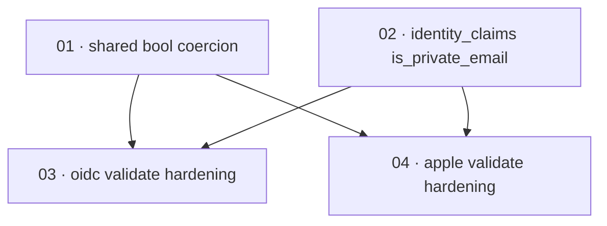

# Plan: Require iss/aud presence and fix claim handling in ID-token validation

**Status:** Accepted · **Layout:** kanban · **Date:** 2026-07-02 · **Owner:** Ant Stanley · **Source spec:** [.specs/changes/2026-07-01-require_iss_aud_in_token_validation.md](../../changes/2026-07-01-require_iss_aud_in_token_validation.md)

This plan hardens ID-token validation in both identity providers so a provider-signed JWT that omits `iss` or `aud` is rejected (closing the cross-token-type confusion class), validates `nbf` when present, infers the signing algorithm from the JWK when it carries no `alg`, coerces Apple's bool-or-string `email_verified`/`is_private_email`, and surfaces `is_private_email` as a first-class `IdentityClaims` field. The decomposition puts two enablers first — a shared bool-or-string coercion helper (01) that both `validate_id_token` bodies call, and the `IdentityClaims.is_private_email` domain-type change (02) with its schema/prose and every constructor updated — then the two provider hardening slices that are reviewed through them: the generic OIDC adapter (03, which also gains alg-inference) and the Apple provider (04, which also populates `is_private_email`). Ordering leads with the enablers so each provider slice lands against a compiling helper and field and can be reviewed end to end.

---

## Source and definition-of-done baseline

- **Spec.** Change spec [.specs/changes/2026-07-01-require_iss_aud_in_token_validation.md](../../changes/2026-07-01-require_iss_aud_in_token_validation.md). Affected canonical pages: [`.specs/service/specs/01-domain-model.md`](../../service/specs/01-domain-model.md) (Token types → `IdentityClaims` field list) and [`.specs/service/specs/05-provider-system.md`](../../service/specs/05-provider-system.md) (OidcProvider behaviour, Tier 2 Apple, Decisions), plus the `IdentityClaims` fragment folded into [`canonical-types.schema.json`](../../service/specs/canonical-types.schema.json). [02-ports-and-adapters.md](../../service/specs/02-ports-and-adapters.md) is unaffected — no port signature changes.
- **Already built (preconditions, not tasks).** Both providers already build `Validation::new(jwk_alg)` from the trusted JWK and call `set_issuer`/`set_audience` (`crates/adapters/src/oidc/mod.rs:137-139`, `crates/providers/src/apple.rs:260-262`); the "algorithm from the JWK" pattern and its match on `alg` strings already exist in both (`oidc/mod.rs:121-136`, `apple.rs:249-259`), and the Apple provider already errors on an unrecognised/absent `alg` — the OIDC adapter defaults to RS256 instead. The `JwksCache` fetch/decode path, the `sub` extraction, and the `IdentityProvider` port (`crates/core/src/ports/identity_provider.rs:12`, returns `IdentityClaims` unchanged) are all in place. `oidc_exchange_adapters::shared` is a public module already consumed cross-crate by the Apple provider (`shared::jwks`, `shared::token_endpoint`). The gaps this plan closes: no `set_required_spec_claims`, `validate_nbf = false`, the OIDC RS256 default, `email_verified` read via `as_bool()` only, and no `is_private_email` field.
- **Definition of done.** [.specs/development-guidelines.md](../../development-guidelines.md) §"Definition of done" and §"Limits and bounds": behaviour exercised by a test, negative-space test for every new validation path, ≥2 meaningful assertions per touched function, every new bound a named constant, and `cargo fmt` / `cargo clippy --workspace -- -D warnings` / `cargo nextest run --workspace` clean. When domain types change, `canonical-types.schema.json` and the affected prose pages move together. No backwards-compat shims — a changed type updates every caller. Each task inherits this baseline; its file adds only task-specific acceptance.

---

## Task graph

The dependency table is the **source of truth**; the Mermaid graph visualizes it. If the two disagree, the table wins.

| Task | Depends on | Edge kind | Produces (reviewable artifact) |
|---|---|---|---|
| 01 · shared bool coercion | — | — | a `coerce_bool` helper in `adapters/shared` that maps JSON bool or `"true"`/`"false"` strings to `Option<bool>`, with unit tests |
| 02 · identity_claims is_private_email | — | — | `IdentityClaims` carries `is_private_email: Option<bool>`; schema and 01-domain-model prose updated; every constructor compiles with the new field |
| 03 · oidc validate hardening | 01, 02 | build | the generic OIDC adapter rejects `iss`/`aud`-omitting and future-`nbf` tokens, infers alg from the JWK's `kty`/`crv` when `alg` is absent, and coerces `email_verified`; plus 05-provider-system.md §"OidcProvider behaviour" + §Decisions *Required spec claims* updated to the merged form |
| 04 · apple validate hardening | 01, 02 | build | the Apple provider rejects `iss`/`aud`-omitting and future-`nbf` tokens, coerces `email_verified`, and populates `is_private_email` from bool-or-string; plus 05-provider-system.md §"Tiers, Tier 2 Apple" updated with the Apple coercion note |

Edge kinds: 03 and 04 both take a **build** edge from 01 (their `validate_id_token` bodies call the shared `coerce_bool`) and from 02 (they construct `IdentityClaims`, which now carries `is_private_email`, and 04 populates it).

---

## Implementation order and milestones

**Order:** `01, 02, 03, 04`. The two enablers lead even though neither is user-visible on its own: 01 (the coercion helper) and 02 (the domain field + schema + all constructors) are reviewed-through by both provider slices, so building them first means 03 and 04 each land against a compiling helper and field and can be exercised end to end. 01 precedes 02 only for size (it is the smallest, self-contained unit); they are independent and could swap. 03 (generic OIDC, the broadest security fix and the alg-inference change) precedes 04 (Apple, the sign-in-denial fix plus the `is_private_email` surfacing) because the OIDC adapter is the shared-behaviour reference the Apple slice mirrors.

**Milestones:**

| Milestone | Tasks | Demonstrable when complete | Review gate |
|---|---|---|---|
| M1 — enablers | 01, 02 | `coerce_bool` unit tests pass for bool, `"true"`/`"false"`, and non-coercible inputs; `IdentityClaims` carries `is_private_email`, the schema/prose match, and the whole workspace compiles with every constructor updated | `cargo nextest run --workspace` green; schema and 01-domain-model prose updated together |
| M2 — provider hardening | 03, 04 | in both providers, a token missing `aud`/`iss` is rejected, a future-`nbf` token is rejected, alg-less RSA and EC JWKs validate (OIDC), and a string `email_verified` maps to `Some(true)`; Apple maps string and bool `is_private_email` to `Some(_)` | negative-space tests present for every new rejection path; `cargo clippy --workspace -- -D warnings` and `cargo nextest run --workspace` clean |

---

## Assumptions and open questions

**Assumptions**

- No supported provider issues legitimate ID tokens without `iss`/`aud`; requiring presence breaks no working configuration (OIDC Core mandates both in ID tokens). Carried from the change spec.
- `nbf` is rarely present in ID tokens; enabling `validate_nbf` with jsonwebtoken's default leeway does not reject valid tokens.
- `oidc_exchange_adapters::shared` stays the correct home for cross-crate shared helpers — the Apple provider (in `crates/providers`) already depends on `crates/adapters` and imports from `shared`, so a new `shared::claims` module is reachable from both `validate_id_token` bodies without a new dependency.

**Decisions**

- *Enablers before providers.* **The coercion helper (01) and the `is_private_email` field (02) are separate tasks scheduled ahead of the provider slices.** Both are reviewed-through by 03 and 04; landing them first keeps each provider slice a thin, compiling, end-to-end-reviewable change rather than bundling a domain-type migration into a validation fix.
- *One hardening task per provider.* **The required-claims, `nbf`, alg-inference (OIDC only), and coercion changes are grouped per provider (03, 04) rather than split by concern.** They all edit the same `validate_id_token` body in one crate; splitting by concern would force overlapping edits to the same ~40-line region across tasks. Each task's DoD stays at ~5 acceptance items.
- *RSA without `alg` means RS256.* **An alg-less `kty: RSA` JWK is treated as RS256** (task 03), matching the change spec's decision: the RSA family is not distinguishable from key parameters alone and the untrusted header must not decide; RS256 is Azure AD's actual signing algorithm.
- *Affected prose moves with its code, not deferred to merge.* **Each affected canonical page is updated during the build by the task that realises its behaviour** — mirroring task 02, which applies the 01-domain-model bullet and the schema fragment. The three `05-provider-system.md` Proposed-changes blocks are split by ownership: task 03 applies §"OidcProvider behaviour" (required claims, `nbf`, alg inference) and the §Decisions *Required spec claims* Add; task 04 applies §"Tiers, Tier 2 Apple" (bool-or-string coercion, first-class `is_private_email`). Both bump the page `**Date:**` to `2026-07-02`; because the two edits touch different sections and set an identical `**Date:**` line, they merge cleanly even though 03 and 04 are otherwise independent. The change spec's Merge plan then only flips Status and moves the change file — the page prose is already in place.

**Open questions**

- (None at this stage.)
