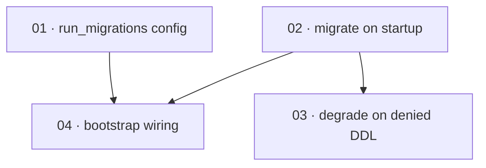

# Plan: Run Postgres migrations on startup

**Status:** Accepted · **Layout:** kanban · **Date:** 2026-07-02 · **Owner:** Ant Stanley · **Source spec:** [.specs/changes/2026-07-01-run_postgres_migrations_on_startup.md](../../changes/2026-07-01-run_postgres_migrations_on_startup.md)

Make a fresh Postgres deployment serviceable on first boot by executing the adapter's already-idempotent `MIGRATIONS` DDL inside `create_pool`, mirroring the SQLite adapter. The work is a thin vertical slice across three crates: a config flag (`crates/core`), the migration behaviour and its degrade-with-warning branch in the adapter (`crates/adapters`), and the bootstrap wiring that threads the flag through both pool builds (`crates/server`). The reviewability spine is the adapter task (02): once `create_pool` migrates a fresh database, a reviewer can prove the core promise — a fresh Postgres DB serves `create_user` after `create_pool` alone — and the remaining tasks (denied-DDL degrade path, bootstrap wiring) are reviewed through it.

---

## Source and definition-of-done baseline

- **Spec.** Change spec [.specs/changes/2026-07-01-run_postgres_migrations_on_startup.md](../../changes/2026-07-01-run_postgres_migrations_on_startup.md), targeting two canonical pages: [08-persistence.md](../../service/specs/08-persistence.md) (PostgreSQL section — `create_pool` runs migrations, degrade-with-warning on denied DDL) and [06-configuration.md](../../service/specs/06-configuration.md) (`[repository.postgres]` gains `run_migrations?`).
- **Already built (preconditions, not tasks).** The idempotent DDL constant `postgres::MIGRATIONS` (`crates/adapters/src/postgres/mod.rs:14-42`, `CREATE TABLE/INDEX IF NOT EXISTS` throughout); the `PostgresRepository` implementing both repository traits; `create_pool(url, max_connections)` building the connection pool (`postgres/mod.rs:60-68`); the SQLite adapter's `create_pool` that already runs its migrations (`crates/adapters/src/sqlite/mod.rs:54-79`) — the shape this change mirrors; the two bootstrap call sites (`crates/server/src/bootstrap.rs:185`, `:244`) already resolving `[repository.postgres]`. This plan wires and executes existing DDL; it does not author new schema.
- **Definition of done.** Each task inherits `.specs/development-guidelines.md` §"Definition of done" (behaviour exercised by a test; negative-space tests for every new validation path; ≥2 meaningful assertions per touched function; every new bound a named constant; `cargo fmt`, `cargo clippy --workspace -- -D warnings`, `cargo nextest run --workspace` green) and §"Limits and bounds" (every limit a named constant). Task files add only task-specific acceptance on top.

---

## Task graph

The dependency table is the **source of truth**; the Mermaid graph visualizes it. If the two ever disagree, the table wins — fix the graph to match.

| Task | Depends on | Edge kind | Produces (reviewable artifact) |
|---|---|---|---|
| 01 · run_migrations config | — | — | `[repository.postgres] run_migrations` deserializes into `PostgresConfig` (absent → `None`, treated as `true`); 06-configuration.md documents the key |
| 02 · migrate on startup | — | — | `create_pool(url, max_connections, run_migrations)` runs `MIGRATIONS` on a fresh Postgres DB when `run_migrations` is true and only connects when false; a gated integration test proves a fresh DB serves `create_user` after `create_pool` alone; 08-persistence.md documents it |
| 03 · degrade on denied DDL | 02 | build | on a denied migration (`SQLSTATE 42501`), `create_pool` logs a warning and proceeds when `users` and `sessions` already exist, else fails with the original error; 08-persistence.md documents the degrade path |
| 04 · bootstrap wiring | 01, 02 | data, contract | both bootstrap call sites pass `pg_cfg.run_migrations.unwrap_or(true)` through `create_pool`, so a `postgres`-configured server migrates on startup across the user and session pools |

Each row keys a task by its **number and title**, not a path link — a task file moves between subfolders as it is built, so it is found by globbing its number across the subfolders (`*/NN-*.md`). `Depends on` references only lower task numbers. Edge kinds: 01→04 is a **data** edge (bootstrap reads the new config field) and 02→04 a **contract** edge (bootstrap calls the new `create_pool` signature); 02→03 is a **build** edge (03 extends the `create_pool` body 02 establishes).

---

## Implementation order and milestones

**Order:** `01, 02, 03, 04`. The two enablers lead: 01 (config contract) is the smallest and unblocks the bootstrap wiring independently; 02 is the reviewability spine — the heart of the change, the point at which the core promise ("a fresh Postgres DB serves `create_user` after `create_pool` alone") becomes demonstrable, and it unlocks both 03 (its error branch) and 04 (its new signature). 03 hardens the migration against a restricted role; 04 threads the flag end to end so a full server boot migrates. A naive dependency-only sort could start with either 01 or 02 (both have no dependencies); 02 is called out as the spine because everything downstream is reviewed through a working `create_pool`.

**Milestones:**

| Milestone | Tasks | Demonstrable when complete | Review gate |
|---|---|---|---|
| M1 — migrate-on-startup | 01, 02 | Against a scratch Postgres (`DATABASE_URL` set), `create_pool(url, n, true)` leaves a fresh database serving `create_user`; `create_pool(url, n, false)` leaves it with no tables; a TOML `run_migrations = false` deserializes to `Some(false)`, absent to `None` | `cargo fmt` / `cargo clippy --workspace -- -D warnings` / `cargo nextest run --workspace` green; the gated Postgres integration test passes where `DATABASE_URL` is set and skips cleanly where it is not |
| M2 — hardening + wiring | 03, 04 | A migration denied with `SQLSTATE 42501` degrades to a warning and proceeds when the tables pre-exist (fails otherwise); a `postgres`-configured server boots and both the user and session pools migrate idempotently on startup | Full suite green; a manual/scripted boot with `repository.adapter = "postgres"` against a fresh database serves a request that touches the repository without a 500 |

---

## Assumptions and open questions

**Assumptions**

- The configured Postgres role has DDL rights on its schema in the documented deployment path (the deployment guide creates the database with `OWNER oidc_exchange`); locked-down deployments either set `run_migrations = false` or rely on the degrade-with-warning branch (task 03).
- Schema evolution stays additive `IF NOT EXISTS` DDL; versioned migrations (`sqlx::migrate!`) are out of scope for this change, so no migration-history table is introduced.
- The multi-statement `MIGRATIONS` block runs through sqlx's simple-query path (`sqlx::raw_sql`, sqlx 0.8), since prepared statements cannot execute multiple statements on Postgres.
- The idempotent DDL makes the second `create_pool` call (the session pool) a harmless no-op when both repositories are configured as `postgres`.

**Decisions**

- *Migrate inside `create_pool`, not in bootstrap.* **Matches the SQLite adapter and keeps the adapter self-contained** — any embedder that builds a pool gets a working schema. Task 02 owns the behaviour; task 04 only threads the flag.
- *`run_migrations` as a per-adapter flag, defaulting to true.* **`create_pool` takes a plain `run_migrations: bool`; the `Option<bool>` lives only on `PostgresConfig`, resolved with `unwrap_or(true)` at the bootstrap boundary.** Keeps the adapter signature total and the "absent → true" default in one place (the wiring), so 01 and 02 have no build dependency on each other.
- *Split the adapter into happy path (02) and degrade branch (03).* **The denied-DDL path needs a restricted-role setup a fresh-DB integration test cannot provide, so it is a separate reviewable slice** rather than inflating task 02's definition of done past the sizing bound.

**Open questions**

- *Postgres test harness.* The gated integration test in task 02 is written against a `DATABASE_URL` env var (skipping when unset) to avoid adding a `testcontainers` dev-dependency; if the team prefers testcontainers for hermetic CI coverage, that is a follow-up. Which gating mechanism CI adopts is left to task 02's implementer and flagged here.
