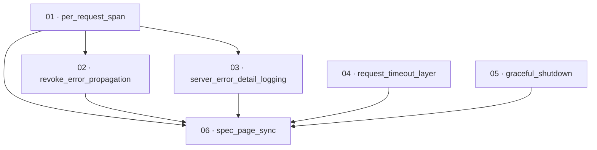

# Plan: Server error handling, request-span correlation, and graceful shutdown

**Status:** Accepted · **Layout:** kanban · **Date:** 2026-07-02 · **Owner:** Ant Stanley · **Source spec:** [.specs/changes/2026-07-01-server_error_handling_and_shutdown.md](../../changes/2026-07-01-server_error_handling_and_shutdown.md)

This plan closes four server-layer gaps in `crates/server`: `/revoke` reports success on
infrastructure failure, `server_error` responses drop the internal detail, request-id
correlation is a no-op because no per-request span exists, and the server neither drains on
SIGTERM nor bounds slow clients. The reviewability spine leads with the **per-request span**
(task 01) — the enabler every error log is correlated through — then the fail-safe revoke
(02) and the server_error detail log (03), which are both reviewed with real request-id
correlation once the span exists. Resilience (request timeout 04, graceful shutdown 05)
follows as independent slices, and a final documentation task (06) syncs the canonical spec
pages to the shipped behaviour. Each task is a thin vertical slice with its own tests.

---

## Source and definition-of-done baseline

- **Spec.** Change spec [.specs/changes/2026-07-01-server_error_handling_and_shutdown.md](../../changes/2026-07-01-server_error_handling_and_shutdown.md),
  targeting canonical pages [03-service-flows.md](../../service/specs/03-service-flows.md),
  [04-http-api.md](../../service/specs/04-http-api.md),
  [06-configuration.md](../../service/specs/06-configuration.md),
  [07-telemetry-and-audit.md](../../service/specs/07-telemetry-and-audit.md), and the
  repo-global [development-guidelines.md](../../development-guidelines.md). No type change
  (`canonical-types.schema.json` is untouched).
- **Already built (preconditions, not tasks).**
  - The request-id middleware exists (`crates/server/src/middleware/request_id.rs`) and echoes
    `X-Request-Id`; only its `tracing::Span::current().record(...)` call is a no-op — task 01
    replaces that, it does not create the middleware.
  - `AppService::revoke` (`crates/core/src/service/revoke.rs`) already splits the token,
    verifies the signature, and calls `revoke_session` / `revoke_all_user_sessions`; it just
    swallows their `Result` with `let _ =`.
  - All five `SessionRepository` adapters implement `revoke_session` as an idempotent DELETE
    (verified in `crates/adapters/src/sqlite/mod.rs:409` and siblings) that returns `Ok(())`
    for a missing token and only `Err(StoreError)` on backend failure — so a propagated `Err`
    is genuinely infrastructural.
  - `map_domain_error` (`crates/server/src/error.rs:51`) already returns generic 500/502/504
    bodies for the `server_error` arms; task 03 adds the missing internal-detail log.
  - `axum::serve(listener, app)` runs in `crates/server/src/main.rs:37` without graceful
    shutdown; the middleware stack is assembled in `crates/server/src/bootstrap.rs:134`.
  - The core service ships a `pub(crate) parse_duration_secs` humantime-style parser
    (`crates/core/src/service/mod.rs:168`) used for the `[token]` TTLs — task 04 parses
    `request_timeout` the same way (a named constant, not a magic literal).
- **Definition of done.** Each task inherits [.specs/development-guidelines.md](../../development-guidelines.md)
  §"Definition of done" (behaviour exercised by a test, negative-space tests for every new
  validation path, two meaningful assertions per touched function, every new bound a named
  constant, and `cargo fmt` / `cargo clippy --workspace -- -D warnings` / `cargo nextest run
  --workspace` clean) and §"Limits and bounds" (the request-timeout default and the shutdown
  drain deadline are declared named constants). Task files add only task-specific acceptance
  on top of this baseline.

---

## Task graph

The dependency table is the **source of truth**; the Mermaid graph visualizes it. If the two
ever disagree, the table wins.

| Task | Depends on | Edge kind | Produces (reviewable artifact) |
|---|---|---|---|
| 01 · per_request_span | — | — | logs emitted during a request carry `request_id`; correlation is real |
| 02 · revoke_error_propagation | 01 | review | `/revoke` returns 503 (not 200) when the session store fails, and logs the detail under the request span |
| 03 · server_error_detail_logging | 01 | review | 500/502/504 responses log the internal detail via `tracing::error!` under the request span, still returning a generic body |
| 04 · request_timeout_layer | — | — | a request past `server.request_timeout` (default 30 s) is aborted with 408 |
| 05 · graceful_shutdown | — | — | SIGTERM / ctrl-c drains in-flight requests, then exits within a 10 s hard deadline |
| 06 · spec_page_sync | 01, 02, 03, 04, 05 | review | canonical spec pages and dev-guidelines carve-out match the shipped behaviour |

Each row keys a task by **number and title**, not a path link — a task file moves between
kanban subfolders as it is built, found by glob (`*/NN-*.md`). Every `Depends on` references a
**lower** number. Edge kinds: build / data / contract / review (see task-decomposition).

---

## Implementation order and milestones

**Order:** `01, 02, 03, 04, 05, 06`. The per-request span (01) leads even though the revoke
safety fix is the highest-severity defect, because 01 is the enabler that 02's and 03's error
logs are *reviewed through*: their spec text requires the log to carry the request id, which is
only observable once the span exists. Tasks 04 and 05 are independent resilience slices that
could run any time after 01; they are scheduled after the correlation-and-safety milestone so a
reviewer signs off the higher-severity fixes first. Task 06 is documentation and lands last,
once every behaviour it describes is shipped.

**Milestones:**

| Milestone | Tasks | Demonstrable when complete | Review gate |
|---|---|---|---|
| M1 — correlation & fail-safe revoke | 01, 02, 03 | Drive `/revoke` against a failing session store → 503 with a correlated `tracing::error!` detail log carrying the request id; trigger a 500-class error and see its internal detail logged (never leaked to the client) under the same request span | `cargo nextest run --workspace` green; the request-id, revoke, and error-mapping tests pass |
| M2 — resilience | 04, 05 | A request exceeding `server.request_timeout` returns 408; sending SIGTERM to a running instance mid-request drains it then exits within 10 s | timeout + config tests pass; manual SIGTERM drive drains and exits within the deadline |
| M3 — spec sync | 06 | The canonical pages (03/04/06) and the dev-guidelines carve-out read true against the shipped code | doc review: every proposed-changes block applied, no stale claim remains |

---

## Assumptions and open questions

**Assumptions**

- The orchestrator owns version control and the `.specs/README.md` index; this plan authors
  only the plan folder. Task 06 edits the canonical spec pages' prose but does **not** flip the
  change spec's `Status` to `Merged`, stamp `Merged:`, move it to `changes/merged/`, or touch
  `README.md` — those merge-plan steps are the orchestrator's.
- Deployment platforms deliver SIGTERM and allow a drain window (ECS default 30 s, K8s
  `terminationGracePeriodSeconds`) before SIGKILL, so a 10 s internal drain deadline sits well
  inside it.
- The 503 revoke body reuses the standard `{"error": ..., "error_description": ...}` shape.
- `tower_http::timeout::TimeoutLayer` responds `408 Request Timeout` on expiry, matching the
  spec's requested status; task 04 confirms this against the pinned `tower-http` 0.6.

**Decisions**

- *Span leads, not the revoke fix.* **Task 01 (per-request span) is scheduled first despite
  the revoke 200-on-failure bug being the most severe defect.** The span is reviewed-through by
  the two error-logging tasks (their spec text requires request-id correlation on the log), so
  building it first makes 02 and 03 reviewable end to end. The revoke fix follows immediately as
  02, still inside milestone M1.
- *Revoke propagation is one vertical slice.* **Core `?`-propagation and the server
  handler's 200/503 mapping are one package (02), not two.** They are always reviewed together —
  the core change is unobservable without the handler change — so splitting them would defer all
  review to the second half.
- *Request timeout and shutdown are independent slices.* **Tasks 04 and 05 carry no edge to
  01–03.** The timeout layer sits inside the pre-existing request-id layer in the middleware
  stack (an ordering fact in `bootstrap.rs`, not a build dependency on the span change), and
  graceful shutdown touches only `main.rs`.
- *One span per request, no nesting.* **The request span is created once, in the middleware
  stack (task 01).** If the tower OTEL request-span layer from
  [2026-06-24-complete_telemetry_exporters.md](../../changes/2026-06-24-complete_telemetry_exporters.md)
  lands first, `request_id` becomes a field on that span rather than a second nested span;
  task 01 checks for an existing request span before opening its own.
- *Spec-page sync is a task, not an orchestrator step.* **Task 06 applies the change spec's
  proposed-changes blocks to the canonical pages** so coverage is honest — every affected spec
  page maps to a task — while the status flip / move / README index stay with the orchestrator.

**Open questions**

- *Shutdown test depth.* Signal-driven graceful shutdown is awkward to assert in an in-process
  `nextest` run; task 05's DoD covers the drain-deadline constant and the shutdown-signal helper
  with a unit test and leaves the full SIGTERM drain to a manual reviewable drive. Is that
  split acceptable, or should an integration test spawn the binary and signal it? Flagged for
  the reviewer; does not block the order.
