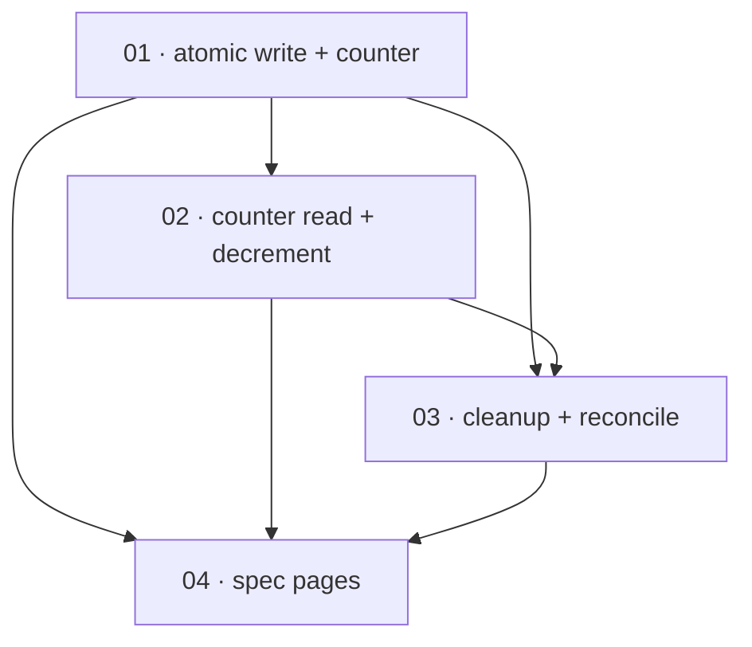

# Plan: Valkey session store — SessionRepository contract conformance

**Status:** In progress · **Layout:** kanban · **Date:** 2026-07-02 · **Owner:** Ant Stanley · **Source spec:** [.specs/changes/2026-07-01-valkey_session_store_conformance.md](../../changes/2026-07-01-valkey_session_store_conformance.md)

This plan brings the Valkey `SessionRepository` (`crates/adapters/src/valkey/mod.rs`) into line
with the port contract the other four session backends honor, in four reviewable slices. It
starts at the write path — an atomic pipelined `store_refresh_token` that rejects non-positive
TTLs, `INCR`s a maintained `{prefix}active_sessions` counter, and bumps the user-set TTL with
`EXPIRE … GT` — because every later slice is exercised through sessions written that way and
reviewed against the counter it maintains. The read/decrement path (`count_active_sessions`,
`revoke_session`, `revoke_all_user_sessions`) follows, then the `cleanup_expired_sessions`
index-prune-and-counter-reconcile pass, and finally the two canonical spec pages are updated to
describe the shipped behavior. The reviewability spine is the counter lifecycle: write (01) →
read/decrement (02) → reconcile (03) → document (04).

---

## Source and definition-of-done baseline

- **Spec.** Change spec [.specs/changes/2026-07-01-valkey_session_store_conformance.md](../../changes/2026-07-01-valkey_session_store_conformance.md),
  which targets two canonical pages: [08-persistence.md](../../service/specs/08-persistence.md)
  §"Session-only stores" and [02-ports-and-adapters.md](../../service/specs/02-ports-and-adapters.md)
  §"Adapter inventory". The port contract is `SessionRepository` in
  `crates/core/src/ports/repository.rs` (see 02-ports-and-adapters §SessionRepository).
- **Already built (preconditions, not tasks).** `crates/adapters/src/valkey/mod.rs` already has:
  the `ValkeySessionRepository` struct and `fred` client init (`new`), the `session_key` and
  `user_sessions_key` helpers (lines 25–31), a working `get_session_by_refresh_token`
  (lines 84–151, unchanged by this plan), and stub/divergent implementations of the five methods
  this plan fixes — non-atomic `store_refresh_token` (37–81), `revoke_session` (154–183),
  `count_active_sessions` returning `DBSIZE` (185–196), `cleanup_expired_sessions` returning
  `Ok(0)` (198–203), and `revoke_all_user_sessions` (205–235). The `fred` 10 dependency
  (`crates/adapters/Cargo.toml`) and the `Error::StoreError { detail }` variant
  (`crates/core/src/error.rs:36`) exist. There are **no** Valkey tests yet — the integration-test
  module and its live-server harness are authored by task 01 and reused by 02–03, mirroring the
  `#[ignore]`-gated in-module pattern the DynamoDB adapter uses (`crates/adapters/src/dynamo/mod.rs:489`).
- **Definition of done.** Every task inherits [.specs/development-guidelines.md](../../development-guidelines.md)
  §"Definition of done" (behavior exercised by a test; negative-space test for every new
  validation path; ≥2 meaningful assertions per new/touched function; every new bound a named
  constant; `cargo fmt` / `cargo clippy --workspace -- -D warnings` / `cargo nextest run
  --workspace` clean) and §"Limits and bounds" (every limit a named constant with units). Task
  files add only task-specific acceptance on top of this baseline. Valkey integration tests are
  `#[ignore]`-gated (they need a live Valkey/Redis), so "the test passes" means it passes against
  a local server; clippy/fmt and the non-ignored suite gate in CI.

---

## Task graph

The dependency table is the **source of truth**; the Mermaid graph visualizes it. If the two
ever disagree, the table wins — fix the graph to match.

| Task | Depends on | Edge kind | Produces (reviewable artifact) |
|---|---|---|---|
| 01 · atomic write + counter | — | — | `store_refresh_token` applies the hash, TTL, user-set membership, `EXPIRE … GT` set-TTL bump, and `INCR {prefix}active_sessions` in one `fred` pipeline; a non-future `expires_at` is rejected with `StoreError` and creates no key; the integration-test harness stands up |
| 02 · counter read + decrement | 01 | build, data | `count_active_sessions` reads the counter (missing → 0); `revoke_session` `DECR`s only when its `DEL` removed the key; `revoke_all_user_sessions` `DECR`s by the number of keys actually deleted |
| 03 · cleanup + reconcile | 01, 02 | build, data, review | `cleanup_expired_sessions` SREMs `user_sessions` members whose session key is gone, deletes emptied sets, reconciles the counter from a SCAN of live `{prefix}session:*` keys, and returns members pruned |
| 04 · spec pages | 01, 02, 03 | review | 08-persistence §"Session-only stores" and 02-ports-and-adapters §"Adapter inventory" describe the shipped Valkey behavior |

Each row keys a task by its **number and title**, not a path link — a task file moves between
subfolders as it is built, so it is found by globbing its number across the four subfolders
(`*/NN-*.md`). Every `Depends on` references a **lower** number, a property of numbering in
implementation order. Edge kinds: build (code cannot be written until the dependency exists),
data (reads/persists data the dependency shapes — here the counter key and user sets), review
(cannot be exercised end to end until the dependency works).

---

## Implementation order and milestones

**Order:** `01, 02, 03, 04`. The write path leads even though `count_active_sessions` is the
most visible defect, because the counter it reads is only meaningful once something maintains it:
01 introduces the `{prefix}active_sessions` key, the `EXPIRE … GT` set-TTL bump, the atomic
pipeline, and the TTL-rejection guard, and stands up the test harness every later slice reuses.
02 then reads and decrements that counter; 03 reconciles the drift 02 cannot prevent (natural
TTL expiry never decrements). 04 documents the finished behavior last, so the prose matches code
that already works.

**Milestones:**

| Milestone | Tasks | Demonstrable when complete | Review gate |
|---|---|---|---|
| M1 — atomic write path | 01 | Against a live Valkey, storing a session writes a TTL'd hash, adds the user-set member, bumps the set TTL only-upward, and `INCR`s the counter in one round-trip; a session whose `expires_at` is not in the future is rejected and leaves no key | `store_refresh_token` integration tests (including the negative-TTL rejection and the GT-only-extend case) pass; clippy/fmt clean |
| M2 — maintained counter + cleanup | 02, 03 | The counter tracks store/revoke/revoke-all exactly (no double-decrement on a repeated revoke), `count_active_sessions` reports it, and a cleanup pass prunes a stale index member and resets the drifted counter to the live-key count | The counter-lifecycle and cleanup integration tests pass; clippy/fmt clean |
| M3 — spec sync | 04 | The two canonical pages read true against the merged adapter — no reviewer finds a claim the code does not honor | Canonical pages updated with bumped `**Date:**`; links resolve |

---

## Assumptions and open questions

**Assumptions**

- The Valkey database may be shared with keys outside `key_prefix`, so the counter key and every
  SCAN are prefix-scoped (`MATCH {prefix}session:*` / `{prefix}user_sessions:*`); SCAN on the
  periodic cleanup path is acceptable at the session cardinalities the session-only topology
  targets (change spec §Assumptions).
- `cleanup_expired_sessions` is invoked periodically by the deployment, as 08-persistence already
  assumes for DynamoDB-without-TTL; between runs the counter over-reports by the sessions that
  expired naturally since the last reconciliation.
- `fred` 10 exposes `EXPIRE … GT` via `ExpireOptions::GT` and a `client.pipeline()` that batches
  the writes into one round-trip (change spec Implementation note 1). The builder confirms the
  exact `fred` API surface at build time.
- A local Valkey/Redis is available to run the `#[ignore]`-gated integration tests; CI does not
  spin one up, so those tests are exercised locally (the same stance the DynamoDB Local tests take).

**Decisions**

- *Write path leads, not the counter read.* **01 precedes 02 even though `count_active_sessions`
  is the headline defect.** A counter read is meaningless until an `INCR` maintains it, and 01
  owns both the counter key and the test harness 02–03 are reviewed through.
- *Cleanup is its own slice.* **`cleanup_expired_sessions` is task 03, not folded into 02.** It is
  a previously-`Ok(0)` no-op turning into a SCAN-driven prune-and-reconcile — a distinct
  behavior with its own scan-batch limit and its own reconciliation invariant, large enough to
  review on its own.
- *One task per counter mutation direction.* **01 owns the `INCR`/write path; 02 owns every
  `DECR`/read path.** Splitting by direction keeps each DoD under six items and gives two clean
  reviewable behaviors (write correctness, then read/decrement correctness) rather than one
  eight-item task.
- *Spec pages last.* **04 updates the canonical prose after 01–03 ship.** The prose describes
  shipped behavior, so it lands once the behavior exists and cannot drift from an
  as-yet-unwritten implementation.

**Open questions**

- (None at this stage.)
