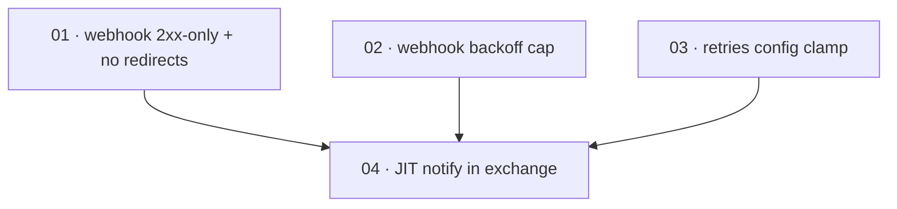

# Plan: Webhook user-sync conformance (JIT notify, 2xx-only, bounded backoff)

**Status:** Accepted · **Layout:** kanban · **Date:** 2026-07-02 · **Owner:** Ant Stanley · **Source spec:** [.specs/changes/2026-07-01-webhook_user_sync_conformance.md](../../changes/2026-07-01-webhook_user_sync_conformance.md)

This plan brings the user-sync path into line with its canonical contract along three axes, sequenced so the feature that adds request-path latency lands last, once its worst case is bounded. First it hardens the webhook adapter: delivery counts only a 2xx as success and stops following redirects so the HMAC-signed body is never re-POSTed cross-host (task 01), and the retry backoff is capped per attempt so a large `retries` cannot sleep for hours or overflow the shift (task 02). Then it clamps `[user_sync.webhook].retries` at config load so a misconfiguration cannot bypass the adapter bound (task 03). Finally it wires the JIT `notify_user_created` into the exchange flow — awaited, best-effort, like the admin flows — reviewed through the two adapter bounds and the config clamp that make its added `/token` latency acceptable (task 04). Four thin vertical slices, each provable with a `wiremock` or unit test.

---

## Source and definition-of-done baseline

- **Spec.** Change spec [`.specs/changes/2026-07-01-webhook_user_sync_conformance.md`](../../changes/2026-07-01-webhook_user_sync_conformance.md), targeting three canonical pages: [`02-ports-and-adapters.md` §Webhook adapter contract](../../service/specs/02-ports-and-adapters.md) (2xx-only, redirect policy, backoff cap), [`03-service-flows.md` §Token exchange](../../service/specs/03-service-flows.md) (exchange step 3 gains the JIT `notify_user_created`), and [`06-configuration.md` §`[user_sync]`](../../service/specs/06-configuration.md) (`retries` clamped, maximum 10). No type change: `WebhookConfig` keeps its shape; only its validation tightens.
- **Already built.** The admin flows already fire the best-effort user-sync notifications and log-and-continue on failure (`admin_create_user`/`admin_update_user`/`admin_delete_user`, `crates/core/src/service/user_admin.rs:13-82`) — the reference pattern the exchange flow mirrors. The webhook adapter already retries on 5xx and timeout/connect errors and does not retry 4xx, signs the raw body with HMAC-SHA256, and carries a `retries` field (`crates/adapters/src/webhook/mod.rs:34-98`). The `WebhookConfig` struct already exists with a redacted-`secret` `Debug` and an `Option<u32> retries` field (`crates/core/src/config.rs:179-196`), and `load_config` already deserializes it (`crates/server/src/bootstrap.rs:26-47`, retries read at `436`). The exchange flow already JIT-registers a user via `create_user` in the `None` registration branch (`crates/core/src/service/exchange.rs:131-137`). This code is a precondition; the plan changes its behaviour, it does not re-create it.
- **Definition of done.** Each task inherits [`.specs/development-guidelines.md`](../../development-guidelines.md) §"Definition of done" and §"Limits and bounds": behaviour exercised by a test, negative-space test for every new validation path, ≥2 meaningful assertions per new/touched function, every new bound a named constant in its module, and `cargo fmt` / `cargo clippy --workspace -- -D warnings` / `cargo nextest run --workspace` clean. Task files add only task-specific acceptance on top of this baseline.

---

## Task graph

The dependency table is the **source of truth**; the Mermaid graph visualizes it. If the two disagree, the table wins.

| Task | Depends on | Edge kind | Produces (reviewable artifact) |
|---|---|---|---|
| 01 · webhook 2xx-only + no redirects | — | — | only a 2xx is delivery success; a 3xx is a non-retried rejection and the client follows no redirects, so the signed body is never re-POSTed to an unconfigured host |
| 02 · webhook backoff cap | — | — | the per-attempt retry delay is capped at 5s and the shift can no longer overflow, so a large `retries` cannot sleep for hours or panic in debug |
| 03 · retries config clamp | — | — | `[user_sync.webhook].retries` is clamped at config load to a named maximum of 10, logging a warning when the configured value is reduced |
| 04 · JIT notify in exchange | 01, 02, 03 | review, review, review | a JIT-registered user triggers exactly one best-effort `user.created` notification; the exchange still returns a token when the webhook fails every attempt |

Each row keys a task by **number and title**, not a path link — find the file by globbing `*/NN-*.md` across the kanban subfolders. Every `Depends on` references a lower number.

---

## Implementation order and milestones

**Order:** `01, 02, 03, 04`. The three hardening tasks (01, 02, 03) are independent roots and could land in any order; they are numbered so the two adapter changes group together before the config clamp. Task 04 is scheduled last on purpose even though it is buildable at any time: it adds awaited, request-path latency to `/token`, and the change spec's own decision is that this latency is acceptable *because* the backoff is capped (02) and `retries` is clamped (03), and its best-effort semantics are cleanest to review once delivery success is 2xx-only (01). So 04 is reviewed *through* all three bounds — the auth-before-gated-features rule applied to a latency-introducing feature.

**Milestones:**

| Milestone | Tasks | Demonstrable when complete | Review gate |
|---|---|---|---|
| M1 — adapter and config hardening | 01, 02, 03 | a `wiremock` 302 is a delivery failure and no second host is contacted; a `retries = 20` run's per-attempt delay never exceeds 5s and does not panic; a config with `retries = 20` loads with `retries` clamped to 10 and a warning logged | `cargo nextest run -p oidc-exchange-adapters -p oidc-exchange-core` green, including the new redirect, backoff-cap, and clamp tests |
| M2 — JIT notify | 04 | a JIT exchange fires exactly one `user.created` webhook and still returns a token when the webhook 500s on every attempt | full `cargo nextest run --workspace` clean, including the new exchange JIT-notify test |

---

## Assumptions and open questions

**Assumptions**

- The change spec's decisions are settled and implemented as stated without revisiting: the webhook client uses `redirect::Policy::none()`, the per-attempt delay is capped at 5s, `retries` is clamped at 10, and the JIT notify is awaited (not spawned) and its result discarded. The plan implements these values as named constants.
- Merging the change spec's prose blocks into the three canonical pages (`02`, `03`, `06`), bumping each page's `**Date:**`, and flipping the change spec to `Merged` is handled by the change-spec merge process / orchestrator, not by a build task here. No domain type changes, so `canonical-types.schema.json` is untouched.
- No deployed webhook target relies on redirect-following or a 3xx-as-ack contract; operators point `url` at the final endpoint (the change spec's stated assumption).
- The exchange flow already exposes `self.user_sync` on `AppService` (the admin flows use it), so the JIT notify needs no new port wiring.

**Decisions**

- *Adapter concerns split into two tasks.* **Task 01 covers delivery-success semantics (2xx-only plus redirects disabled) and task 02 covers the backoff bound** — although both edit `crates/adapters/src/webhook/mod.rs`, they assert different behaviours (what counts as success and never leaking the signed body, versus never sleeping for hours or overflowing) and each is a one-sitting review with its own focused test.
- *The config clamp is defence in depth, kept separate.* **Task 03 clamps `retries` at config load independently of task 02's per-attempt cap.** Either bound alone prevents an hours-long synchronous hang; keeping both means a bypass of one does not remove the protection, and the config change is reviewed against `06-configuration.md` rather than the adapter contract.
- *The latency-introducing feature lands last.* **Task 04 depends on 01, 02, and 03 by review edges, not build edges** — the JIT notify compiles without them, but the spec accepts its added `/token` latency only because those bounds are in place, so it is reviewed through them.
- *Backoff delay extracted for testing.* **Task 02 pulls the per-attempt delay into a pure helper so the cap can be unit-tested at `retries = 20` without sleeping** for the accumulated real time, keeping the negative-space test fast and deterministic.

**Open questions**

- (None at this stage.)
