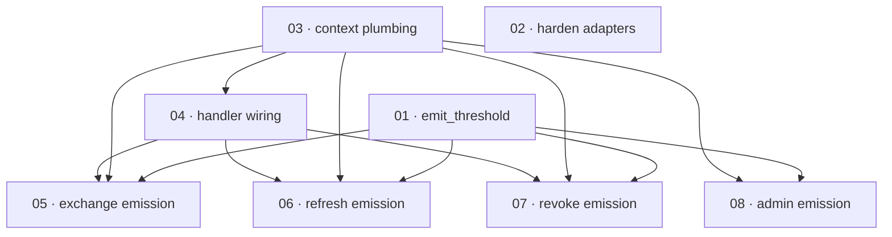

# Plan: Wire audit event emission into the service flows

**Status:** Done · **Layout:** kanban · **Date:** 2026-07-02 · **Owner:** Ant Stanley · **Source spec:** [.specs/changes/2026-07-01-wire_audit_event_emission.md](../../changes/2026-07-01-wire_audit_event_emission.md)

This plan turns the dead audit pipeline into a live one. `AppService::emit_audit` exists and is
tested but has no production call site; the `AuditContext` middleware extracts client headers that
nothing consumes; the core request structs and `create_audit_event` hardcode client fields to
`None`; and the two real audit adapters undermine the design (stdout panics on write errors, sqs
detects FIFO with a substring). The work is decomposed into eight task packages: three foundation
packages make the audit machinery correct and gated (an `emit_threshold` filter, hardened adapters,
client-context plumbing through the core request structs and `create_audit_event`), one integration
package wires the HTTP handlers to thread real client context, and four emission packages call
`emit_audit` from the exchange, refresh, revocation, and admin flows the spec names. The
reviewability spine leads with the machinery foundations and the handler wiring, so every emission
flow that follows is exercised end to end through a real request with client headers. No canonical
type or schema changes.

---

## Source and definition-of-done baseline

- **Spec.** Change spec [.specs/changes/2026-07-01-wire_audit_event_emission.md](../../changes/2026-07-01-wire_audit_event_emission.md). In scope: the `[audit]` configuration and `emit_audit` filter ([06-configuration](../../service/specs/06-configuration.md), [07-telemetry-and-audit](../../service/specs/07-telemetry-and-audit.md)); the session client-context population ([01-domain-model](../../service/specs/01-domain-model.md) §Session); the audit emission points across the flows ([03-service-flows](../../service/specs/03-service-flows.md)); and the handler consumption of `AuditContext` ([04-http-api](../../service/specs/04-http-api.md) §Middleware stack).
- **Already built (preconditions, not tasks).** `AppService::emit_audit` with its fallback-and-blocking-threshold logic (`crates/core/src/service/mod.rs:102`); `create_audit_event` (`mod.rs:132`) and `parse_severity` (`mod.rs:153`); the `AuditContext` middleware and its layer, already installed at `crates/server/src/bootstrap.rs:135` (`crates/server/src/middleware/audit_context.rs`); all `AuditEventType` variants (`crates/core/src/domain/audit.rs:39`, including the reserved `SessionRevoked`); `Session` already carries `device_id`/`user_agent`/`ip_address`; `AuditEvent` already carries `ip_address`/`user_agent` (no `device_id`); the existing `emit_audit` tests (`crates/core/tests/audit.rs`). No type or `canonical-types.schema.json` change is required.
- **Definition of done.** Each task inherits [.specs/development-guidelines.md](../../development-guidelines.md) §"Definition of done" and §"Limits and bounds": behaviour exercised by a test, negative-space tests for every new validation path, at least two meaningful assertions per touched function, every new bound a named constant, and `cargo fmt` / `cargo clippy --workspace -- -D warnings` / `cargo nextest run --workspace` clean. Task files add only task-specific acceptance on top.

---

## Task graph

The dependency table is the **source of truth**; the Mermaid graph visualizes it. If the two ever
disagree, the table wins — fix the graph to match.

| Task | Depends on | Edge kind | Produces (reviewable artifact) |
|---|---|---|---|
| 01 · emit_threshold | — | — | `emit_audit` drops sub-threshold events before any adapter dispatch; `[audit] emit_threshold` config key with `info` default |
| 02 · harden_audit_adapters | — | — | stdout adapter returns `AuditError` on write failure instead of panicking; sqs adapter uses `ends_with(".fifo")` and per-event `message_group_id` |
| 03 · client_context_plumbing | — | — | core request structs carry `ip_address`/`user_agent`/`device_id`, sessions are populated from them, `create_audit_event` takes the context |
| 04 · server_handler_wiring | 03 | build | `/token` and `/revoke` handlers thread `AuditContext` into the core requests; a real exchange stores a session with the request's ip/ua/device |
| 05 · exchange_flow_emission | 01, 03, 04 | build, build, review | the exchange flow emits `UserSuspended` / `RegistrationDenied` / `UserCreated` / `TokenExchange` with client context |
| 06 · refresh_flow_emission | 01, 03, 04 | build, build, review | the refresh flow emits `ValidationFailed` (debug) / `UserSuspended` / `TokenRefresh` |
| 07 · revoke_flow_emission | 01, 03, 04 | build, build, review | the revocation flow emits `AllSessionsRevoked` / `TokenRevocation`, silent on failed verification |
| 08 · admin_operations_emission | 01, 03 | build, build | admin mutations emit `UserCreated` / `UserUpdated` / `UserSuspended` / `UserDeleted`; reads emit nothing |

Each row keys a task by its **number and title**, not a path link — a task file moves between
subfolders as it is built, found by globbing its number across the subfolders (`*/NN-*.md`). Every
`Depends on` references a **lower** task number. Edge kind names why the dependency exists.

---

## Implementation order and milestones

**Order:** `01, 02, 03, 04, 05, 06, 07, 08`. The three foundation packages lead: `01` (the
`emit_threshold` pre-dispatch filter) and `03` (the client-context plumbing through the request
structs and `create_audit_event`) are hard build dependencies of every emission flow, so they land
first; `02` (adapter hardening) is independent of everything but belongs with the machinery
foundations that make `emit_audit`'s fallback path meaningful. `04` (handler wiring) is the
integration enabler the flow-emission packages are reviewed through — once it lands, a real request
with client headers threads into the core, so each emission flow is exercisable end to end rather
than only via a hand-built core request. `05` (exchange) leads the emission flows as the primary
vertical slice; `06`/`07`/`08` follow. `08` (admin) carries no HTTP client context, so it does not
depend on `04`.

**Milestones:**

| Milestone | Tasks | Demonstrable when complete | Review gate |
|---|---|---|---|
| M1 — audit machinery | 01, 02, 03 | `emit_audit` drops a debug event under the default `info` threshold and blocks per the existing rules; the stdout adapter returns `AuditError` on a write failure; the sqs adapter groups FIFO messages per event; a core-level exchange with a client-context `ExchangeRequest` stores a session carrying that ip/ua/device | `cargo nextest run --workspace` green; new negative-space tests for the threshold filter and the stdout write failure present |
| M2 — edge integration | 04 | a real `POST /token` with `X-Forwarded-For` / `User-Agent` / `X-Device-Id` stores a session whose `ip_address`/`user_agent`/`device_id` match the headers | end-to-end handler test asserting the session fields; M1 gate still green |
| M3 — flow emission | 05, 06, 07, 08 | each named flow emits its named `AuditEvent` (with ip/ua on exchange/refresh/revoke); `ValidationFailed` stays silent under the default threshold and appears when it is lowered to `debug`; reads emit nothing | per-flow emission tests via `MockAuditLog`; full suite green |

---

## Assumptions and open questions

**Assumptions**

- The canonical `AuditEvent` shape is settled: events record `ip_address`/`user_agent` and carry no
  `device_id`; `device_id` lives only on the `Session`. No schema change is in scope.
- `X-Forwarded-For` is set by a trusted proxy (per [04-http-api](../../service/specs/04-http-api.md)); the service records it verbatim without validating the trust chain.
- The committed default audit adapter stays `noop`, so wiring emission changes nothing for
  deployments that have not opted into stdout or sqs auditing — emission tests use `MockAuditLog`.

**Decisions**

- *Foundations before flows.* **The `emit_threshold` filter (01), adapter hardening (02), and
  context plumbing (03) precede every emission package.** Emission call sites depend on the new
  `emit_audit` gating and the new `create_audit_event` signature, so they cannot be reviewed until
  the machinery is correct.
- *Handler wiring is the review enabler.* **`04` lands before the exchange/refresh/revoke emission
  flows.** Those flows record client context; wiring the handlers first means each emission flow is
  reviewed end to end through a real request rather than only a synthetic core request.
- *Admin is its own slice with no HTTP context.* **`08` depends on `01` and `03` but not `04`.**
  Admin routes carry no `AuditContext`; admin audit events record no ip/ua, and admin audit failures
  follow `emit_audit`'s blocking rules unlike best-effort user sync.
- *Suspension audits `UserSuspended`.* **Every suspension rejection (exchange and refresh) emits
  `UserSuspended`, not `Unauthorized`.** Resolves the 03-service-flows open question; `05` and `06`
  carry it.
- *`SessionRevoked` stays reserved.* **No `AuditEventType` variant is added or removed.** The plan
  wires existing variants; the reserved variant is a precondition, not a task.

**Open questions**

- (None at this stage.)
