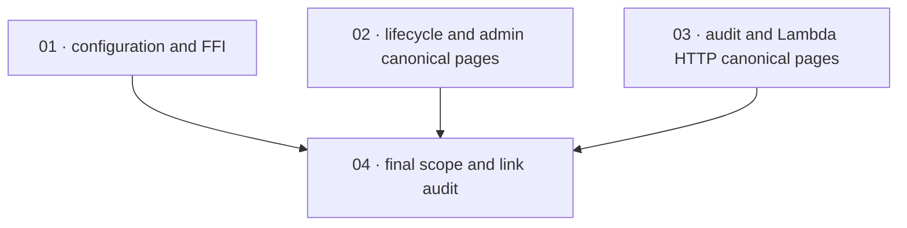

# Apply unmerged change-spec blocks

**Status:** Done · **Layout:** kanban · **Date:** 2026-08-05 · **Owner:** Ant Stanley · **Source change:** `spec/apply-unmerged-change-spec-blocks` / PR #29

This documentation-only PR applies the `Proposed changes` and resolved-open-question blocks from four already-merged change specs that were never copied into their canonical pages. The branch diff is confined to six canonical Markdown pages; no production code, schemas, source change specs, README index, or certificates are in scope. The four source specs are: [complete config loading](../../changes/merged/2026-07-01-complete_config_loading.md), [enforce user lifecycle transitions](../../changes/merged/2026-07-01-enforce_user_lifecycle_transitions.md), [implement Lambda runtime](../../changes/merged/2026-07-01-implement_lambda_runtime.md), and [wire audit event emission](../../changes/merged/2026-07-01-wire_audit_event_emission.md).

---

## Scope and definition-of-done baseline

- **Branch-diff scope.** Exactly these canonical pages: [bindings FFI core](../../bindings/specs/01-ffi-core.md), [domain model](../../service/specs/01-domain-model.md), [service flows](../../service/specs/03-service-flows.md), [HTTP API](../../service/specs/04-http-api.md), [configuration](../../service/specs/06-configuration.md), and [telemetry and audit](../../service/specs/07-telemetry-and-audit.md).
- **Coverage source.** The four source change specs above define every required block. Their merge plans require applying the blocks and bumping each changed canonical page's date; the PR has already made those canonical edits.
- **Out of scope.** No behavior implementation, test/code changes, canonical-type/schema change, change-spec status/move, `.specs/README.md` update, or additional correction is authorized by this unstacked PR. Do not plan the already-done implementation work represented by the historical `done/` plans.
- **Task-package DoD.** For each package: every listed source block is present with equivalent semantics in its target canonical page; all applicable resolved open questions are removed; the page's date is `2026-08-05`; all Markdown links introduced or relied on by the package resolve; and the package changes no out-of-scope path. Repository-wide code-test commands from [development guidelines](../../development-guidelines.md#definition-of-done) are not applicable to this Markdown-only, already-applied documentation PR; use link/scope/content review instead.
- **Certificate omission.** Intentional: no done certificates are created. Execution evidence is recorded in the completed task packages.
- **Index ownership.** `spec/apply-unmerged-change-spec-blocks` is the active plan index for this PR and must remain set to `@-`.

---

## Task graph

The dependency table is the source of truth; the graph is a visualization and must match it.

| Task | Status | Depends on | Edge kind | Produces |
|---|---|---|---|---|
| 01 · configuration_and_ffi | Done | — | — | Complete-config-loading blocks on `01-ffi-core.md`, `04-http-api.md`, and `06-configuration.md` |
| 02 · lifecycle_and_admin_canonical_pages | Done | — | — | Lifecycle-transition blocks on `01-domain-model.md`, `03-service-flows.md`, and `04-http-api.md` |
| 03 · audit_and_lambda_http_canonical_pages | Done | — | — | Audit-emission blocks on `01-domain-model.md`, `03-service-flows.md`, `04-http-api.md`, `06-configuration.md`, `07-telemetry-and-audit.md`, plus Lambda blocks on `04-http-api.md` and `06-configuration.md` |
| 04 · final_scope_and_link_audit | Done | 01, 02, 03 | review | One PR-level verification that all source blocks, dates, scope limits, task links, status, and DAG are correct |

Every dependency points to a lower task number. Tasks 01–03 are independent content packages; task 04 is the sole integration/review gate.

---

## Coverage matrix

| Source change spec | Required canonical targets | Owning task |
|---|---|---|
| `2026-07-01-complete_config_loading.md` | `01-ffi-core.md`, `04-http-api.md`, `06-configuration.md` | 01 |
| `2026-07-01-enforce_user_lifecycle_transitions.md` | `01-domain-model.md`, `03-service-flows.md`, `04-http-api.md` | 02 |
| `2026-07-01-wire_audit_event_emission.md` | `01-domain-model.md`, `03-service-flows.md`, `04-http-api.md`, `06-configuration.md`, `07-telemetry-and-audit.md` | 03 |
| `2026-07-01-implement_lambda_runtime.md` | `04-http-api.md`, `06-configuration.md` | 03 |

All six branch-diff paths are covered. `04-http-api.md` is deliberately split between tasks by source change spec; task 04 checks the combined page without changing its ownership boundaries.

---

## Implementation order

**Order:** `01, 02, 03, 04`. Packages 01–03 can be performed in parallel because they own disjoint source-spec block sets, even where those blocks land on the same canonical page. Complete task 04 last to validate the combined diff and prevent scope creep.

## Assumptions and decisions

- The four named merged change specs are the authoritative sources for this PR; “unmerged” in the branch name means their blocks were previously unmerged into canonical pages, not that the change specs remain unmerged.
- Equivalent canonical prose is acceptable where the PR consolidates adjacent source blocks without changing their stated semantics.
- The canonical pages and all four task packages are **Done**; their execution evidence records the independent content and final-scope gates.
- No open questions remain for this scoped planning work.
