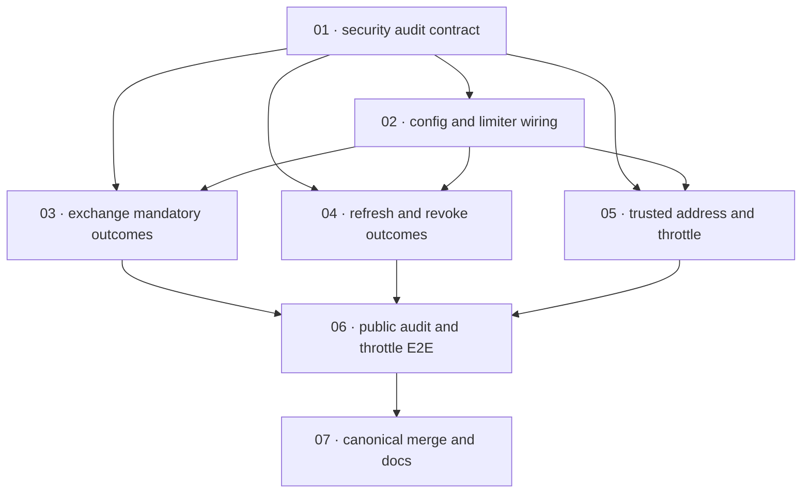

# Plan: Audit and throttle authentication failures

**Status:** Reviewed · **Layout:** kanban · **Date:** 2026-08-05 · **Owner:** Ant Stanley · **Source spec:** [.specs/changes/2026-08-05-audit_and_throttle_authentication_failures.md](../../changes/2026-08-05-audit_and_throttle_authentication_failures.md)

Deliver a reviewable security path in three stages: first establish typed security outcomes, address provenance, rate-limit contracts, and validated configuration; then make public authentication flows emit mandatory security records and enforce the rate budgets; finally attach trusted client-address resolution, public-route throttling, access logging, deployment guidance, and canonical merge updates. The implementation order starts with the core contract that every later path is reviewed through, then exposes a complete `/token` and `/revoke` path before the HTTP-boundary controls are added.

---

## Source and definition-of-done baseline

- **Spec.** The source change spec's Proposed changes, Type changes, Implementation notes, Merge plan, and Assumptions and open questions. In scope are the listed changes to service canonical pages `00`, `01`, `02`, `03`, `04`, `06`, `07`, the service index, service canonical type schema, `crates/core`, `crates/server`, `crates/adapters`, `config/default.toml`, server/core tests, and the Linux server deployment guide. This unstacked plan does not implement sibling changes.
- **Canonical targets.** [.specs/service/specs/00-overview.md](../../service/specs/00-overview.md), [01-domain-model.md](../../service/specs/01-domain-model.md), [02-ports-and-adapters.md](../../service/specs/02-ports-and-adapters.md), [03-service-flows.md](../../service/specs/03-service-flows.md), [04-http-api.md](../../service/specs/04-http-api.md), [06-configuration.md](../../service/specs/06-configuration.md), [07-telemetry-and-audit.md](../../service/specs/07-telemetry-and-audit.md), [service README](../../service/README.md), and [service canonical types](../../service/specs/canonical-types.schema.json).
- **Already built.** `AuditEvent`, `AuditLog`, `AppService::emit_audit`, existing flow call sites, `AuditContext`, audit adapters, router middleware, and test mocks already exist, but have the defects enumerated by the source spec. Existing audit tests deliberately assert suppression and missing failure records, so they are migration targets rather than preconditions. `cargo test --workspace` is already red on this branch because three unrelated `providers.*.adapter` configuration tests are missing; this plan records and preserves that baseline rather than fixing it.
- **Definition of done.** [.specs/development-guidelines.md](../../development-guidelines.md) §Limits and bounds and §Definition of done govern every task: appropriate positive and negative tests, meaningful assertions, named constants for bounds, Rust format/clippy/nextest gates, and synchronized prose/schema for domain-type changes. Each task adds scoped acceptance and must report the existing `cargo test --workspace` failure separately without remediating it.
- **Certificates.** Done certificates are explicitly forbidden by the request. No certificate files are authored; the certificate checklist is intentionally inapplicable for this plan.

---

## Task graph

The dependency table is the **source of truth**; the Mermaid graph visualizes it. If the two disagree, the table wins.

| Task | Depends on | Edge kind | Produces (reviewable artifact) |
|---|---|---|---|
| 01 · security audit contract | — | — | typed `SecurityEvent`, `ClientAddr`, audit provenance, and `RateLimiter` port contracts with mock/noop support |
| 02 · configuration and limiter wiring | 01 | contract, build | validated audit durability, trusted-proxy, and bounded rate-limit configuration wired into service construction |
| 03 · exchange mandatory outcomes | 01, 02 | contract, build | `/token` exchange records exactly one classified security outcome, fails closed on enforce-mode audit failure, and applies provider/subject budgets |
| 04 · refresh and revoke mandatory outcomes | 01, 02 | contract, build | refresh and revoke record exactly one classified security outcome while preserving RFC 7009 indistinguishability under enforce mode |
| 05 · trusted address and public-route throttle | 01, 02 | contract, build | public routes resolve observed/trusted-forwarded addresses, throttle before provider work, return 429, and emit access records |
| 06 · public audit and throttle end-to-end | 03, 04, 05 | review | router-level tests demonstrate mandatory recording, provenance, limits, retry headers, no outbound work after denial, and baseline preservation |
| 07 · canonical merge and deployment documentation | 06 | review | canonical specs, schema, service index, deployment guidance, change-spec merge housekeeping, and `.specs` index accurately describe the shipped behavior |

Every dependency points to a lower-numbered task. No task bodies appear here; task packages are in `backlog/`.

---

## Implementation order and milestones

**Order:** `01, 02, 03, 04, 05, 06, 07`. Task 01 leads because the security-event, address, and limiter contracts are reviewed through by configuration, core flows, and middleware. Task 02 makes those contracts constructible with bounded, validated settings. Tasks 03 and 04 form two independently reviewable core-flow slices before task 05 joins them to the public HTTP edge. Task 06 is the first full public-route proof, and task 07 follows only after behavior is verified so documentation is a truthful final record.

**Milestones:**

| Milestone | Tasks | Demonstrable when complete | Review gate |
|---|---|---|---|
| M1 — typed and configured security controls | 01, 02 | a service can construct mandatory audit outcomes and a bounded rate limiter from validated configuration | targeted core/config tests pass; `cargo fmt --check --all` and `cargo clippy --workspace -- -D warnings` pass |
| M2 — mandatory core outcomes | 03, 04 | exchange, refresh, and revoke each yield one classified security event, with enforce-mode failure behavior exercised | targeted core-flow tests prove single-exit outcomes, cleanup, and revocation indistinguishability |
| M3 — public boundary enforcement | 05, 06 | a public caller reaches `/token` through trusted address resolution, throttle, audit, access logging, and 429 behavior without excess provider work | server E2E tests pass; baseline `cargo test --workspace` remains red only on the known three missing `providers.*.adapter` tests |
| M4 — canonical reconciliation | 07 | canonical pages, schema, documentation, and change-spec/index lifecycle all describe the reviewed implementation | link, coverage, and schema/prose checks pass; no unrelated baseline failure is changed |

---

## Coverage map

| Source requirement | Tasks |
|---|---|
| 01-domain-model: SecurityEvent, ClientAddr, AuditEvent provenance, ThrottleExceeded | 01, 07 |
| 02-ports-and-adapters: RateLimiter port and in-process/noop inventory | 01, 02, 07 |
| 03-service-flows: terminal mandatory outcomes, audit durability, exchange/refresh/revoke/admin behavior | 03, 04, 07 |
| 04-http-api: client address, throttle, access log, 429 mapping, ConnectInfo, proxy assumptions | 05, 06, 07 |
| 06-configuration: defaults, durability, rate limits, trusted proxies, load validation | 02, 07 |
| 07-telemetry-and-audit: mandatory/best-effort channels and default stdout | 01, 03, 04, 07 |
| 00-overview and service README: scope, goals, port/crate counts | 07 |
| canonical-types.schema.json: ClientAddrSource, AuditEventType, AuditEvent | 01, 07 |
| Implementation notes and required tests | 01–06 |
| Merge plan | 07 |

---

## Assumptions and open questions

### Assumptions

- This is an unstacked PR. It may mention sibling work only as a dependency or conflict and must not include sibling implementation, canonical edits, or tests in its task scope.
- The source spec's `observe`-first durability release decision is implemented by this PR; changing the default to `enforce` is a later release action, not a separate task here.
- The rate limiter remains an in-process backstop, with edge infrastructure providing coarse global protection.
- The three existing `providers.*.adapter` configuration-test failures are baseline noise. Tasks must not alter their behavior or claim a green workspace test run until they are repaired separately.

### Decisions

- *Certificate omission.* **We omitted done certificates.** The user explicitly forbade them; task DoDs remain the completion criteria and the plan records the omission for downstream builders.
- *Vertical core-first spine.* **We ordered typed contracts, configuration, and one complete core flow before HTTP middleware.** This exposes mandatory audit semantics before integration mechanics and lets task 06 review all public-route controls together.
- *Sibling containment.* **We treated refresh-token rotation/reuse detection, revoke-token claim validation, secret-leakage remediation, telemetry exporters, and other workspace PRs as external work.** Where their assumptions touch audit or revoke semantics, this plan calls out coordination rather than absorbing their changes.

### Open questions

- *Mandatory audit buffering.* Does the mandatory channel need a bounded local durable buffer so `enforce` tolerates transient sink outages? It does not block tasks 01–07 because the change spec selects synchronous `observe`/`enforce` behavior, but it blocks any later durability-buffer design.
- *Best-effort threshold retirement.* Should `emit_threshold` be removed once all shipped flows emit mandatory `SecurityEvent`s, after confirming FFI embedders do not rely on `emit_audit`? This is a follow-up, not scope for this unstacked PR.
- *Budget calibration.* What per-IP budget is appropriate behind a large NAT after observe-only telemetry? Task 02 implements the specified bounded configuration and defaults; production calibration remains open.
- *Session address provenance.* Should `Session.ip_address` gain provenance with an adapter storage migration? It is intentionally excluded; this plan limits provenance to audit records.
- *Sibling dependency — revoke validation.* The sibling `2026-08-05-validate_revoke_token_claims` change also edits revoke behavior and references `audit.durability`. Coordinate cherry-pick/order and reconcile canonical `03-service-flows` text, but do not implement its token-claim validation here.
- *Sibling dependency — refresh rotation.* The sibling `2026-08-05-rotate_refresh_tokens_with_reuse_detection` changes refresh behavior and audit event taxonomy. Coordinate the final `AuditEventType` and refresh-flow merge, but do not add rotation, family persistence, or reuse detection here.
- *Sibling dependency — secret leakage.* The sibling `2026-08-05-eliminate_secret_leakage_in_logs_and_spans` owns adapter-side secret/span remediation. This plan only uses fixed audit reason classifications and must not fold in its newtypes or adapter changes.
- *Boundary-rejected requests.* Should malformed forms and unknown `grant_type` rejected before the core create a `SecurityEvent`, or does the public access log suffice? The source spec leaves this open; task 06 covers the core-reached failure classes only.
