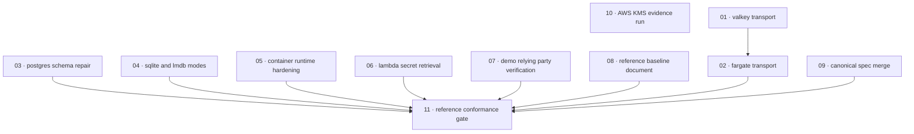

# Plan: Baseline reference deployments

**Status:** Review-ready · **Layout:** kanban · **Date:** 2026-08-05 · **Owner:** Ant Stanley · **Source spec:** [changes/2026-08-05-baseline_reference_deployments.md](../../changes/2026-08-05-baseline_reference_deployments.md)

**Review verdict:** xhigh remediation pass complete for plan/index only. Source coverage, link integrity, DoDs, acyclic ordering, external-boundary handling, and the no-certificate rule are represented in the plan; no source code or canonical spec pages were changed.

Remediate each independently reviewable deployment defect before adding the baseline and its blocking conformance gate. The plan leads with the adapter and template paths that must be correct before the gate can enforce them, while the normative baseline document proceeds in parallel. The manual AWS/KMS validation remains an independent evidence task and does not absorb the sibling KMS algorithm fix.

---

## Source and definition-of-done baseline

- **Spec.** [`.specs/changes/2026-08-05-baseline_reference_deployments.md`](../../changes/2026-08-05-baseline_reference_deployments.md), especially *Proposed changes*, *Implementation notes*, *Compatibility*, and *Assumptions and open questions*. The plan covers every affected canonical target named there: [bindings distribution](../../bindings/specs/05-distribution.md), [persistence](../../service/specs/08-persistence.md), [configuration](../../service/specs/06-configuration.md), and [architecture principles](../../architecture-principles.md).
- **Already built.** The current branch provides the deployable examples, CI workflow, adapter migrations, Lambda bootstrap/config placeholder resolution, and demo application. The code read (re-verified 2026-08-25 against post-merge `main`) confirmed the defects remain: `fred` lacks a TLS feature (`crates/adapters/Cargo.toml:33`), SQLite creates its file through `sqlx` (`crates/adapters/src/sqlite/mod.rs:106-116`, `create_if_missing(true)`), the old Postgres example index remains (`examples/linux-postgres/init.sql:14`, while the adapter's own migrations already converge on the partial `(external_id, provider) WHERE status != 'deleted'` index), and the demo loader only decodes the JWT (`examples/aws-web/demo-app/src/routes/authenticated/+page.server.ts:5-35`). These are implementation targets, not completed work.
- **Definition of done.** Every task inherits [`.specs/development-guidelines.md` §Definition of done](../../development-guidelines.md): behavior and negative-space tests, meaningful assertions in touched functions, named constants for bounds, and applicable Rust/TypeScript/Python format, lint, typecheck, and test gates. Task-specific DoDs add the change-spec acceptance. Done certificates are explicitly omitted at the requester’s direction; no certificate files were authored, and the done-certificate checklist does not apply.
- **Review constraints.** The review and remediation stay inside `.specs/plans/2026-08-05-baseline_reference_deployments/`; source code, canonical specs, and certificates remain untouched in this pass.
- **Sibling dependencies, not scope.** The plan consumes `oidc-exchange config check` from [`2026-08-05-resolve_config_placeholders_all_channels.md`](../../changes/merged/2026-08-05-resolve_config_placeholders_all_channels.md); consumes the durable-audit outcome (`audit.durability`) from [`2026-08-05-audit_and_throttle_authentication_failures.md`](../../changes/merged/2026-08-05-audit_and_throttle_authentication_failures.md); coordinates the AWS KMS algorithm fix with [`2026-08-05-fail_closed_across_config_and_adapters.md`](../../changes/merged/2026-08-05-fail_closed_across_config_and_adapters.md); and leaves release provenance, installer, advisory, and `.gitignore` work to [`2026-08-05-harden_release_supply_chain.md`](../../changes/merged/2026-08-05-harden_release_supply_chain.md). **All four siblings are now merged on `main`** — `config check` (positional env-free and `--dir`/`--file` env-aware forms), typed `audit.durability`, the KMS JWS-name algorithm domain, and the supply-chain gates are available to build against — so the external gates this plan cited are lifted and no task is blocked on a sibling any longer.

---

## Task graph

The dependency table is the **source of truth**; the Mermaid graph visualizes it. If the two ever disagree, the table wins — fix the graph to match.

| Task | Depends on | Edge kind | Produces (reviewable artifact) |
|---|---|---|---|
| 01 · Valkey transport | — | — | a TLS-capable Valkey client with a regression proving `rediss://` selects TLS |
| 02 · Fargate transport | 01 | contract, review | an ECS/Fargate template that uses authenticated TLS Valkey and never forwards plaintext unless an explicit testing-only opt-in is set |
| 03 · Postgres schema repair | — | — | an example schema and adapter migrations that converge on the partial live-user uniqueness index |
| 04 · SQLite and LMDB restrictive modes | — | — | generated local authentication state is owner-only across permitted umasks, and SQLite bootstrap is atomic |
| 05 · Container runtime hardening | — | — | digest-pinned, non-root image and restricted Kubernetes reference workload |
| 06 · Lambda secret retrieval | — | — | the AWS Lambda reference template reads the Google secret at runtime without synthesizing its value |
| 07 · Demo relying party verification | — | — | a reusable JWKS-backed verifier and demo auth gate that rejects invalid access tokens |
| 08 · Reference baseline document | — | — | a versioned operator-facing baseline whose rules map to B1–B7 |
| 09 · Canonical spec merge | — | — | canonical distribution, persistence, configuration, and architecture pages state the intended baseline |
| 10 · AWS KMS evidence run | — | — | a recorded, reproducible result for first-request `/token` and `/keys` on both AWS reference deployments |
| 11 · Reference conformance gate | 02, 03, 04, 05, 06, 07, 08, 09 | build, contract, review | blocking CI coverage for the baseline across discovered templates and cross-layer tests |

---

## Implementation order and milestones

**Order:** `01, 02, 03, 04, 05, 06, 07, 08, 09, 10, 11` (no external sibling gates remain — see Sibling dependencies above) — Task 01 leads Task 02 because a `rediss://` declaration is unsafe until the client actually supports TLS. The independent remediations and normative work then proceed as reviewable slices; Task 11 follows all controls and canonical rules so it can be made blocking rather than landing as a permanent failing report. Task 10 is independent and runs early when credentials and an AWS account are available, without delaying code work.

**Milestones:**

| Milestone | Tasks | Demonstrable when complete | Review gate |
|---|---|---|---|
| M1 — encrypted reference paths | 01, 02, 06 | a reviewer can inspect plans/synthesis and see Fargate’s TLS-first listener, TLS Valkey, and Lambda runtime secret retrieval | Valkey TLS regression, Terraform plans across listener permutations, and CDK synth complete with no secret literal |
| M2 — durable and restricted templates | 03, 04, 05 | a reviewer can migrate drifted local stores and run the digest-pinned, non-root container workload under restricted settings | adapter regression tests and manifest/image policy checks pass |
| M3 — verified consumer and normative baseline | 07, 08, 09, 10 | a reviewer can exercise a rejecting relying-party gate, read the baseline, inspect canonical statements, and review recorded AWS evidence | TypeScript verifier tests and canonical/doc link review pass; AWS evidence is recorded or a documented external blocker is captured |
| M4 — enforced reference surface | 11 | CI discovers every shipped template, checks baseline conformance, and blocks regressions after remediation | `reference-baseline` is blocking and all required CI jobs pass |

---

## Assumptions and open questions

**Assumptions**

- `oidc-exchange config check` is delivered by the configuration-placeholder sibling before the configuration portion of Task 11 is made blocking; the remaining gate portions remain independently deliverable.
- The plan must remain acyclic: Task 01 precedes Task 02 because the `fred` TLS feature is a prerequisite for a truthful `rediss://` deployment, and Task 11 waits for Tasks 02–09 so it can become blocking rather than a permanent failing report.
- The current external AWS credentials, accounts, and cost controls are available to perform Task 10; otherwise the task records the unavailable prerequisite and no code change is inferred from it.
- The baseline scanner will be selected during Task 11 only after its rules can be traced to Task 08’s baseline document.

**Decisions**

- *Control-before-gate sequencing.* **We placed the conformance gate last.** The source spec requires remediations first because the current templates would otherwise fail the gate, while all remediation tasks remain independently reviewable.
- *External boundaries stay explicit.* **Any task that depends on an external service or credential path names that boundary and records the fallback or blocker.** This keeps AWS, KMS, and config-check prerequisites from being mistaken for local implementation work.
- *Valkey ordering.* **We placed the `fred` TLS feature and proof before Fargate’s `rediss://` URL.** This prevents infrastructure from claiming encrypted transport while the runtime silently downgrades it.
- *Canonical merge scope.* **We isolated canonical-page updates in Task 09.** This keeps the implemented behavior in focused changes and gives the normative edits a direct, auditable review surface before CI enforces them.
- *Certificates.* **We omitted done certificates.** The requester explicitly forbade them; task DoDs remain the acceptance protocol.

**Open questions**

- *Postgres bootstrap ownership.* Should `examples/linux-postgres/init.sql` and its compose mount be deleted instead of corrected, and does any deployment require DDL before application startup? This blocks the final choice inside Task 03 but not the required adapter self-repair.
- *Direct secret references.* Should service configuration resolve secret-store references directly instead of retaining the Lambda exec wrapper? This is outside Task 06 and blocks no planned task.
- *Compose runtime probing.* Should compose examples be started and probed on every PR in addition to static and workspace checks? This may extend Task 11’s final gate.
- *Policy scanner.* Which pinned scanner produces a small traceable ruleset without normalizing exceptions? This blocks the exact implementation mechanism of Task 11.
- *Framework sample scope.* Should Node.js and Python framework samples receive hardening beyond B7 verification behavior? This is not absorbed by Task 07 or Task 11.
- *No-certificate rule.* **This plan deliberately excludes done certificates and any certificate file creation.** The requester forbade certificates, so the remediation stays in plan/index only.
