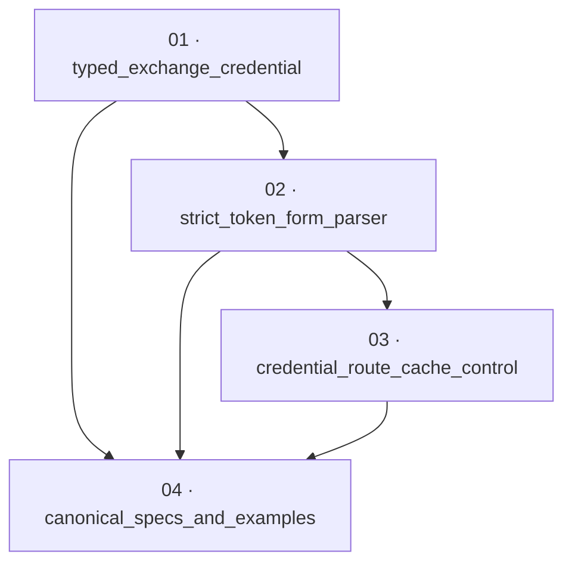

# Bind `grant_type` at the token endpoint — implementation plan

**Status:** Ready · **Layout:** kanban · **Date:** 2026-08-05 · **Owner:** Ant Stanley · **Source spec:** [.specs/changes/merged/2026-08-05-bind_grant_type_at_token_endpoint.md](../../changes/merged/2026-08-05-bind_grant_type_at_token_endpoint.md)

This unstacked-on-`main` plan fixes the token-endpoint grant-confusion vulnerability by making the declared `grant_type` the only selector of the executed flow. It first makes exchange credentials unrepresentable as a mixture of optional fields, then parses the wire form into that type at the HTTP boundary, protects credential-bearing responses with route-scoped cache directives, and finally synchronizes the canonical service specification and binding examples. The plan does not implement the separately proposed id-token grant gate/replay protection or revoke-claim validation; those are external proposed changes and are not prerequisites for this scoped security fix.

No done certificates will be created. The user explicitly forbade certificate files; task packages remain in `backlog/` until implementation moves them through the kanban, and completion evidence belongs in the implementation PR/review rather than `done/*-certificate.md` files.

---

## Source and definition-of-done baseline

- **Source change spec:** [2026-08-05-bind_grant_type_at_token_endpoint.md](../../changes/merged/2026-08-05-bind_grant_type_at_token_endpoint.md), specifically its affected canonical pages, implementation notes, compatibility section, and decisions.
- **Canonical targets:** [00-overview.md](../../service/specs/00-overview.md), [01-domain-model.md](../../service/specs/01-domain-model.md), [03-service-flows.md](../../service/specs/03-service-flows.md), [04-http-api.md](../../service/specs/04-http-api.md), and [service canonical-types.schema.json](../../service/specs/canonical-types.schema.json).
- **Guidelines:** [.specs/development-guidelines.md](../../development-guidelines.md), especially HTTP-boundary validation, invalid-state prevention, handler/core separation, negative-space testing, canonical-schema synchronization, and the Rust format/clippy/test gates.
- **Current implementation facts:** `ExchangeRequest` is `Default` and exposes optional `code`, `redirect_uri`, and `id_token` fields; `AppService::exchange` selects the direct-token path by `id_token` field presence; `TokenForm` has a required `String` `grant_type`; `public_routes` mounts `/token` and `/revoke` with the cacheable public endpoints; `MockIdentityProvider` does not currently record calls.
- **Current tests to preserve:** `crates/server/tests/routes.rs` already covers unknown grant → `400 unsupported_grant_type`, missing code → `400 invalid_request`, successful code exchange, discovery, and audit context. `crates/server/tests/e2e.rs` covers code + refresh flow. Core `ExchangeRequest` literals occur in `crates/core/tests/exchange.rs`, `refresh.rs`, `revoke.rs`, and `user_admin.rs`.
- **Baseline limitation:** `cargo test --workspace` on `main` is already red with three configuration tests failing because `providers.*.adapter` is missing. Do not alter unrelated configuration code or tests; report those failures separately if the full suite is run. Use targeted tests to establish this plan's behavior, then run the prescribed workspace checks and distinguish the known baseline failures.
- **Definition of done:** every task inherits the development-guidelines definition of done: behavior and negative space tested, meaningful assertions in touched functions, canonical types/prose updated with domain changes, `cargo fmt --all --check`, `cargo clippy --workspace -- -D warnings`, and workspace tests assessed against the stated baseline.

### Mandatory remediation constraints

- Do not create any `done/*-certificate.md` files or otherwise add done certificates.
- Do not modify code, non-plan specs, or any files outside this plan directory and `.specs/README.md`.
- Verify links, source coverage, task DoDs, DAG/order, and the no-certificate constraint before merging this plan/index update.

---

## Task graph

The dependency table is the source of truth; Mermaid is a visualization only.

| Task | Depends on | Edge kind | Produces |
|---|---|---|---|
| 01 · typed_exchange_credential | — | — | `ExchangeRequest` has a non-default `ExchangeCredential` enum and core callers construct one coherent exchange credential |
| 02 · strict_token_form_parser | 01 | contract | `POST /token` parses declared grants into typed credentials, rejects cross-grant fields and missing/unknown grants in the OAuth error envelope |
| 03 · credential_route_cache_control | 02 | build | only `/token` and `/revoke` responses carry `Cache-Control: no-store` and `Pragma: no-cache`, including token errors |
| 04 · canonical_specs_and_examples | 01, 02, 03 | review | canonical pages/schema and Node/Python snippets accurately describe and demonstrate the shipped strict behavior |

Every dependency targets a lower-numbered task. Task files are keyed by number/title and may move between kanban folders without invalidating the graph.

---

## Implementation order and milestones

**Order:** `01 → 02 → 03 → 04`.

1. **M1 — structural grant binding (01–02):** Core cannot receive an incoherent exchange credential, and the route converts the untrusted form into the correct typed request before invoking the service. A probe with `grant_type=authorization_code` plus `id_token` fails before either provider operation runs.
2. **M2 — response confidentiality (03):** Successful and OAuth-error `/token` responses (and `/revoke` under the shared credential route group) carry both required cache-control headers, while `/keys` and discovery remain unmarked.
3. **M3 — canonical contract (04):** Service prose, schema, and binding examples agree with the implementation; no affected canonical target is left stale.

---

## Scope boundaries, assumptions, and open questions

### Scope boundaries

- This plan implements only the source change spec. Do not add a configuration switch, replay protection, or discovery-list derivation for the `id_token` grant; the source spec identifies `2026-08-05-bind_id_token_grant_replay_protection.md` as a separate proposed change, not a dependency.
- Do not implement `/revoke` token-claim validation; the source spec names `2026-08-05-validate_revoke_token_claims.md` as separate work. Task 03 includes `/revoke` only because the source spec explicitly places it in the no-store route group.
- Do not move the change spec, flip it to Merged, or perform other merge housekeeping. The plan covers canonical spec synchronization, while merge status/move is an orchestrator action.
- No bindings code change is needed: FFI already dispatches through `build_router`. Binding README corrections are in scope because their examples are presently invalid endpoint requests.

### Assumptions

- The handler can map a missing-form-field extraction rejection to `ApiError::Domain(Error::InvalidRequest { reason: "missing required parameter: grant_type" })` without weakening the `TokenForm` wire field to `Option<String>`; task 02 verifies this against the pinned axum 0.8 API.
- The strict parser ignores truly unknown form parameters while rejecting only known parameters belonging to a different grant, matching the source spec's table.
- The mock provider must gain call observation, or a local test double with equivalent counters must be added, so the grant-confusion regression proves neither `exchange_code` nor `validate_id_token` runs on parse failure.
- The existing public router test helper will include the new cache layer through `public_routes()`, so route tests exercise production route grouping rather than a copied test-only stack.

### Open questions for review

- The source spec calls for two assertions per touched function. If a minimal `TryFrom<TokenForm>` or `no_store_layer` cannot support two non-artificial assertions without redundant runtime behavior, confirm the project reviewer accepts targeted validation assertions in the parser and test coverage for the middleware rather than `assert!(true)`-style padding.
- The source spec directs the no-store group to include `/revoke`, although RFC 7009 does not require it. Preserve that explicit design decision; if a reviewer wants `/revoke` excluded, that is a source-spec change, not an implementation shortcut.
- The two referenced external proposed specs are not present in this unstacked workspace. Treat their absence as confirmation that this plan cannot and should not implement them here.

---

## Coverage map

| Source requirement | Task(s) |
|---|---|
| `ExchangeCredential` owns non-optional code/id-token fields; `ExchangeRequest` loses `Default` | 01 |
| Core selects on typed credential, never input field presence; all core callers migrate | 01 |
| Required/binding `grant_type`; per-grant closed parameter sets; absent/unknown/error-envelope semantics | 02 |
| Cross-grant rejection occurs before service/provider calls; existing valid code/id-token/refresh paths remain supported | 02 |
| `/token` and `/revoke` receive no-store/no-cache headers; `/keys` and discovery do not | 03 |
| Canonical pages, service schema, and binding README examples align with shipped behavior | 04 |
| User-directed omission of done certificates | This plan and all four task packages |
