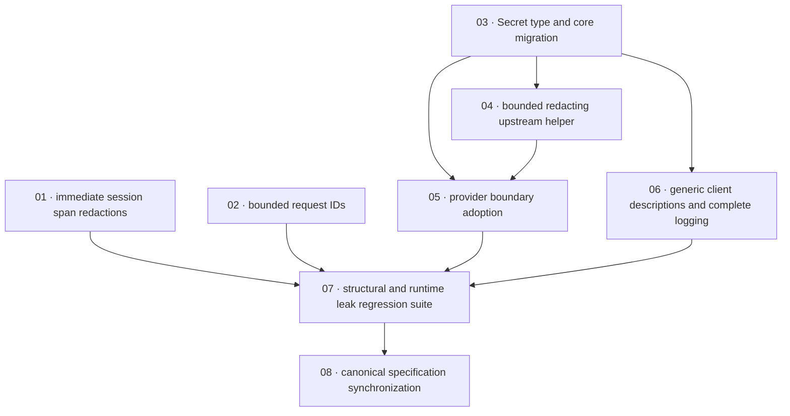

# Plan: Eliminate secret leakage in logs, spans, and error responses

**Status:** In Progress · **Layout:** kanban · **Date:** 2026-08-05 · **Owner:** Ant Stanley · **Source spec:** [`.specs/changes/merged/2026-08-05-eliminate_secret_leakage_in_logs_and_spans.md`](../../changes/merged/2026-08-05-eliminate_secret_leakage_in_logs_and_spans.md)

This independent PR makes credential-derived values unprintable, closes the immediately known span leaks, bounds and redacts provider error bodies, genericizes public OAuth descriptions while retaining internal diagnostics, and bounds client-selected request IDs. It changes Rust only, across `core`, `adapters`, `providers`, and `server`; persisted and wire shapes remain unchanged.

## Scope, siblings, and exclusions

- **In scope:** all seven canonical pages named by the source spec; the enumerated `Secret<String>` migration; the three upstream non-2xx call sites; all `SessionRepository` implementations; request-id and domain-error behavior; structural and runtime leak tests.
- **Sibling recorded, not absorbed:** the source spec names `2026-08-05-audit_and_throttle_authentication_failures.md`, but it is absent from this working copy. That sibling owns audit failure `reason` classification and authentication throttling. This plan neither creates it nor changes audit/throttling behavior.
- **No-certificate constraint:** no `*-certificate.md` artifact is required or allowed for this work.
- **Explicitly deferred:** server-authored-only correlation keys; client provenance bounds/observed-address plumbing; wrapping `TokenResponse.access_token` and `ProviderTokens` fields; FFI/binding changes; plaintext-subscriber policy.
- **No schema/migration work:** `Secret<T>` is serde-transparent; `canonical-types.schema.json`, `schemas/datamodel.schema.json`, stored session records, and wire bodies keep their current string shapes.
- **Merge bookkeeping is excluded from this independent PR:** moving the source spec, marking it Merged, and updating `.specs/README.md` are owned by the merge process after implementation, not a backlog task.

## Baseline and global definition of done

Tasks inherit [`.specs/development-guidelines.md` §Definition of done](../../development-guidelines.md#definition-of-done): tests exercise behavior and negative space; new/touched functions carry meaningful assertions; bounds are named constants; and Rust gates are clean (`cargo fmt --all --check`, `cargo clippy --workspace -- -D warnings`, `cargo nextest run --workspace`). Each task adds its own focused acceptance criteria. **Done certificates are forbidden for this plan and intentionally omitted; no `*-certificate.md` files may be created.**

Current-code anchors: `Session` and `SessionRepository` are still `String`/`&str`; LMDB and Valkey instrument unsafe values; `token_endpoint`, OIDC revoke, and Apple revoke call unbounded `response.text()`; `request_id_layer` only rejects empty/malformed UTF-8 IDs; and server mapping publishes variant reason/detail for most 4xx errors.

## Task graph

The table is authoritative. Every dependency references a lower-numbered task, so the graph is acyclic, and the order matches the implementation notes below.

| Task | Depends on | Edge kind | Produces |
|---|---|---|---|
| 01 · immediate session span redactions | — | — | LMDB and Valkey exclude session hashes and provenance from recorded values now, without waiting for `Secret<T>` |
| 02 · bounded request IDs | — | — | inbound IDs are reused only when non-empty, ASCII `[A-Za-z0-9_-]`, and at most 128 bytes; invalid values silently receive generated UUIDv4 IDs |
| 03 · Secret type and core migration | — | — | serde-transparent, non-formatting `Secret<T>`; constant-time `Secret<String>` equality; all enumerated core/config/session/repository values typed and migrated |
| 04 · bounded redacting upstream helper | 03 | type, build | bounded provider-body reader returns `Secret<String>` and one audited `upstream::error_detail` redacts before producing a loggable detail |
| 05 · provider boundary adoption | 03, 04 | type, contract | token exchange and OIDC/Apple revocation consume bounded secret bodies and use the one redacting error-detail constructor |
| 06 · generic client descriptions and complete logging | 03 | type, contract | every domain error has a stable static public description; every mapped error logs full internal diagnostics under its request span |
| 07 · structural and runtime leak regression suite | 01, 02, 05, 06 | verification | compile-fail formatting proof plus cross-store/span/provider/error/request-id leak corpus proves the controls and boundary cases |
| 08 · canonical specification synchronization | 07 | review, documentation | all seven listed canonical pages match shipped behavior; no schema change; source change remains Proposed for merge process |

## Implementation order and milestones

**Recommended order:** `01, 02, 03, 04, 05, 06, 07, 08`. Tasks 01 and 02 are independent, immediately risk-reducing slices. Task 03 establishes the type boundary required by later provider and error work. Tasks 04 and 06 can proceed in parallel after 03; task 05 joins the shared helper to the three provider surfaces. Task 07 proves all slices together; task 08 documents only demonstrated behavior.

| Milestone | Tasks | Demonstrable outcome |
|---|---|---|
| M1 — immediate observability containment | 01, 02 | session spans no longer contain hash/provenance values and malformed/oversized IDs are silently replaced |
| M2 — structural secret boundary | 03, 04 | listed credentials cannot be formatted; upstream bodies are bounded before retention and redacted at one constructor |
| M3 — protected external boundaries | 05, 06 | all three provider error paths are safe; `/token` receives stable generic descriptions while operators retain request-correlated diagnostics |
| M4 — regression proof and canonical alignment | 07, 08 | compile/runtime leak tests and all seven canonical-page updates validate the independent PR end to end |

## Validation checklist

- [x] Source spec, canonical targets, guidelines, current code, existing completed plans, and relevant tests were read; the review verified links, coverage, DoDs, DAG/order, and the no-certificate constraint.
- [x] Each source-spec implementation note and each enumerated wrapped value is covered by one or more backlog tasks.
- [x] Every backlog task is indexed, in `backlog/`, has a source/canonical back-reference, dependencies, steps, task-specific DoD, and test plan.
- [x] Dependencies are lower-numbered and acyclic; Mermaid matches the authoritative table.
- [x] All links are relative and resolve within this checkout; no sibling scope is absorbed.
- [x] Status is Planned; all task statuses are Backlog; `in-progress/`, `blocked/`, and `done/` are intentionally empty.
- [x] Done certificates are forbidden and documented as omitted.

## Assumptions and decisions

- The source spec’s design decisions are settled: `Secret<T>` keeps serde but implements neither `Debug` nor `Display`; `Secret<String>` comparison uses `subtle`; provider bodies cap at 64 KiB; excerpts cap at 256 characters; request IDs cap at 128 bytes; rejected IDs are never logged.
- `trybuild` is not currently a declared workspace dependency, so task 07 explicitly adds it as a core dev-dependency rather than assuming it exists.
- Existing store adapters with bare `fields(token_hash)` are migrated under the repository signature change; explicit `skip(self, token_hash)` is required so a future rename cannot reveal the value.
- The review found no dangling backlinks or canonical-page coverage gaps in the plan/index set.
- No done certificate is a deliverable or acceptable substitute for test evidence in this plan.
