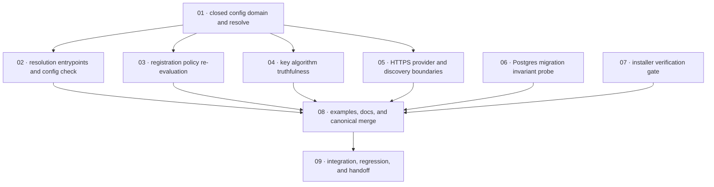

# Plan: Fail closed across config, adapters, and the installer

**Status:** In Progress · **Layout:** kanban · **Date:** 2026-08-05 · **Owner:** Ant Stanley · **Source spec:** [`.specs/changes/2026-08-05-fail_closed_across_config_and_adapters.md`](../../changes/2026-08-05-fail_closed_across_config_and_adapters.md)

This unstacked PR establishes the fail-closed rule in the configuration boundary, its service
consumers, the affected adapters, and the installer. It replaces security-significant free-form
configuration with resolved closed-domain values; startup and FFI construction consume the same
resolved configuration; registration and signing consume typed values without permissive
fallbacks; discovery, the PostgreSQL migration fallback, and the installer reject a control that
could not run. It also updates the exact canonical and shipped-documentation surfaces named by
the source spec.

**Scope boundary.** This plan is only for the source spec above. It records, but does not
implement, the placeholder-resolution, admin-plane, runtime-parity, release-supply-chain, and
audit/throttling sibling work. In particular, no task adds a signature/attestation feature,
changes `--version` argument handling, relocates `/internal/*`, changes runtime topology, or
rewrites the sibling audit defaults.

**No done certificates.** Per the planning request, this plan intentionally creates **no** done
certificates. Task-specific acceptance and definition-of-done checklists below are the only
completion evidence format; there are no `*-certificate.md` files and no task links to one.

---

## Source, baseline, and verification policy

- **Source spec.** [Fail closed across config, adapters, and the installer](../../changes/2026-08-05-fail_closed_across_config_and_adapters.md): proposed canonical deltas, type changes,
  implementation notes, compatibility/rollout, and merge plan are authoritative.
- **Canonical targets.** [Architecture principles](../../architecture-principles.md),
  [configuration](../../service/specs/06-configuration.md),
  [service flows](../../service/specs/03-service-flows.md),
  [ports and adapters](../../service/specs/02-ports-and-adapters.md),
  [provider system](../../service/specs/05-provider-system.md),
  [persistence](../../service/specs/08-persistence.md),
  [distribution](../../bindings/specs/05-distribution.md), and
  [service canonical types](../../service/specs/canonical-types.schema.json).
- **Engineering baseline.** Every task inherits
  [development guidelines](../../development-guidelines.md) §§Defensive coding and assertions,
  Make invalid states unrepresentable, Guidelines for AI agents, and Definition of done:
  errors-as-data, no production `unwrap`/`expect`, exhaustive enum matches, two meaningful
  assertions per touched function, positive and negative tests for validation, named bounds, and
  formatting/lint/test gates for touched languages.
- **Baseline test note.** The planning brief reports pre-existing red config/adapters failures.
  This worktree's unmodified baseline was independently checked with
  `cargo nextest run --workspace --no-fail-fast` and is green (387 passed, 27 skipped); retain
  the brief's constraint not to fix unrelated config/adapters failures. Each task must still run
  narrow relevant tests and record actual results; the final task reruns workspace checks and
  distinguishes any discovered baseline failures from regressions.
- **Test-only HTTP.** Production `HttpsUrl` has no loopback exemption. Wiremock and equivalent
  tests use a `#[cfg(test)]`-only constructor/injection seam; no production `http://` bypass is
  permitted.

---

## Kanban board

| Column | Tasks | Entry condition | Exit condition |
|---|---|---|---|
| Backlog | [01](backlog/01-closed_config_domain_and_resolve.md), [02](backlog/02-resolution_entrypoints_and_config_check.md), [03](backlog/03-registration_policy_re_evaluation.md), [04](backlog/04-key_algorithm_truthfulness.md), [05](backlog/05-https_provider_and_discovery_boundaries.md), [06](backlog/06-postgres_migration_invariant_probe.md), [07](backlog/07-installer_verification_gate.md), [08](backlog/08-examples_docs_and_canonical_merge.md), [09](backlog/09-integration_regression_and_handoff.md) | Dependencies in the table below are complete; sibling blockers are resolved or explicitly accepted | Task DoD is checked, narrow tests are reported, and task moves to `in-progress/`, `blocked/`, or `done/` without renaming its numeric prefix |
| In progress | — | Move exactly one or explicitly parallel-safe tasks from Backlog | Implementation, tests, and task DoD are complete or the task moves to Blocked |
| Blocked | — | A declared sibling/operational dependency prevents safe progress | Blocker, owner, and resume condition are recorded in the task; do not absorb sibling scope |
| Done | — | Task's own DoD and verification are satisfied | No certificate is created; retain the task markdown as the evidence record |

All nine task packages are presently in `backlog/`; therefore this plan status is **Backlog**.

---

## Task graph

The dependency table is the source of truth; if it differs from the diagram, correct the
diagram. Every edge points to a lower-numbered predecessor, so the graph is acyclic.

| Task | Depends on | Edge kind | Produces (reviewable artifact) |
|---|---|---|---|
| 01 · closed config domain and resolve | — | — | `RawConfig` → typed `Config::resolve`, closed-domain constructors, required non-empty issuer/audience, URL/domain validation, and a fail-closed corpus |
| 02 · resolution entrypoints and config check | 01 | build | server disk loading, FFI TOML construction, and `oidc-exchange config check <path>` all use one side-effect-free resolution path |
| 03 · registration policy re-evaluation | 01 | type/use-site | exhaustive `RegistrationMode` handling plus one allowlist predicate applied to found and not-found exchange paths |
| 04 · key algorithm truthfulness | 01 | type/use-site | local and KMS key-manager configuration accepts only truthful JWS algorithms; adapter metadata derives from loaded key material |
| 05 · HTTPS provider and discovery boundaries | 01 | type/use-site | config/provider/Apple endpoint construction uses `HttpsUrl`; discovery rejects non-success responses before parsing |
| 06 · Postgres migration invariant probe | — | — | `42501` fallback verifies tables, partial unique index, and `users.version`, otherwise returns the original migration error |
| 07 · installer verification gate | — | — | installer exits non-zero before installation when neither checksum verifier exists, with hermetic shell coverage |
| 08 · examples, docs, and canonical merge | 02, 03, 04, 05, 06, 07 | reconciliation | source-spec canonical deltas, schema, default/example configs, and affected documentation agree with shipped behavior |
| 09 · integration, regression, and handoff | 08 | verification | focused cross-crate verification, baseline-red classification, link/status/DAG/coverage audit, and merge handoff without certificates |

### Implementation order and milestones

**Order:** `01`, then `02`/`03`/`04`/`05` in parallel where staffing permits, while `06` and
`07` proceed independently; then `08`; then `09`. Task 01 is the review spine: downstream
behavior must consume its typed resolved configuration rather than duplicate string validators.
Tasks 06 and 07 are independent decisive controls and intentionally remain small, reviewable
slices rather than being folded into the configuration refactor.

| Milestone | Tasks | Demonstrable when complete | Review gate |
|---|---|---|---|
| M1 — resolved closed configuration | 01, 02 | malformed security configuration cannot construct a running service via disk, FFI, or config-check path | table-driven positive/negative resolve tests; all three entry paths share resolution |
| M2 — typed security consumers | 03, 04, 05 | exchange policy, key metadata, provider endpoints, and discovery have no permissive string/status fallback | focused core/adapters/providers tests cover denial and happy paths |
| M3 — decisive non-config controls | 06, 07 | DDL-denied incomplete schemas and absent checksum tools fail instead of proceeding | Postgres probe tests and hermetic installer test show original-error/no-install behavior |
| M4 — reconciled PR | 08, 09 | code, docs, canonical types, examples, source spec, and release handoff are mutually accurate | links, task coverage, DAG, DoDs/status, focused tests, and baseline-red report are reviewed |

---

## Coverage map

| Source-spec obligation | Task(s) |
|---|---|
| Closed value domains; `RawConfig`/`Config::resolve`; required issuer/audience; existing validation survives; two-phase compatibility behavior | 01, 02 |
| `config check`; shared server/Lambda/FFI construction path | 02 |
| Registration mode cannot fall open; verified email and allowlist policy at creation and for found users | 03 |
| Local/KMS declared algorithm validation, metadata truthfulness, KMS examples/docs vocabulary | 04, 08 |
| `HttpsUrl` for server/webhook/provider/Apple endpoints; discovery non-success rejection | 01, 05 |
| `42501` migration fallback verifies partial unique index and version column | 06 |
| Installer aborts if checksum verification cannot run | 07 |
| All affected canonical pages, `AccessTokenClaims` minLength, default and deployment/example updates, source-spec merge housekeeping | 08 |
| Full verification, pre-existing red baseline classification, sibling handoff, and no-certificate audit | 09 |

---

## Sibling dependencies and excluded work

| Sibling | Relationship to this unstacked PR | Boundary / handoff |
|---|---|---|
| `g2-parse-config-placeholder-gap` / config placeholder-resolution change | **Downstream hard dependency.** It depends on this PR unifying `load_config` and `parse_config` at `resolve()`. | This PR preserves existing placeholder semantics and supplies the single resolve seam. The sibling owns any placeholder-specific gap/rewording beyond that; do not absorb it. |
| `g2-role-all-admin-surface-colocation` / admin-plane change | Related, no task edge. | Do not change role topology or `/internal/*` placement; retain only current internal-secret cross-field validation. |
| runtime-parity change (**I19**) | Related, no task edge. | Do not broaden behavior parity work. Task 02 only ensures named construction entrypoints use shared resolve as required by this source spec. |
| `g4-installer-version-argument-url-traversal` / release supply-chain change | Related, separate owner. | Task 07 fixes only missing-checksum-utility fail-open. It does not change operand handling or add signing/attestation. |
| `2026-08-05-audit_and_throttle_authentication_failures.md` | **Merge-order successor.** It merges after this PR and supersedes the `[audit]` committed-default snapshot. | Task 08 applies the source spec's `noop` snapshot only; do not add its durability/rate-limit keys or change `adapter` to `stdout`. |

---

## Assumptions and decisions

- The worktree's source spec is authoritative even where its examples conflict with current
  code; implementation plans must retain every existing validation named in the spec while
  migrating it into construction.
- The source spec's permissive-to-enforcing rollout is modeled in Tasks 01–02. Exact flag name,
  warning event fields, and version timeline must be decided from the referenced hardening
  proposal/release policy during implementation, without inventing a silent permanent bypass.
- KMS startup `GetPublicKey` truthfulness remains an explicit source-spec open question. Task 04
  must either implement the accepted check or document the explicitly accepted, tested exception;
  it must not silently claim an unavailable guarantee.
- `RawConfig::deny_unknown_fields` remains out of scope, as the source spec explicitly leaves it
  open.
- No canonical merge is performed by planning work. Task 08 is future implementation scope; this
  plan does not alter canonical pages, source-spec status, or the global index until the change
  ships.
