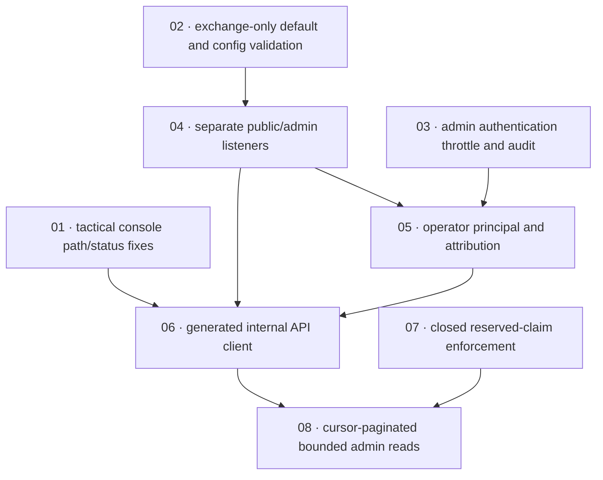

# Harden admin plane — implementation plan

**Status:** Planned · **Layout:** kanban · **Date:** 2026-08-05 · **Owner:** Ant Stanley · **Source spec:** [.specs/changes/2026-08-05-harden_admin_plane.md](../../changes/2026-08-05-harden_admin_plane.md)

This unstacked PR hardens the currently deployed shared-secret admin surface without taking ownership of sibling-delivered primitives or the later credential migration. It first fixes the console's immediate path/status defects, then changes the default role and isolates the admin plane on its own listener. Once the audit/throttle sibling is available, it adds failed-admin-auth accounting and the shared-secret length floor. The remaining PR-local slices add named-principal plumbing and attribution, a schema-generated console client, closed reserved-claim enforcement, and bounded/cursor-paginated admin reads. The plan deliberately leaves deprecation/removal of `shared_secret` and sibling-owned session/JWT, limiter, audit-channel, and revoke-claim work outside this PR.

**Verdict:** Passed review after index repairs.

---

## Source, scope, and definition-of-done baseline

- **Spec:** [2026-08-05-harden_admin_plane.md](../../changes/2026-08-05-harden_admin_plane.md). Canonical targets: [00-overview](../../service/specs/00-overview.md), [01-domain-model](../../service/specs/01-domain-model.md), [02-ports-and-adapters](../../service/specs/02-ports-and-adapters.md), [03-service-flows](../../service/specs/03-service-flows.md), [04-http-api](../../service/specs/04-http-api.md), [06-configuration](../../service/specs/06-configuration.md), [07-telemetry-and-audit](../../service/specs/07-telemetry-and-audit.md), [08-persistence](../../service/specs/08-persistence.md), [service canonical types](../../service/specs/canonical-types.schema.json), and [admin-ui overview](../../admin-ui/specs/00-overview.md).
- **Current state read:** `internal_auth_layer` only accepts a shared secret; `build_router` merges internal routes into the public router; default `server.role` is `all`; the admin client interpolates raw ids and declares title-cased statuses; repository listing is offset-based and DynamoDB's list/stats paths scan. Existing port, service, adapter, route, test-utils, and UI call sites were enumerated before decomposition.
- **Definition of done:** every task inherits [development-guidelines.md](../../development-guidelines.md) §"Definition of done": appropriate tests, negative-space coverage for validation, meaningful assertions, named bounds, and applicable Rust/TypeScript format/lint/typecheck/test gates. Domain-type tasks update canonical schema and prose together. Each task file adds concrete acceptance and a reviewable result.
- **Intentional omission:** no done certificates are created, per request. This is a planning-only PR: all task files begin in `backlog/`; no implementation status is asserted and unrelated test failures are neither investigated nor fixed.

### Sibling dependencies (recorded, not absorbed)

| Sibling change | Relationship to this PR | Boundary retained here |
|---|---|---|
| `2026-08-05-verify_admin_ui_session_jwt.md` (sibling source spec, not present in this worktree) | prerequisite for trusting the console identity | Does not implement session-cookie/JWT verification or login-action fixes; task 01 only changes the non-session client/path/status half and must integrate after that sibling's UI changes. |
| `2026-08-05-audit_and_throttle_authentication_failures.md` (sibling source spec, not present in this worktree) | prerequisite for task 03 | Owns `RateLimiter`, `ClientAddr`, mandatory `SecurityEvent` channel, `TooManyRequests` mapping, and its audit-type additions. Task 03 extends those surfaces only after they land. |
| `2026-08-05-validate_revoke_token_claims.md` (sibling source spec, not present in this worktree) | merge-order input to task 07 | Owns its revoke validation and its initial `sid`/`nbf` reservation. Task 07 must preserve/fold those names, not reimplement sibling behaviour. |

### Explicitly deferred beyond this unstacked PR

Tasks 09 (shared-secret deprecation warning for one release) and 10 (shared-secret removal) from the source spec are intentionally not scheduled. They require post-adoption evidence and a release boundary; this PR retains shared-secret compatibility while adding alternatives. The open mTLS-vs-token recommendation and remediation of already-persisted reserved claims also remain source-spec open questions, not implementation work here.

---

## Task graph

The dependency table is the source of truth; the diagram is a visualization. Every local dependency points to a lower-numbered task. Sibling dependencies are external gates documented in task headers and do not become nodes in this PR's DAG.

| Task | Depends on | Edge kind | Produces |
|---|---|---|---|
| 01 · tactical console path/status fixes | —; external: session-JWT sibling integration | contract | Encoded user-id paths and snake_case status values in the existing server-only client/UI. |
| 02 · exchange-only default and config validation | — | build | Default role is `exchange`; config tests cover deployment-impacting validation/release-note documentation. |
| 03 · admin authentication throttle and audit | —; external: audit/throttle sibling merged | contract | Failed internal authentication is throttled/audited using sibling primitives; shared-secret floor is enforced. |
| 04 · separate public/admin listeners | 02 | build | Public and internal routers/listeners are separated across native, Lambda, and FFI runtime rules. |
| 05 · operator principal and attribution | 03, 04 | build, contract | Named mechanisms authenticate into an `OperatorPrincipal` and admin mutations carry attribution. |
| 06 · generated internal API client | 01, 04, 05 | contract | Published internal schema drives generated client/types, credential selection, and cursor API consumption. |
| 07 · closed reserved-claim enforcement | —; external: revoke-claims sibling merge order | data, contract | All 24 reserved names are rejected at every write/template/config boundary. |
| 08 · cursor-paginated bounded admin reads | 06, 07 | build, data, review | Bounded `UserPage` listing and DynamoDB stats paths replace unbounded admin reads; console consumes the contract. |

---

## Milestones and implementation order

**Order:** `01, 02, 03, 04, 05, 06, 07, 08`, subject to the external sibling gates. Tasks 01/02/07 can be prepared independently, but task 01 must integrate with the session-JWT sibling, task 03 cannot start until the audit/throttle sibling lands, and task 07 must preserve the revoke sibling's `sid`/`nbf` additions. Task 08 is last because its response contract must match the generated client and its core/adapters touch broad shared surfaces.

**Review notes:** This plan now has a single acyclic local DAG, complete task-to-requirement coverage, explicit DoDs, and no certificate generation step. The canonical no-certificate rule is retained by keeping implementation work in backlog-only task files.

| Milestone | Tasks | Demonstrable outcome | Review gate |
|---|---|---|---|
| M1 — immediate containment | 01, 02 | The console cannot change an internal route via an id and speaks service status values; default startup serves only exchange routes. | Admin-ui tests/typecheck and config tests verify positive/negative boundaries. |
| M2 — authenticated separated plane | 03, 04, 05 | Admin traffic is on its own listener; failures are recorded/throttled through shared machinery; successful mutations are attributed. | Router/runtime E2E plus middleware/core audit tests demonstrate no public merge, 429/401 paths, and principal propagation. |
| M3 — contract and data hardening | 06, 07, 08 | The schema-generated UI client uses safe wire values and paging; claims cannot collide with protocol fields; reads stay bounded. | Schema/generation freshness, core/adapter tests including DynamoDB capacity assertions, and full internal-API pagination E2E pass. |

---

## Coverage index

| Source requirement | Task(s) |
|---|---|
| Tactical console encoding and wire-format status | 01, then 06 structurally preserves it |
| Default `exchange` role and deployment migration note | 02 |
| Failed-auth throttle/audit, peer-only provenance, secret length floor | 03 (on sibling primitives) |
| Separate admin listener, role/runtime constraints, port collision | 04 |
| Three authentication mechanisms, `OperatorPrincipal`, audit attribution | 05 |
| Published schema, generated client/types, server-side credential preference | 06 |
| Closed 24-name reserved set at all ingress/template paths | 07 |
| Cursor page contract, core clamp, Dynamo/Postgres/SQLite pagination, Dynamo counters/cache | 08 |
| Shared-secret warning/removal | intentionally deferred; not in this PR |
| Session identity verification/login security | sibling-owned; not in this PR |

---

## Assumptions and decisions

- Canonical-spec merge edits remain orchestrator-owned; implementation tasks reference target pages and schema but do not claim those edits are already applied.
- `shared_secret` remains enabled as a compatibility mechanism in this PR. The operator-token/mTLS recommendation remains unresolved; task 05 implements the source-specified mechanisms/configuration validation without choosing a deployment default.
- Task 08 uses the source spec's required capacity-based DynamoDB verification rather than wall-clock timing. It must preserve each adapter's ordering semantics while removing offset pagination.
- The only release-note location currently discoverable is absent; tasks 02/03 therefore require documenting migration impact in the established project release/documentation mechanism selected by the implementer, rather than inventing an unreviewed changelog convention.
