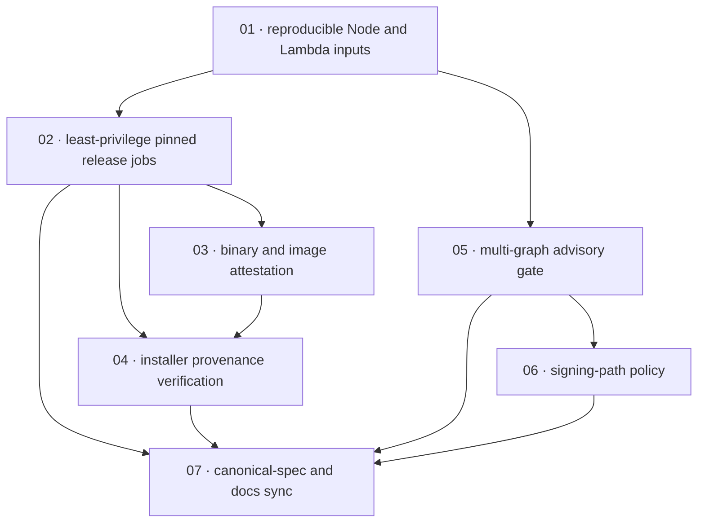

# Plan: Harden release supply chain

**Status:** Review · **Layout:** kanban · **Date:** 2026-08-05 · **Owner:** Ant Stanley · **Source spec:** [changes/2026-08-05-harden_release_supply_chain.md](../../changes/2026-08-05-harden_release_supply_chain.md)

Harden the tagged release and dependency supply chain through reviewable slices: first make the Node/Lambda dependency graph reproducible, then remove publishing authority from dynamic tool resolution and over-broad workflow credentials, add provenance with a verifying installer, and introduce advisory and signing-path policy gates. The dependency-policy slices are isolated from the release-pipeline slices so this unstacked PR does not absorb the sibling fail-closed installer change or unrelated release-candidate remediation.

**Plan quality gate:** every backlog task must keep the task graph acyclic, preserve the documented sibling boundary, and cite only plan/index changes that remain inside the requested remediation scope.

---

## Source and definition-of-done baseline

- **Spec.** [changes/2026-08-05-harden_release_supply_chain.md](../../changes/2026-08-05-harden_release_supply_chain.md), covering its proposed distribution and repository-hygiene deltas, implementation packages A–D, and regression tests. No type/schema change is in scope.
- **Canonical targets.** [bindings/specs/05-distribution.md](../../bindings/specs/05-distribution.md) §§Artifacts, Install script, Release pipeline, and the new Supply-chain gates section; [development-guidelines.md](../../development-guidelines.md) §Repository hygiene.
- **Already built.** All `uses:` references in the reviewed workflows are full commit SHAs; npm and PyPI already use OIDC trusted publishing; release builds and checksums, Node platform artifacts, and the existing CI jobs are present. The code read found the remaining workflow-level permissions, dynamic Node tooling, non-frozen installs, missing Lambda lockfile, absent advisory config, and installer URL interpolation. Existing release-candidate crypto crates and `pyo3` remain preconditions for the policy/triage tasks, not silently fixed by this PR.
- **Definition of done.** Every task inherits [development-guidelines.md](../../development-guidelines.md) §Definition of done and §Limits and bounds: focused positive and negative tests, named constants for new bounds, meaningful assertions where functions are touched, and clean format/lint/test gates for every touched language. Workflow and shell changes must additionally use hermetic/static tests that prove their security invariants without publishing.
- **Done certificates.** Omitted by explicit user instruction; no certificate files were authored, and the done-certificate checklist is intentionally inapplicable.
- **Sibling boundary.** The fail-open checksum-tool path in `install.sh` belongs to the unstacked sibling change spec `2026-08-05-fail_closed_across_config_and_adapters.md` (its task 07, outside this PR workspace). This plan owns `--version` validation and attestation verification only; sequence shared `install.sh` edits during integration rather than absorbing the sibling.

---

## Task graph

The dependency table is the **source of truth**; the Mermaid graph visualizes it. If they disagree, the table wins.

| Task | Depends on | Edge kind | Produces (reviewable artifact) |
|---|---|---|---|
| 01 · reproducible Node and Lambda inputs | — | — | committed, usable Node and Lambda lockfiles and frozen install paths |
| 02 · least-privilege pinned release jobs | 01 | build, contract | jobs have minimal credentials and publishing jobs execute only pinned or locked tooling |
| 03 · binary and image attestation | 02 | contract | release builds publish Sigstore provenance for each binary and image digest |
| 04 · installer provenance verification | 02, 03 | build, review | installer validates pins before URL construction and verifies released binary provenance when `gh` exists |
| 05 · multi-graph advisory gate | 01 | data, build | CI/release report and enforce documented Cargo, pnpm, and Python advisory policy |
| 06 · signing-path policy | 05 | data, review | resolved signing/verification dependency graph rejects pre-release cryptographic path dependencies |
| 07 · canonical-spec and docs sync | 02, 04, 05, 06 | review | canonical distribution/hygiene claims and consumer instructions match merged controls |

---

## Implementation order and milestones

**Order:** `01, 02, 03, 04, 05, 06, 07`. Lockfiles lead because frozen installs are required before release jobs and pnpm auditing can be trusted. Credential/tooling hardening precedes attestations and installer verification so any provenance-producing job starts from least privilege; advisory work proceeds independently after reproducible inputs.

**Milestones:**

| Milestone | Tasks | Demonstrable when complete | Review gate |
|---|---|---|---|
| M1 — reproducible, least-privilege release inputs | 01, 02 | reviewers can statically prove all checkout jobs have required read scope, publish jobs have no dynamic package fetches, and CI/release installs are frozen | frozen installs and workflow-invariant tests pass |
| M2 — authenticated binary and container consumption | 03, 04 | a scratch release artifact/image attests successfully, while modified or wrong-repository inputs fail; installer rejects unsafe pins before a request | attestation round-trip and hermetic installer tests pass |
| M3 — dependency governance | 05, 06 | CI reports each dependency graph under a dated policy and rejects unapproved signing-path prereleases | cargo/pnpm/pip audit fixtures and policy-check tests pass |
| M4 — canonical handoff | 07 | canonical spec and public install/container instructions describe the actual release controls | docs/spec links and all affected workflow/toolchain gates pass |

---

## Assumptions and open questions

### Assumptions

- GitHub-hosted release runners can mint OIDC tokens and reach Sigstore.
- `bindings/nodejs` can regenerate its stale lockfile at the declared napi CLI major without breaking the native build.
- The other unstacked PR owns fail-closed handling when both checksum utilities are absent.

### Decisions

- *PR boundary.* **The plan excluded the sibling’s missing-checksum-tool behavior despite the shared installer file.** This avoids conflicting ownership while retaining an integration sequencing note.
- *Policy separation.* **The pre-release signing-path check follows advisory triage rather than a broad dependency upgrade.** It makes the resolved graph policy reviewable without claiming a remediation not specified for this PR.
- *Certificates.* **Done certificates were omitted.** The user forbade them, so task headers intentionally carry no certificate links.

### Open questions

- *Installer fallback.* Should a host without `gh` be allowed to proceed after the explicit checksum-only warning, or should provenance verification become mandatory? This does not block task ordering but must be resolved before task 04 merges.
- *Container mechanism.* Is the proposed build attestation sufficient for both registries, or is registry signing required? This affects task 03’s final consumer verification documentation.
- *Signing-path membership.* Which resolved crypto crates are on the signing/verification path in every deployment mode? This defines task 06’s allowlist and test fixture.
