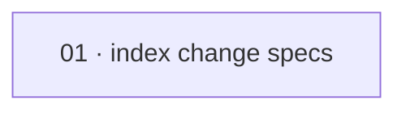

# Plan: Index 2026-08-05 change specs

**Status:** Draft · **Layout:** kanban · **Date:** 2026-08-05 · **Owner:** Ant Stanley · **Source spec:** branch `spec/index-2026-08-05-change-specs` / PR #28 index-only documentation intent

Add the fourteen existing 2026-08-05 security change-spec references to the canonical change-spec index in one documentation-only package. The package is intentionally limited to `.specs/README.md`: it makes the existing change proposals discoverable and preserves their relative links without creating, editing, or planning implementation of any proposal. The index includes an unrelated admin JWT entry only as a source-spec reference in the table, not as a plan target or implementation scope.

---

## Source and definition-of-done baseline

- **Spec.** The branch diff from `trunk()` to `spec/index-2026-08-05-change-specs` modifies only `.specs/README.md`, adding fourteen `changes/2026-08-05-*.md` rows to `## Change specs`. The intended source documents are absent from this checkout and must not be authored or modified by this plan.
- **Already built.** `.specs/README.md` already provides the canonical change-spec table and relative-link convention. The branch change already identifies the exact fourteen rows and their intended ordering; this plan treats the existing index structure as a precondition and does not introduce any source specs or certificates.
- **Definition of done.** Derived from [development-guidelines.md](../../development-guidelines.md) §Repository hygiene and §Definition of done. Because this is a Markdown-only index change, validate changed Markdown links, source coverage, explicit intentional unresolved links, DAG consistency, and the absence of certificates; no Rust, TypeScript, or Python source or test suite is in scope.

---

## Task graph

The dependency table is the **source of truth**; the Mermaid graph visualizes it.
If the two ever disagree, the table wins — fix the graph to match.

| Task | Depends on | Edge kind | Produces (reviewable artifact) |
|---|---|---|---|
| 01 · index change specs | — | — | the canonical index lists the fourteen intended 2026-08-05 change specs with correct relative links |

---

## Implementation order and milestones

**Order:** `01` — the single package is the complete, independently reviewable documentation change; there are no build or review dependencies.

**Milestones:**

| Milestone | Tasks | Demonstrable when complete | Review gate |
|---|---|---|---|
| M1 — indexed change specs | 01 | a reader can locate each of the fourteen intended 2026-08-05 proposals from `.specs/README.md` and resolve its relative link when the source spec set is present | inspect the diff, verify all fourteen planned source paths are represented once, check relative-link syntax, confirm intentional unresolved links are called out, and verify no certificates are introduced |

---

## Assumptions and open questions

**Assumptions**

- The fourteen indexed change-spec paths are supplied by the intended PR/spec set even though their Markdown source files are not present in this checkout; they are intentionally unresolved here until the source spec set exists.
- PR #28 is limited to indexing those proposals; the listed admin JWT proposal is only an index entry and is not implementation scope for this plan.

**Decisions**

- *Single package.* **The plan used one documentation package.** The branch changes one index file, has no dependencies, and is reviewable as one complete table update.
- *Certificates.* **Done certificates were intentionally omitted.** The request explicitly excludes them, so the plan must remain free of certificate artifacts.

**Open questions**

- *(None at this stage.)*
