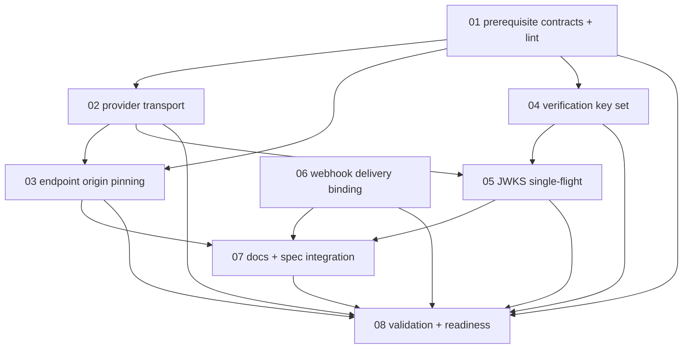

# Plan: Own the outbound HTTP boundary

**Status:** Done · **Layout:** indexed kanban · **Date:** 2026-08-05 · **Owner:** Ant Stanley · **Source spec:** [`.specs/changes/2026-08-05-own_outbound_http_boundary.md`](../../changes/2026-08-05-own_outbound_http_boundary.md)
**Review:** spec-reviewer · verdict: changes needed
**Outbound boundary owner:** @-

This plan makes provider HTTP and provider verification controls owned by shared adapter types, pins discovery-supplied endpoint origins, removes the JWKS cache lock from the network path, and binds each webhook retry burst to one signed delivery occasion. It is deliberately planned against this unstacked PR: the source spec's required sibling artifacts are absent from this workspace, so their interfaces and behavior are explicit external prerequisites rather than assumed landed work. Because those sibling artifacts are not in this checkout, the plan keeps their contracts as external prerequisites, does not invent missing helper APIs or reassign their ownership, and does not absorb any implementation that belongs to sibling changes.

## Kanban index

| ID | Task | Status | Depends on | External prerequisites |
|---|---|---|---|---|
| 01 | [Establish prerequisite contracts and guard lint](done/01-prerequisite_contracts_and_guard_lint.md) | Done | — | `HttpsUrl`, bounded-read/error-detail helpers from sibling specs; confirm exact API/ownership before dependent work |
| 02 | [Add bounded provider transport](done/02-provider_transport.md) | Done | 01 | 01 contracts; source spec requires bounded success reads before transport migration |
| 03 | [Pin discovery endpoint origins and wire config](done/03-endpoint_origin_pinning.md) | Done | 01, 02 | `HttpsUrl` contract from 01; warning-mode release boundary explicitly required |
| 04 | [Build shared verification key set](done/04-verification_key_set.md) | Done | 01 | cross-provider baseline corpus from 01; answer C12 before replacing both validators |
| 04a | [Keep provider-specific admitted algorithm policies explicit](done/04-verification_key_set.md#scope) | Done | 04 | external prerequisite: do not collapse provider policies into one union |
| 05 | [Redesign JWKS cache single-flight](done/05-jwks_cache_single_flight.md) | Done | 02, 04 | bounded success reads from 02; keep cache/forced-refresh guards off the network path |
| 06 | [Bind webhook deliveries and document receivers](done/06-webhook_delivery_binding.md) | Done | — | —; delivery id and timestamp are minted once outside the retry loop |
| 07 | [Complete compatibility, docs, and spec integration](done/07-compatibility_docs_and_spec_integration.md) | Done | 03, 05, 06 | resolved sibling merge/ownership decision; update canonical targets only after behavior stabilizes |
| 08 | [Run full validation and release-readiness review](done/08-full_validation_and_release_readiness.md) | Done | 01, 02, 03, 04, 05, 06, 07 | all implementation tasks; final gate, not a certificate |

`backlog/` and `in-progress/` are now empty; `done/` holds all eight task files with their
completion records. No done certificates are created or planned; their omission is deliberate
per the request, and the no-cert rule applies to both the plan and its task files.

## Source coverage

| Source requirement | Covered by |
|---|---|
| External `HttpsUrl`, `read_bounded`, `MAX_UPSTREAM_BODY_BYTES`, and `upstream::error_detail` prerequisites; committed guard lint | 01 |
| External sibling-owned implementation boundaries remain separate and are not absorbed here | 01, 02, 03, 04, 05, 06, 07 |
| One `ProviderTransport`; status-before-body; bounded discovery/JWKS success reads; migrate all five provider call sites | 02 |
| `endpoint_origins` type/config/bootstrap/provider wiring; warning then enforce; update shipped Google examples | 03 |
| Cross-provider C12 corpus; purpose/algorithm/key-type filtering; replace both selectors and algorithm matches | 04 |
| `Arc<VerificationKeySet>` cache values; no cache/timestamp guard across network; stale-serving single-flight and forced-refresh semantics | 05 |
| Timestamp + ULID + body webhook MAC; retry identity reuse; receiver contract/example | 06 |
| Canonical specs/schema, docs/config sweep, compatibility/release note, plan/spec merge housekeeping | 07 |
| Rust validation and manual architecture/release review | 08 |

## Task graph

The index dependency column is authoritative. Every edge points from a lower-numbered prerequisite to a higher-numbered consumer; the graph is acyclic, and task 06 remains intentionally independent because the source change includes an outbound webhook boundary that does not depend on the sibling-owned provider prerequisites. External prerequisites are named explicitly and remain out of scope for implementation in this plan; they may be referenced as inputs, but their code stays in sibling changes.

## Execution order

1. Resolve or explicitly vendor/coordinate the absent sibling-owned interfaces in 01. Do not implement against guessed names or semantics, and record which pieces are external prerequisites versus in-PR work before starting dependent tasks. Keep the boundary explicit: identify the external prerequisites, then stop short of implementing their behavior in this plan.
2. Land 02 before cache concurrency work: bounded body reads must exist before lifting current implicit fetch serialization, because the single-flight redesign otherwise widens the allocation surface.
3. Record C12 behavior before replacing both validators in 04.
4. Keep 05 as its own reviewable concurrency change and verify the cache guard no longer spans the network path.
5. 03 and 06 may proceed after their respective prerequisites; integrate docs/specs only after behavior stabilizes, and keep the webhook change aligned with the no-cert rule.
6. Run 08 last; it is a gate, not a certificate.

## Definition-of-done baseline

Every task inherits [`.specs/development-guidelines.md`](../../development-guidelines.md) §Definition of done: behavior and negative-space coverage, two meaningful assertions per touched function, named bounds, and clean `cargo fmt --all --check`, `cargo clippy --workspace -- -D warnings`, and `cargo nextest run --workspace` for this Rust-only change. Task files specify additional observable acceptance criteria, and any external prerequisite work must be explicitly labeled as such rather than implied. No certificate artifacts are created or implied anywhere in the plan/index.

## Assumptions and decisions

- **Unstacked PR.** The sibling change specs named by the source (`fail_closed_across_config_and_adapters`, `eliminate_secret_leakage_in_logs_and_spans`, and `bind_id_token_grant_replay_protection`) do not exist in this checkout. Their required artifacts are external prerequisites; task 01 must establish their exact availability/ownership before dependent work starts.
- **No done certificates.** The historical plan convention is intentionally not followed. Completion evidence belongs in task updates and review/CI output, not `*-certificate.md` files.
- **Warning-to-enforcement release boundary.** Origin pinning requires a release decision after warning-mode telemetry; task 03 must not silently collapse the two stages.
- **Canonical merge is not assumed.** Task 07 updates canonical material only when the change is approved for merge; until then the source change spec remains Proposed.

## Execution deviations (recorded)

1. **Canonical material was updated in this branch while the source change spec stays
   Proposed** — deviating from the assumption above, per the repository convention of the
   three prior unstacked PRs (#23/#24/#25), where canonical prose/schema travel with the
   implementing branch and the change-spec status flip happens at merge time. Page `Date:`
   fields were therefore not bumped (that stays a merge-time act), and the canonical pages
   document the as-implemented behavior: origin pinning ships in warning mode with the
   `Warn` → `Enforce` flip stated everywhere as a separate future release-owner decision,
   including an implementation-status annotation on the source spec's compatibility claim.
2. **Sibling prerequisites are vendored, not merged** (`HttpsUrl`,
   `read_bounded_bytes`/`MAX_UPSTREAM_BODY_BYTES`, `upstream::error_detail`, marked in code
   under `crates/adapters/src/shared/`). The sibling changes named by the source do not
   exist in this unstacked checkout; task 01 records the dispositions.
3. **Merge bookkeeping is deferred, not fabricated.** The siblings are not merged, so per
   task 07's own gate the source spec keeps `Status: Proposed`; it is not moved to
   `changes/merged/`, `.specs/README.md`'s pending/merged listings are untouched (the
   change-spec index is owned by separate in-flight work), and the missing sibling rows the
   source asks to repair stay unrepaired until that index work lands.
