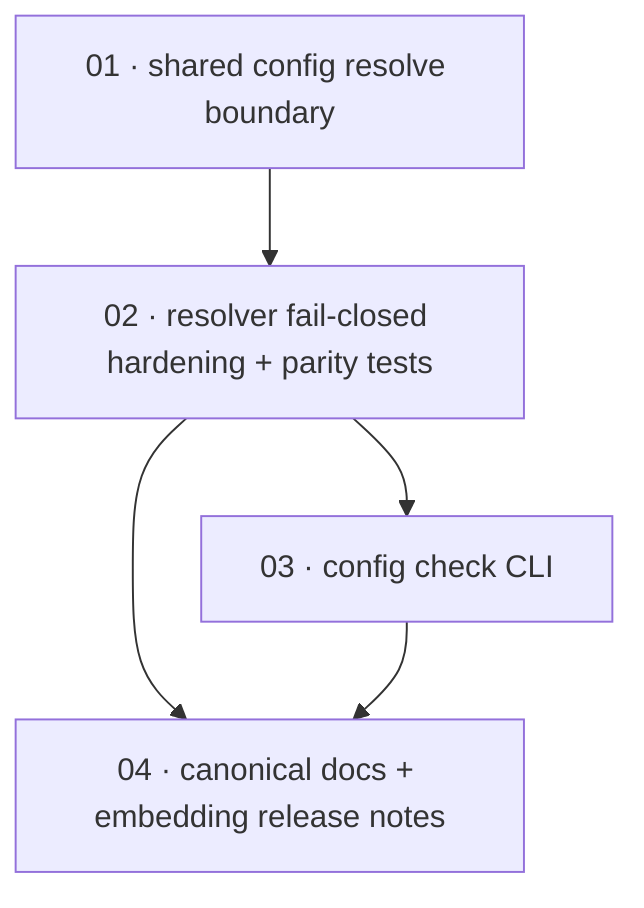

# Plan: Resolve `${VAR}` placeholders on every configuration entry point

**Status:** Done · **Layout:** kanban · **Date:** 2026-08-05 · **Owner:** Ant Stanley · **Source spec:** [`.specs/changes/merged/2026-08-05-resolve_config_placeholders_all_channels.md`](../../changes/merged/2026-08-05-resolve_config_placeholders_all_channels.md)

Build one configuration resolve boundary for every source shape: file-backed server/Lambda configuration and inline/file FFI configuration. The resolver owns placeholder rejection, env overrides, deserialization, and validation; entry points own only source layering. The plan then exposes the same path through `oidc-exchange config check`, documents the shipped contract and publishes embedding release notes. Node, Python, and `@oidc-exchange/lambda` are covered through their existing FFI chain; this plan deliberately does not duplicate binding implementations.

---

## Source and definition-of-done baseline

- **Spec.** The source change spec's Motivation, Affected spec pages, Proposed changes, Implementation notes, Type changes, and Merge plan. It targets `crates/server`, `crates/ffi`, the three canonical pages named in the change spec, and release-note locations for Node, Lambda, and PyPI. It adds no TOML-visible field and requires no `canonical-types.schema.json` change.
- **Already built.** `bootstrap::load_config_from_dir` layers default/overlay/environment sources, directly resolves placeholders, deserializes, and validates; `bootstrap::parse_config` directly uses `toml::from_str` then validation, omitting placeholders and structural overrides. `OidcExchange::new` is the sole configuration path for napi/PyO3 and `OidcExchange::from_file` delegates to it. `main.rs` recognizes only `--version`; no CLI parser or `config check` exists. Existing resolver tests cover file-backed set/unset/escaped/nested cases, but there is no entry-point parity table or malformed/empty/residual test.
- **Known baseline failure.** `cargo test --workspace` is already red because three `providers.*.adapter` configuration tests are missing. This unstacked PR neither fixes nor absorbs that unrelated failure. Each task reports that failure separately if it appears; targeted tests and non-test checks remain required evidence.
- **Definition of done.** Every task inherits [`.specs/development-guidelines.md`](../../development-guidelines.md) §Definition of done: positive and negative-space tests, meaningful assertions in touched functions, named bounds, and Rust format/clippy/test checks. Since this scope touches Rust only, run `cargo fmt --all --check`, `cargo clippy --workspace -- -D warnings`, and targeted package/test commands during task work; attempt `cargo test --workspace` at integration and record the three pre-existing missing-provider-adapter test failures without changing them.
- **Done certificates.** Intentionally omitted by explicit instruction. Task packages move from `backlog/` to `done/` as kanban records, but no `*-certificate.md` files are created; task checklists, review evidence, and the plan-level DoDs are the sole tracking artifacts.

---

## Task graph

The dependency table is the **source of truth**; the Mermaid graph visualizes it. If they disagree, the table wins.

| Task | Depends on | Edge kind | Produces (reviewable artifact) |
|---|---|---|---|
| 01 · shared config resolve boundary | — | — | one server-owned resolve function used by file-backed and FFI TOML source builders; FFI receives `OIDC_EXCHANGE__…` overrides before resolution and validation |
| 02 · resolver fail-closed hardening + parity tests | 01 | build, contract | path-aware, total placeholder resolution rejects unset, empty, malformed, and residual placeholders identically on both entry points; `$${` remains the literal escape |
| 03 · config check CLI | 02 | build | `oidc-exchange config check [--dir <config-dir>] [--file <path>]` resolves and validates without adapters, socket binding, or writes, and prints a redacted summary |
| 04 · canonical docs + embedding release notes | 02, 03 | review | 06-configuration, 04-http-api, and FFI-core describe the shipped one-resolve contract; Node/Lambda/PyPI release notes explain construction can now fail for unresolved placeholders |

## Kanban

| Status | Task packages |
|---|---|
| Done | [01 · shared config resolve boundary](done/01-shared_config_resolve_boundary.md); [02 · resolver fail-closed hardening and entry-point parity](done/02-resolver_fail_closed_parity.md); [03 · config check CLI](done/03-config_check_cli.md); [04 · document the shared-resolve contract and embedding break](done/04-document_contract_and_release_notes.md) |

All four task packages are complete. The source spec is merged, and task back-references target its merged location.

Each `Depends on` references lower-numbered tasks only. Task 01 defines the sole production seam; task 02 strengthens and proves its contract; task 03 consumes that proven seam; task 04 must be reviewed against both implementation and CLI behaviour before it describes either as canonical fact.

---

## Implementation order and milestones

**Order:** `01, 02, 03, 04`. Task 01 removes the divergent source-to-runtime pipeline before any behavioural hardening is added. Task 02 makes the shared resolver total and supplies the parity test harness that subsequent entry points must join. Task 03 is then a thin CLI caller rather than a third pipeline. Task 04 lands last because canonical specs and release notes must describe observable shipped behaviour.

| Milestone | Tasks | Demonstrable when complete | Review gate |
|---|---|---|---|
| M1 — one resolve boundary | 01, 02 | File-backed and FFI TOML inputs use one builder-to-resolved-config tail; both receive structural overrides and have identical set/unset/empty/escape/unterminated/empty-name outcomes with paths and no secret values in errors | server unit parity table plus FFI construction regression tests; `cargo fmt --all --check`; `cargo clippy --workspace -- -D warnings` |
| M2 — preflight operator path | 03 | `config check` loads either directory or one file, prints only redacted output on success, and fails non-zero without building adapters/binding/writing when resolution fails | CLI success/failure tests demonstrate exit status and secret non-disclosure; targeted server tests green |
| M3 — contract published | 04 | All three canonical pages have the source spec's merge blocks, embedding release notes disclose the construction-time break, and the change spec/README housekeeping is ready for merge | link check; docs agree with M1/M2; `cargo test --workspace` attempted and the known three missing `providers.*.adapter` failures are recorded, not altered |

---

## Scope boundaries, sibling dependencies, and open questions

**In scope:** shared resolve factoring; FFI source layering parity; placeholder failure rules and tests; `config check`; the specified canonical docs; release notes for published embedding channels; source-spec merge housekeeping once implementation is complete.

**Out of scope:** closed-domain config types and adapter validation, new TOML fields/schema changes, binding API redesigns, a hermetic FFI opt-out, environment simulation beyond the checking process, and the unrelated three missing `providers.*.adapter` tests.

**Sibling dependency / merge coordination:** The sibling `2026-08-05-fail_closed_across_config_and_adapters` hardening change is not a prerequisite to build this PR. Its spec is not present in this unstacked workspace; this reference records the declared coordination dependency only. It deliberately owns narrowing security-relevant fields to closed types and also edits 06-configuration's Loading order and Validation at load. Do not fold any of that work into tasks 01–04. Whichever unstacked PR merges second must refresh its Modify blocks against the then-current canonical page.

**Open questions retained for owner decision (not implementation blockers):**

1. Whether FFI needs a future opt-out from ambient `OIDC_EXCHANGE__…` overrides for hermetic embedding.
2. How `config check --file` should represent the eventual Lambda/container environment rather than only the checker process.
3. Whether a future per-field opt-out is needed for intentionally empty environment substitutions; no shipped config needs one.

**Decisions fixed by the source spec:** fail closed immediately; reject empty and malformed placeholders; `$${` is the literal escape; no raw secret in errors or diagnostic output; config check ships in this PR; no schema/type-narrowing work here.

---

## Completion evidence

- Implementation completed in `0165e369` (`feat(config): resolve placeholders across all configuration entry points`); documentation completed in `d6098ba4` (`docs(config): document shared placeholder resolution`).
- Independent review gate passed.
- Final verification: `cargo nextest run --workspace` — **391 passed, 27 skipped**.
- Markdown task and source-spec links were validated locally; no certificate files were created.
