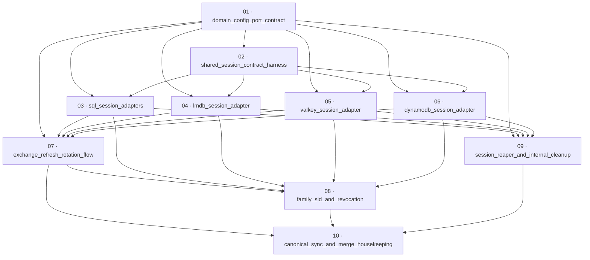

# Rotate refresh tokens with reuse detection

**Status:** Done · **Layout:** kanban · **Date:** 2026-08-05 · **Owner:** Ant Stanley · **Source spec:** [2026-08-05-rotate_refresh_tokens_with_reuse_detection.md](../../changes/merged/2026-08-05-rotate_refresh_tokens_with_reuse_detection.md)

This plan implements only the refresh-token rotation and reuse-detection change. It first establishes the typed session-family contract and shared conformance harness, then makes each of the five persistent session adapters and `MockRepository` satisfy SR1–SR5. With that atomic store substrate in place, it updates exchange, refresh, audit, and access-token family identity behaviour; adds the owned reaper and internal cleanup endpoint; and synchronizes canonical types and prose at merge. The plan deliberately does not implement work owned by sibling changes.

---

## Scope, baseline, and definition of done

- **Source and canonical targets.** The source spec changes service specs [00-overview](../../service/specs/00-overview.md), [01-domain-model](../../service/specs/01-domain-model.md), [02-ports-and-adapters](../../service/specs/02-ports-and-adapters.md), [03-service-flows](../../service/specs/03-service-flows.md), [04-http-api](../../service/specs/04-http-api.md), [06-configuration](../../service/specs/06-configuration.md), and [08-persistence](../../service/specs/08-persistence.md), plus [service canonical types](../../service/specs/canonical-types.schema.json) and [logical data model](../../../schemas/datamodel.schema.json). No new canonical page is in scope.
- **Current implementation.** `SessionRepository` only stores, looks up, revokes one hash/revokes all user sessions, counts, and cleans up; `Session` has no family/generation state; `AppService::refresh` does a read-only lookup and returns no replacement; all five adapters and `MockRepository` implement the old port. `cleanup_expired_sessions` has no production caller. These are implementation gaps, not prerequisites.
- **Unstacked boundary.** This PR contains only this source spec’s behaviour. It integrates the finalized public contract supplied by the sibling `2026-08-05-validate_revoke_token_claims.md` only after that sibling is available; it does not recreate that sibling’s JWT `typ`/claim-validation work. The runtime-parity sibling’s catch-panic layers are not part of this plan.
- **Baseline.** `cargo test --workspace` is already red because three `providers.*.adapter` configuration tests are missing. That unrelated failure is recorded and must neither be fixed nor used to reject the scoped work. Task gates use focused tests plus format/clippy/nextest where possible and report that baseline separately.
- **Definition of done.** Every task inherits [.specs/development-guidelines.md](../../development-guidelines.md) §Definition of done and §Limits and bounds: tests exercise the behaviour and every new validation path has negative-space coverage; touched/new functions carry meaningful assertions; new bounds are named constants; Rust format, clippy, and nextest are run. Task files add precise acceptance criteria.
- **Done certificates.** Explicitly forbidden for this plan. No `*-certificate.md` files are created, and task completion is represented solely by the kanban move and checked task DoDs.

---

## Task graph

The dependency table is authoritative; update the graph if it disagrees.

| Task | Depends on | Edge kind | Produces |
|---|---|---|---|
| 01 · domain_config_port_contract | — | — | Session-family domain types, `RefreshResolution`, SR1–SR5 port API, configuration defaults/validation, and `MockRepository` support |
| 02 · shared_session_contract_harness | 01 | build | Generic `SessionRepository` conformance assertions and `MockRepository` invocation |
| 03 · sql_session_adapters | 01, 02 | build, review | Postgres/SQLite migrations and atomic rotation, classification, family/user revocation, cleanup, and conformance coverage |
| 04 · lmdb_session_adapter | 01, 02 | build, review | Four-database LMDB implementation with atomic swap, family index, and bounded cleanup batching |
| 05 · valkey_session_adapter | 01, 02 | build, review | TTL’d retirement/family keys, atomic Lua swap, family revocation, and non-panicking counter clamp |
| 06 · dynamodb_session_adapter | 01, 02 | build, review | Strongly consistent classification, transactional rotation/roster maintenance, and complete revocation |
| 07 · exchange_refresh_rotation_flow | 01, 03, 04, 05, 06 | contract | Family issuance and policy-owning refresh rotation/reuse flow with audit and focused core tests |
| 08 · family_sid_and_revocation | 07, 03, 04, 05, 06 | sibling contract, build | Stable family `sid` at issuance/refresh and access-token family revocation using the sibling’s finalized validated-claims seam |
| 09 · session_reaper_and_internal_cleanup | 01, 03, 04, 05, 06 | build | Long-lived-runtime reaper, shutdown handling, protected internal cleanup route, and adapter cleanup coverage |
| 10 · canonical_sync_and_merge_housekeeping | 07, 08, 09 | review | Canonical prose/schema synchronization, source-spec merge metadata/move, and `.specs` indexes |

Every dependency points to a lower-numbered task. Files start in `backlog/` and move between kanban columns; locate them by `*/NN-*.md` rather than a permanent path.

---

## Implementation order and milestones

**Order:** `01, 02, 03, 04, 05, 06, 07, 08, 09, 10`.

| Milestone | Tasks | Demonstrable when complete | Review gate |
|---|---|---|---|
| M1 — contract and proof harness | 01, 02 | Domain/config/port contract compiles; `MockRepository` proves SR1–SR5 including exactly-one concurrent winner and byte-identical failed CAS | Core/test-utils focused tests, format, clippy |
| M2 — all stores conform | 03, 04, 05, 06 | Every adapter runs the same conformance suite; SQL/LMDB/Valkey run by default and Dynamo keeps its existing ignored integration gating | Adapter focused tests, ignored Dynamo suite where configured, format, clippy |
| M3 — credential lifecycle | 07, 08 | Exchange creates a family; refresh rotates, bounded grace re-rotates once, reuse revokes only its family and emits Warning; access JWT `sid` is stable family identity and revokes that family | Core + server focused positive/negative tests; sibling integration prerequisite satisfied |
| M4 — operations and canonical closure | 09, 10 | Reaper owns cleanup in persistent runtimes, Lambda has protected scheduler endpoint, canonical specs/schemas reflect shipped behaviour | Server/adapter tests and link/schema checks; report known workspace-test baseline separately |

---

## Dependencies, assumptions, and open questions

### Sibling dependencies (not folded into this PR)

- **`2026-08-05-validate_revoke_token_claims.md` — required before task 08.** It supplies the validated access-token claims/sid contract and merge ordering that this plan re-points from hash to `family_id`. Task 08 consumes that seam; it does not implement the sibling’s token-claim hardening.
- **`2026-08-05-runtime_parity_across_interfaces.md` — informational overlap only.** Its catch-panic treatment is separate. Task 05 fixes the Valkey counter panic at its source as required by this spec; it must not absorb runtime-parity changes.

### Assumptions

- The existing `ulid` dependency generates lowercase ULIDs; task 01 prefixes session families with `fam_` and validates that exact form at the appropriate boundary.
- `crates/test-utils` remains an adapters dev-dependency, allowing the generic conformance suite to be shared without a new crate.
- DynamoDB integration coverage keeps existing ignored/environment-gated execution; SQLite, LMDB, Valkey test infrastructure, and `MockRepository` run in their current normal tiers.

### Open questions to carry forward

- Decide whether reuse response may be escalated beyond one family (suspend user or revoke all families).
- Define fleet migration sequencing/observability for turning rotation and family revocation on.
- Re-evaluate the unchanged 30-day absolute refresh-token TTL separately.
- Resolve representation and first-redemption semantics for pre-rotation rows in DynamoDB/LMDB/Valkey; SQL’s nullable `family_id` proposal is specified, but the cross-adapter migration shape is not.
- Decide whether leftover retirement hits while `refresh_rotation = false` should emit an alarm without revocation.

---

## Coverage map

| Source-spec obligation | Task(s) |
|---|---|
| Family/generation/retired domain and schema; config bounds/defaults | 01, 10 |
| Atomic SR1–SR5 port contract and generic conformance | 01, 02 |
| Postgres/SQLite, LMDB, Valkey, Dynamo adapter persistence details | 03, 04, 05, 06 |
| Exchange/refresh rotation, grace, reuse Warning audit, disabled switch | 07 |
| Stable family `sid`, access-token validation/revocation integration | 08 |
| Reaper, internal cleanup, LMDB batching, native-store backstop | 04, 05, 06, 09 |
| Canonical pages, schemas, source merge/index housekeeping | 10 |
| Explicit certificate prohibition | This plan and every task file |
