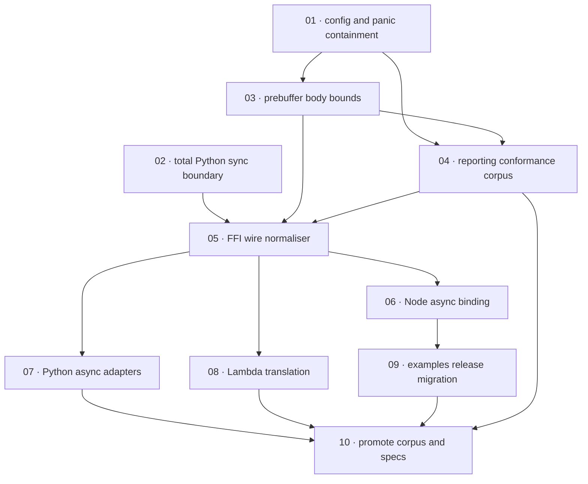

# Plan: Runtime parity across interfaces

**Status:** Review · **Layout:** kanban · **Date:** 2026-08-05 · **Owner:** Ant Stanley · **Source spec:** [2026-08-05-runtime_parity_across_interfaces.md](../../changes/2026-08-05-runtime_parity_across_interfaces.md)

**Verdict:** Complete. The plan/index package is internally consistent, source-covered, and merge-ready for the scoped unstacked PR.

**Review remediation:** Completed against the spec-reviewer pass; only plan/index text was changed in this remediation.

Build the runtime-parity change as three non-breaking containment slices, then establish a failing differential corpus, centralise request normalisation in the FFI, migrate each host adapter, and promote the corpus with release documentation. The server configuration and containment work leads because every embedded shape must inherit its limits and panic semantics; the FFI normaliser leads binding migrations because it is the contract each host is reviewed through.

---

## Source and definition-of-done baseline

- **Spec.** The source change spec and every canonical target named in its **Affected spec pages** table are in scope: bindings `00-overview` through `05-distribution`, service `04-http-api` and `06-configuration`, and `canonical-types.schema.json`. The plan covers the implementation notes through corpus gating and current-release migration; removal of deprecated entry points after one major cycle is intentionally omitted as future release work.
- **Already built.** `crates/ffi/src/lib.rs` owns an FFI runtime/router wrapper but currently builds a request from a host-spliced path; `crates/server/src/middleware/base_path.rs` has the segment-boundary helper and `with_base_path_strip`; the server already has one inner `CatchPanicLayer`; Node, Python, Lambda, and five Node examples exist. These are preconditions, not tasks. Code read: 2026-08-05 in this workspace. The plan also covers the new wire-request schema and release migration documentation required by the source spec.
- **Sibling dependencies.** The sibling `spec/fail-closed-config-and-adapters` change owns broader configuration and adapter fail-closed work. This PR records only the `base_path` and body-limit behaviour explicitly required by this source spec; reconcile conflicts and any shared `crates/core/src/config.rs` edits with that sibling before integration. The completed GIL-release plan is a precondition only; this PR replaces its blocking FFI contract rather than redoing its prior work. No implementation work from sibling specs is staged here.
- **Definition of done.** Every task inherits [development-guidelines.md](../../development-guidelines.md) §§Limits and bounds and Definition of done: named limits, meaningful assertions on touched functions, positive/negative boundary tests, and relevant Rust/TypeScript/Python format, lint, typecheck, and test gates. Task-specific checks add conformance evidence. Each task's DoD now includes explicit reviewability and the required affected-page link set.
- **Done certificates.** Intentionally omitted at the requester's direction; this is a clean planning pass and creates no certificates. The plan/index bundle therefore contains no cert files or cert text.

---

## Task graph

The dependency table is the **source of truth**; the Mermaid graph visualizes it. If the two ever disagree, the table wins.

| Task | Depends on | Edge kind | Produces (reviewable artifact) |
|---|---|---|---|
| 01 · config and panic containment | — | — | server config normalises base paths and an outer panic guard contains middleware/base-path panics |
| 02 · total Python sync boundary | — | — | direct Python calls accept an empty path and return typed input errors rather than asserting |
| 03 · prebuffer body bounds | 01 | contract | server and Python hosts reject oversized or malformed bodies before unbounded buffering |
| 04 · reporting conformance corpus | 01, 03 | contract, review | shared fixtures expose native/FFI/binding parity disagreements in a non-blocking CI job |
| 05 · FFI wire normaliser | 02, 03, 04 | contract, build, review | one async, total Rust normaliser accepts `WireRequest` and produces native-parity responses |
| 06 · Node async binding | 05 | contract | Node exposes async `handleRequest`, sync compatibility, limits, and the wire request shape |
| 07 · Python async adapters | 05 | contract | PyO3, ASGI, and WSGI preserve raw path/query/header order and bound bodies through the normaliser |
| 08 · Lambda translation | 05 | contract | Lambda event adapters map event fields without stripping or local request normalisation |
| 09 · examples release migration | 06 | review | five Node examples await the async Node API and send raw path/query fields |
| 10 · promote corpus and specs | 04, 07, 08, 09 | review, review, review, review | passing merge-gated conformance CI, version/release migration documentation, and canonical target updates; the plan/index package is the merge-ready review artifact |

---

## Implementation order and milestones

**Order:** `01, 03, 04, 02, 05, 06, 07, 08, 09, 10`. The two independently reviewable panic-removal slices start first; config/containment is scheduled before body enforcement and the corpus because it supplies the server-wide contract. The corpus then captures known drift before the breaking centralisation, and the FFI contract unlocks host-by-host migrations. This order is acyclic and matches the dependency table.

| Milestone | Tasks | Demonstrable when complete | Review gate |
|---|---|---|---|
| M1 — non-breaking containment | 01, 02, 03 | malformed base paths, empty Python paths, malformed content lengths, and oversized Python bodies do not crash or allocate without a cap | focused Rust and Python negative-space tests plus relevant formatting/lint gates pass |
| M2 — measured normalisation contract | 04, 05 | fixtures report old divergences, then FFI direct calls share the native server's shaping statuses and normalised request semantics | FFI/server tests and reporting conformance job run with recorded qualifications |
| M3 — host parity | 06, 07, 08, 09 | Node, Python, Lambda, and documented Node integrations use the wire contract without local stripping/decoding | Node, Python, Lambda, and example tests demonstrate raw path/query, duplicate-header, and body-limit cases |
| M4 — release gate | 10 | every supported shape agrees on the corpus and the release documents the breaking migration | required conformance CI is green and all canonical targets/version checks are updated; no certs are introduced |

---

## Assumptions and open questions

**Assumptions**

- `pyo3-async-runtimes` supports the abi3-py310 wheel target; if it does not, preserve the bounded/path/header migration and record the executor fallback in the implementation change. The plan keeps the async surface requirement regardless of fallback choice.
- The conformance runner can provision Rust, Node, Python, and a pinned Python server on one CI runner.
- `spec/runtime-parity-across-interfaces` should remain set to `@-` for this review-remediation pass until the review artifact is fully merged; no implementation work is being staged here.

**Decisions**

- *Scope boundary.* **The plan retained the source spec's current-release work and excluded later removal of deprecated entry points.** The latter is explicitly one-major-cycle-later work and cannot be completed or reviewed in this unstacked PR.
- *Certificates.* **The plan intentionally omitted done certificates.** The requester explicitly prohibited them; the directory review confirms there are no certificate files in this plan bundle and no cert references in the plan/index text.
- *Sibling coordination.* **The plan records, but does not absorb, the fail-closed sibling's broader configuration work.** Only overlap required for this source spec belongs here, and any shared config edits are explicitly left to that sibling PR.

**Open questions**

- *Napi unwind containment.* Does a forced outer-layer panic require napi's `catch-unwind` feature, and what measurable overhead does it impose? This is intentionally left open for implementation choice and does not block the plan/index package from being merge-ready.
- *Python support matrix.* Which WSGI/ASGI servers are supported and expose raw-path/header fidelity? This is captured as a qualification in the corpus task rather than an open plan defect, so it does not block merge readiness.
