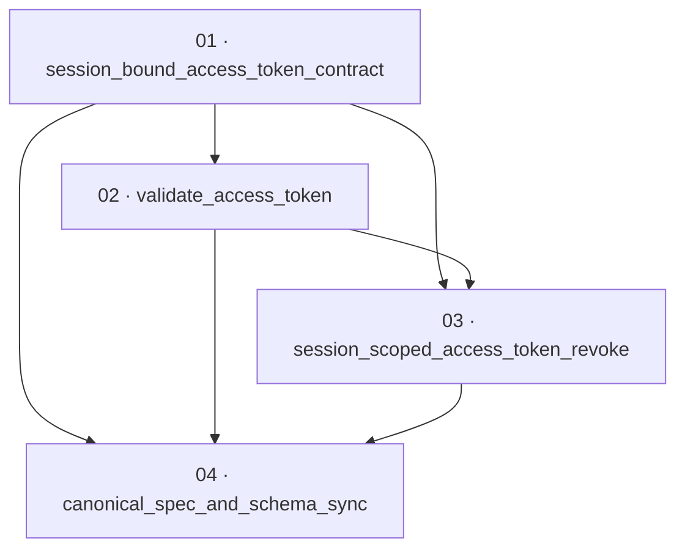

# Validate revoke-token claims — implementation plan

**Status:** Planned · **Layout:** kanban · **Date:** 2026-08-05 · **Owner:** Ant Stanley · **Source spec:** [../../changes/2026-08-05-validate_revoke_token_claims.md](../../changes/2026-08-05-validate_revoke_token_claims.md)

This plan closes the first-party JWT revocation vulnerability in `crates/core`. It changes the
access-token authority presented to `POST /revoke` from “all sessions for a verified `sub`” to
the one session named by a required `sid`, and introduces one shared
`AppService::validate_access_token` path that authenticates the JWS and validates its header,
issuer, audience, and validity window before its claims are readable. The plan leads with the
small domain/minting contract that makes a session-bound token representable (01), then builds
the validator and negative-space tests on that contract (02), rewires `/revoke` and its audit
semantics through the validator (03), and finally synchronizes all five affected canonical pages
and the machine-readable schema (04). Each package is a vertical, reviewable slice; no server,
adapter, or persistence migration is in scope.

---

## Source and definition-of-done baseline

- **Spec.** The proposed change spec targets [01-domain-model.md](../../service/specs/01-domain-model.md),
  [02-ports-and-adapters.md](../../service/specs/02-ports-and-adapters.md),
  [03-service-flows.md](../../service/specs/03-service-flows.md),
  [04-http-api.md](../../service/specs/04-http-api.md), and
  [canonical-types.schema.json](../../service/specs/canonical-types.schema.json). It explicitly
  leaves [08-persistence.md](../../service/specs/08-persistence.md) untouched: `sid` is the
  existing `Session.refresh_token_hash`, so there is no store-schema or port change.
  The source spec also states that this plan must not create done certificates; keep only task
  packages and the plan file in this folder.
- **Already built (preconditions, not tasks).** `build_access_token` already owns JWT assembly
  and signing (`crates/core/src/service/mod.rs`); exchange stores a session before minting and
  refresh has the resolved session in hand (`exchange.rs`, `refresh.rs`); the `KeyManager` port
  already exposes signing algorithm, key id, and async signature verification; `MockKeyManager`
  deterministically signs/validates test JWTs; and the session repository already supports
  lookup and idempotent one-session revocation. The current revoke access-token branch is the
  scoped defect: `verify_and_extract_sub` checks only a signature, reads untyped JSON, and then
  calls `revoke_all_user_sessions`.
- **Definition of done.** Every package inherits
  [.specs/development-guidelines.md](../../development-guidelines.md) §§Tiger Style, Rust
  conventions, Testing, and Definition of done: tests plus negative-space coverage for each new
  validation path; at least two meaningful assertions in every touched/new function; named
  constants for new bounds; no swallowed backend errors; and `cargo fmt --all --check`,
  `cargo clippy --workspace -- -D warnings`, and `cargo nextest run --workspace`. The known
  mainline baseline failure remains out of scope: `cargo test --workspace` currently has three
  config tests failing because `providers.*.adapter` is missing; this plan neither changes nor
  waives them. A task must report that pre-existing failure separately if it prevents a full run.
- **Scope boundary.** This PR is unstacked on `main`. The proposed audit/throttling and
  refresh-rotation specifications named by the source spec are external dependencies, not
  packages in this plan. Task 03 should use the audit event types and durability behavior
  available on the branch at implementation time, while preserving the source spec’s required
  outcome symmetry; task 04 documents the prescribed merge ordering and supersession rather than
  implementing either sibling.
- **No done certificates.** The user explicitly forbids done certificates. This plan creates
  only `plan.md` and four `backlog/NN-*.md` task packages. Implementers move task files through
  the kanban folders when work progresses, but **must not create `*-certificate.md` files or any
  other certificate artifacts**.

---

## Task graph

The dependency table is the **source of truth**; the Mermaid graph visualizes it. If they
disagree, the table wins.

| Task | Depends on | Edge kind | Produces (reviewable artifact) |
|---|---|---|---|
| 01 · session_bound_access_token_contract | — | — | `AccessTokenClaims.sid`, `at+jwt` minting, `sid` reserved from custom claims, and exchange/refresh callers that mint a token bound to the session they use |
| 02 · validate_access_token | 01 | contract | one first-party JWT validator that rejects malformed, wrong-header, invalid-signature, missing-claim, issuer/audience, time-window, and blank-identifier cases before returning typed claims |
| 03 · session_scoped_access_token_revoke | 01, 02 | build | `/revoke` access-token requests validate once, revoke only `claims.sid`, and produce symmetric audit outcomes while retaining RFC 7009 client semantics and backend-error propagation |
| 04 · canonical_spec_and_schema_sync | 01, 02, 03 | review | the five affected canonical artifacts state the shipped type, minting, validation, revocation, and HTTP authority model; the change spec remains Proposed for the orchestrator to merge |

Every dependency targets a lower-numbered package. The **contract** edge means task 02 can only
deserialize and validate the required `sid` after task 01 defines it. The **build** edges mean
revoke consumes both the minted/session contract and the validator. The final **review** edges
keep canonical prose and schema from claiming behavior that has not shipped.

---

## Implementation order and milestones

**Order:** `01, 02, 03, 04`. Task 01 is the compact type-and-minting spine: it eliminates every
missing `sid` construction and gives tests a real session identifier to assert. Task 02 follows
because it consumes the type/header contract and is independently reviewable as a strict
first-party-JWT validity boundary. Task 03 then replaces the vulnerable hand-rolled path with
that boundary and makes the one-session authority observable. Task 04 lands last so all
canonical wording describes shipped behavior, not a mixture of old revoke-all and new
session-scoped behavior.

| Milestone | Tasks | Demonstrable when complete | Review gate |
|---|---|---|---|
| M1 — session-bound access tokens | 01 | Exchange and refresh mint `at+jwt` access tokens containing the stable hash of their current session; a custom `sid` cannot override it | core exchange, refresh, and claims tests prove the minted/unchanged session binding |
| M2 — validated, narrow revocation | 02, 03 | A signed token must be the current service’s unexpired `at+jwt` with required claims before `/revoke` touches storage; a valid token removes only its own session | revoke negatives leave sessions live and record the required failure event; positive access-token revoke leaves sibling sessions live and audits one token revocation |
| M3 — canonical convergence | 04 | Prose and schema agree with the code and the change spec’s merge instructions remain actionable | documentation/schema review plus the scoped Rust test suite; full workspace test result reported with the known unrelated config failures if still present |

---

## Assumptions and open questions

**Assumptions**

- This change lands before refresh-token rotation. Until the rotation proposal lands,
  `Session.refresh_token_hash` is stable for a session lifetime and is the `sid` value. The later
  rotation proposal is responsible for migrating `sid` to `family_id`, retargeting revoke to a
  family operation, and failing closed on old hash-valued identifiers.
- `token.audience.unwrap_or_default()` is intentionally the same expression at mint and validate
  boundaries; changing configured audience invalidates older access tokens for revocation.
- Tokens minted before this change (`typ: "JWT"`, no `sid`) fail closed at access-token
  revocation. Their maximum normal lifetime is the configured access-token TTL.
- The referenced sealed `.security` bundle is not present in this workspace, so task packages
  rely on the change spec’s stated invariants and reproducible code/test pointers rather than
  adding a dependency on that absent evidence directory.

**Decisions**

- *One validator, one authority model.* **Tasks 02 and 03 are separated for review but retain a
  hard edge.** The validator is a reusable boundary; session-scoped revoke is the only current
  consumer. Neither is considered complete behaviorally without the other.
- *Domain contract before canonical sync.* **Task 01 updates code/tests only; task 04 applies the
  canonical schema and prose together after all behavior exists.** This avoids concurrent edits
  to the same spec sections while keeping the final package accountable for every affected
  canonical artifact.
- *Audit sibling is external.* **This PR must not implement the absent
  `2026-08-05-audit_and_throttle_authentication_failures` proposal.** Task 03 records the
  required failure outcome using the current audit surface or the sibling’s API only if it has
  independently merged first; no speculative audit types, limiter, durability config, or
  throttling code belongs here.
- *No certificates.* **Task completion is evidenced by task-file checklists and command output
  in the implementation PR, not by done-certificate files.** This is an explicit user constraint
  and overrides the historical plan-folder convention.

**Open questions**

- The source spec names an `AuthenticationFailed` security event “rendered `ValidationFailed`,"
  but current `AuditEventType` exposes only `ValidationFailed` and the audit/throttling sibling
  is absent. Before implementation, confirm whether that sibling has merged; use its compatible
  canonical event/channel API if so, otherwise use `ValidationFailed` without broadening this PR.
- The source spec’s 60-second leeway applies to `exp`, `iat`, and optional `nbf`. Task 02 must
  make the inclusive/exclusive boundary explicit in tests (including exact-skew behavior) so the
  implementation does not accidentally turn leeway into an extra credential lifetime beyond the
  documented rule.
- The source spec requires the task graph and dependency order to remain aligned with the
  implementation notes, so keep the 01 → 02 → 03 → 04 ordering and do not introduce any new
  certificate-producing tasks or done artifacts while reviewing this plan.
- Should an access token whose `sid` points to an already-expired-but-not-yet-reaped session emit
  a success audit after the idempotent revoke, or be treated as a no-op? The source spec leaves
  this unsettled; preserve current repository semantics and raise it as a follow-up rather than
  adding session-expiry validation to this change.
