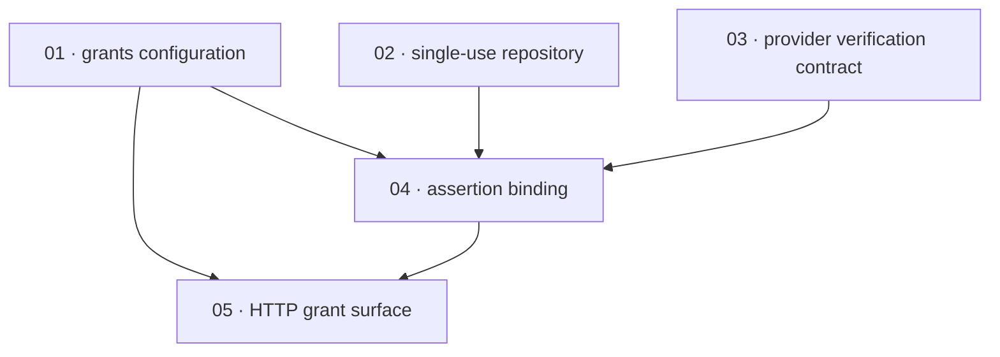

# Plan: Bind the direct ID-token grant to replay protection

**Status:** Draft · **Layout:** kanban · **Date:** 2026-08-15 · **Owner:** Ant Stanley · **Source spec:** [`.specs/changes/2026-08-05-bind_id_token_grant_replay_protection.md`](../../changes/2026-08-05-bind_id_token_grant_replay_protection.md)

Implement the replay-protected direct ID-token grant as a reviewable spine: establish typed configuration and portable atomic single-use storage, extend the provider-to-core contract, then bind verified assertions once in core before exposing the opt-in HTTP surface. The repository contract and all five store implementations lead because the binding flow cannot be reviewed safely without atomic consume/claim semantics; the core flow then becomes independently testable before server wiring exposes it.

---

## Source and definition-of-done baseline

- **Spec.** The source change spec and its affected canonical pages: [00-overview](../../service/specs/00-overview.md), [01-domain-model](../../service/specs/01-domain-model.md), [02-ports-and-adapters](../../service/specs/02-ports-and-adapters.md), [03-service-flows](../../service/specs/03-service-flows.md), [04-http-api](../../service/specs/04-http-api.md), [05-provider-system](../../service/specs/05-provider-system.md), [06-configuration](../../service/specs/06-configuration.md), [08-persistence](../../service/specs/08-persistence.md), and [the service canonical types schema](../../service/specs/canonical-types.schema.json). This unstacked plan covers only the replay-protection change; sibling proposed specs are external integration dependencies.
- **Already built.** `AppService::exchange` already validates an ID token for direct and authorization-code input paths; the standard OIDC and Apple providers validate signature, issuer, audience, expiry, and `nbf`; five session adapters and `MockRepository` already implement `SessionRepository`; the server already shares `build_router` across server, Lambda, and FFI. None implement the grants switch, nonce route, binding checks, single-use store API, `client_id()`, or `IdentityClaims.signing_alg`.
- **Definition of done.** Every task inherits [`.specs/development-guidelines.md` §Limits and bounds and §Definition of done](../../development-guidelines.md): focused Rust tests with positive and negative cases, two meaningful assertions per touched/new function, named constants for new bounds, public-item documentation, `cargo fmt --all`, `cargo clippy --workspace -- -D warnings`, and `cargo nextest run --workspace`. The known baseline is red: `cargo test --workspace` on `main` has three unrelated configuration-test failures caused by missing `providers.*.adapter`; do not repair or attribute those failures to this plan.
- **Done certificates.** Intentionally omitted at the user's direction. No certificate files are authored for this plan; this plan must not create any done-certificate artifacts.

---

## Task graph

The dependency table is the **source of truth**; the Mermaid graph visualizes it. If the two ever disagree, the table wins — fix the graph to match.

| Task | Depends on | Edge kind | Produces (reviewable artifact) |
|---|---|---|---|
| 01 · grants configuration | — | — | startup accepts validated opt-in direct-grant configuration with safe compiled defaults |
| 02 · single-use repository | — | — | every supported session store atomically inserts or consumes short-lived single-use records |
| 03 · provider verification contract | — | — | every provider returns its verified signing algorithm and configured client ID to core |
| 04 · assertion binding | 01, 02, 03 | build, data, contract | core rejects replayable or improperly bound assertions on both exchange paths |
| 05 · HTTP grant surface | 01, 04 | contract, review | an enabled deployment mints nonces and advertises/serves the direct grant; a disabled deployment exposes neither |

| Task | Depends on | Edge kind | Produces (reviewable artifact) |
|---|---|---|---|
| 01 · grants configuration | — | — | startup accepts validated opt-in direct-grant configuration with safe compiled defaults |
| 02 · single-use repository | — | — | every supported session store atomically inserts or consumes short-lived single-use records |
| 03 · provider verification contract | — | — | every provider returns its verified signing algorithm and configured client ID to core |
| 04 · assertion binding | 01, 02, 03 | build, data, contract | core rejects replayable or improperly bound assertions on both exchange paths |
| 05 · HTTP grant surface | 01, 04 | contract, review | an enabled deployment mints nonces and advertises/serves the direct grant; a disabled deployment exposes neither |

---

## Implementation order and milestones

**Order:** `01, 02, 03, 04, 05` — configuration establishes an opt-in safety boundary early, while the repository and provider contract can proceed independently. Assertion binding follows once it can use atomic state and trusted provider metadata; the HTTP surface lands last so a reviewer can exercise a complete safe path rather than a partially wired public endpoint.

**Milestones:**

| Milestone | Tasks | Demonstrable when complete | Review gate |
|---|---|---|---|
| M1 — prerequisites | 01, 02, 03 | an operator can configure the feature, all stores provide atomic state, and providers expose trusted binding inputs | focused config, adapter-conformance, and provider tests pass; format and clippy are clean |
| M2 — core security path | 04 | core accepts each valid assertion once and rejects missing/invalid nonce, replay, lifetime, `azp`, and `at_hash` cases | core exchange and assertion tests cover both grant paths and negative space |
| M3 — opt-in public surface | 05 | a reviewer can enable the grant, obtain a nonce, exchange once, observe discovery metadata, and confirm disabled requests/routes are rejected or absent | server E2E/route tests and all applicable Rust gates pass, except documented pre-existing baseline failures |

---

## Assumptions and open questions

**Source coverage**

- This plan covers only the service-side replay-protection change from the source spec. It does not expand scope to sibling change specs or unrelated hardening proposals.
- The task graph must cover every affected canonical page named in the source spec, including 00-overview, 01-domain-model, 02-ports-and-adapters, 03-service-flows, 04-http-api, 05-provider-system, 06-configuration, 08-persistence, and canonical-types.schema.json.
- The review must verify that no done certificates are created, and that the plan remains entirely within the plan folder plus `.specs/README.md`.

**Assumptions**

- Existing direct-grant clients can fetch `POST /nonce` before provider authentication and pass its returned value as the upstream OIDC nonce.
- The plan must preserve the repository rule that per-package specs may reference global specs, but global specs do not reference package-specific pages; any links added here must keep that directionality intact.
- The existing `SessionRepository` selection rules continue to locate single-use state in `[session_repository]` when configured and otherwise in `[repository]`.
- Proposed sibling specs for endpoint grant-type parsing and refresh-token rotation remain external to this unstacked PR.

**Decisions**

- *Repository-first security boundary.* **The atomic single-use port and its five adapters are a dedicated package before core binding.** This makes the replay primitive independently reviewable and prevents the core task from relying on mock-only semantics.
- *No certificate artifacts.* **This plan remains a planning document only.** The work may discuss later certificate handling, but it must not create or imply any done-certificate files as part of review remediation.
- *Core before route exposure.* **The assertion-binding service task precedes nonce route and discovery wiring.** The new unauthenticated route becomes reachable only after its state machine and rejection behavior have focused core coverage.
- *Certificates.* **No done certificates were authored.** The user explicitly forbade them, so task headers point to the deliberate omission rather than nonexistent files.

**Open questions**

- *EdDSA compatibility.* Does any deployment configure a provider that emits both an EdDSA-signed ID token and `at_hash`? The proposed global rejection needs a per-provider exception if this occurs.
- *Scope boundary.* The implementation tasks should not require edits to `.specs/changes/2026-08-05-bind_id_token_grant_replay_protection.md` or any source code; they are limited to the plan folder and `.specs/README.md` only.
- *Nonce endpoint discovery.* Should a custom discovery member publish `POST /nonce`, or should direct-grant clients learn it through deployment documentation? This does not block the scoped implementation because the source spec intentionally leaves it out of discovery.
- *Sibling integration.* When the grant-type endpoint and refresh-rotation specs merge, which merge order reconciles their overlapping `ExchangeRequest`, `SessionRepository`, flow, and canonical-spec changes? This PR must not implement either sibling's work.
