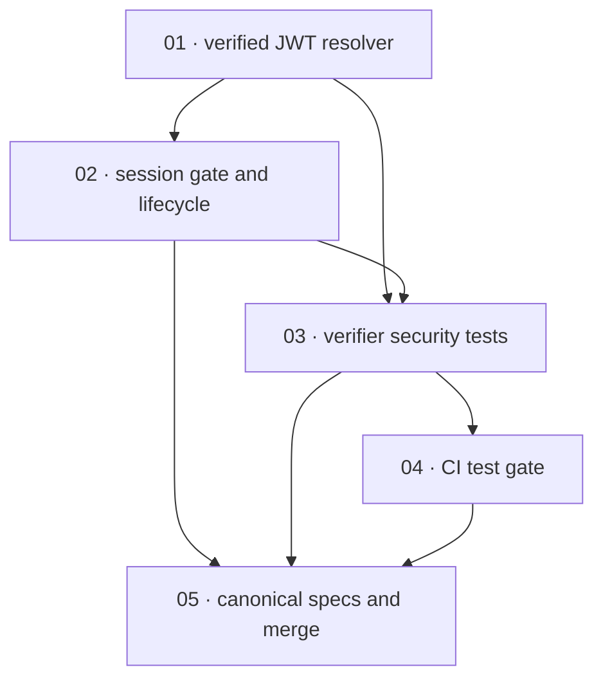

# Plan: Verify the admin UI session JWT

**Status:** Done · **Layout:** kanban · **Date:** 2026-08-15 · **Owner:** Ant Stanley · **Source spec:** [changes/merged/2026-08-05-verify_admin_ui_session_jwt.md](../../changes/merged/2026-08-05-verify_admin_ui_session_jwt.md)

Replace the console's unverified JWT decoding with one discovery-backed verification path, then route the gate and login lifecycle through it and prove the security boundary with focused Vitest coverage and CI execution. The verifier leads because the gate, login action, cookie policy, and tests all review through its signature, claim-binding, and fail-closed contract; canonical-spec and change-spec merge housekeeping close the scoped change after that vertical path is demonstrable.

---

## Source and definition-of-done baseline

- **Spec.** [Change: Verify the admin console's session JWT against the service JWKS](../../changes/merged/2026-08-05-verify_admin_ui_session_jwt.md), specifically `Affected spec pages`, `Proposed changes`, `Type changes`, `Implementation notes`, and `Merge plan`. It targets [Admin UI overview](../../admin-ui/specs/00-overview.md) and [Development Guidelines](../../development-guidelines.md) while consuming the existing service discovery/JWKS contract in [HTTP API, Roles, and Bootstrap](../../service/specs/04-http-api.md) and the service audience configuration described in [Configuration](../../service/specs/06-configuration.md). This unstacked plan schedules only this change; the proposed audience-config hardening and admin-plane work remain external dependencies.
- **Already built.** The admin UI already has a SvelteKit server gate, paste-token login action, logout route, and an unused five-minute JWKS fetch cache (`apps/admin-ui/src/hooks.server.ts:4`, `apps/admin-ui/src/routes/login/+page.server.ts:5`, `apps/admin-ui/src/routes/logout/+page.server.ts:4`, `apps/admin-ui/src/lib/auth.ts:17`). The service already publishes discovery, JWKS, `issuer`, and an algorithm list (`.specs/service/specs/04-http-api.md` §Routes and §GET /.well-known/openid-configuration). Current code has no admin-UI tests and decides authorization from an unverified decode; it is the work planned here, not a precondition.
- **Canonical targets.** The plan's review and merge steps only touch `.specs/admin-ui/specs/00-overview.md`, `.specs/development-guidelines.md`, `.specs/README.md`, and the plan folder itself. The source spec and source code are not modified during review.
- **Definition of done.** Every package inherits [.specs/development-guidelines.md](../../development-guidelines.md) §Limits and bounds, §TypeScript conventions, and §Definition of done: defensive validation, named bounds, meaningful assertions in touched functions, positive and negative-space Vitest tests, and clean `pnpm format:check`, `pnpm lint`, `pnpm typecheck`, and `pnpm test` for the affected TypeScript workspace. Task-specific acceptance supplements that baseline. The known main baseline failure—three Rust configuration tests missing `providers.*.adapter`—is unrelated and must be reported rather than fixed.

- **Done certificates.** Intentionally omitted at the user's explicit direction. No certificate files are authored for this plan; the done-certificate checklist does not apply.
- **Source coverage.** The plan is grounded in the change spec, admin UI overview, development guidelines, service HTTP API, service configuration, and the current admin-ui code paths named in the task pointers. No additional source pages are needed for review or implementation.

---

## Task graph

The dependency table is the **source of truth**; the Mermaid graph visualizes it. If the two ever disagree, the table wins—fix the graph to match.

| Task | Depends on | Edge kind | Produces (reviewable artifact) |
|---|---|---|---|
| 01 · verified JWT resolver | — | — | `verifyAccessToken` verifies a token through configured discovery, JWKS, algorithm, and required-claim bindings, while unverified decode helpers are absent |
| 02 · session gate and lifecycle | 01 | build, review | the hook, login, and logout routes admit only verified admin tokens and manage a hardened `__Host-admin_session` cookie |
| 03 · verifier security tests | 01, 02 | contract, review | generated-key tests exercise the verifier and both enforcement points across accepted and rejected token cases |
| 04 · CI test gate | 03 | review | the `web-apps` job runs the admin UI's Vitest suite alongside its existing TypeScript gates |
| 05 · canonical specs and merge | 02, 03, 04 | contract, review | canonical admin-UI and CI guidance describe the shipped behavior, and the change-spec merge bookkeeping is ready to apply |

Each row keys a task by number and title, not a file path: task files move between kanban subfolders as work proceeds. `Depends on` references lower numbers and edge kinds name why the predecessor is required.

---

## Implementation order and milestones

**Order:** `01, 02, 03, 04, 05` — the verification resolver is the review-through security boundary, so it precedes all cookie and route work. The lifecycle task then provides the end-to-end path tests can exercise; CI makes that proof continuously enforced before the canonical specification and merge state are synchronized.

**Milestones:**

| Milestone | Tasks | Demonstrable when complete | Review gate |
|---|---|---|---|
| M1 — verified session path | 01, 02 | a valid configured-service token reaches an authenticated route only after signature and claims verify; all invalid token cases clear or avoid the hardened session cookie | Focused admin-UI format, lint, typecheck, and route/verifier tests pass locally |
| M2 — executable security proof | 03, 04 | generated-key tests prove acceptance and specified rejection cases, and CI runs them for every change | `web-apps` job runs lint, format check, typecheck, and `pnpm test` for the admin UI |
| M3 — canonical merge state | 05 | canonical pages and change-spec bookkeeping accurately describe the delivered console behavior | Re-run scoped TypeScript gates; report but do not fix the known unrelated `cargo test --workspace` configuration failures |

---

## Assumptions and open questions

**Assumptions**

- The exchange endpoint configured for the console serves the `exchange` or `all` role and exposes discovery plus JWKS; a public-role endpoint is a deployment prerequisite outside this PR.
- The separate proposed config hardening makes service `[token] audience` required before production deployment. Until it merges, this PR's console still fails closed when its configured audience does not match issued tokens.
- `jose` and Vitest can be added using the workspace's existing pnpm lockfile and Node 24 toolchain.

**Decisions**

- *Vertical security boundary first.* **The resolver is one package, and gate/login lifecycle is a second package.** The resolver has a self-contained contract reviewers can inspect; the lifecycle package demonstrates every enforcement point consumes only its result.
- *Tests precede CI wiring in the graph.* **The test suite is authored and shown locally before the workflow invokes it.** This makes the CI change reviewable as an enforcement addition rather than as untested workflow plumbing.
- *Certificates omitted.* **No done certificates were authored.** The user explicitly prohibited certificate files, so task headers name that omission instead of linking to nonexistent artifacts.
- *Unstacked scope.* **This plan does not implement sibling proposed changes.** Their surfaces are external dependencies or follow-on work, preserving a plan buildable against `main` plus this PR only.
- *No-certificate constraint is absolute.* **The plan folder contains backlog task files only; no done-certificate artifacts appear anywhere under the plan directory.** The review checks for that absence as part of acceptance.

**Open questions**

- *Deployment exposure.* Is `apps/admin-ui` deployed, and should a build/release artifact be added or should it be declared a reference implementation? This does not block this scoped verification change.
- *Future authentication model.* Should the service issue a dedicated operator session instead of accepting pasted user access tokens? This plan leaves that admin-plane redesign to the named follow-on change.
- *Provider redirect return.* If a `login/callback` flow is later added, should it use `SameSite=Lax` or a same-site landing hop while retaining the `__Host-` cookie requirements? It does not block the current pasted-token flow.
