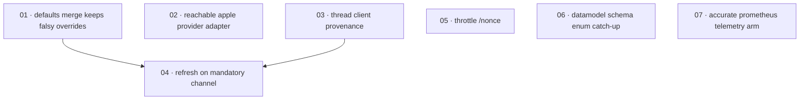

# Plan: Close the R2 audit's code-side divergences

**Status:** Draft · **Layout:** kanban · **Date:** 2026-08-25 · **Owner:** Ant Stanley · **Source spec:** [.specs/changes/2026-08-25-close_r2_audit_code_divergences.md](../../changes/2026-08-25-close_r2_audit_code_divergences.md)

Seven independently-reviewable code fixes bring `crates/core`, `crates/server`, and the code-side
`schemas/datamodel.schema.json` up to the behaviour the canonical specs already describe. The spine
leads with the two config-resolution fixes (S2 falsy-override reversion, S1 unreachable Apple adapter)
because they gate the config-driven test setup everything else relies on, then the audit pair
(S7 real client provenance threaded through the core flows, S3 the refresh flow onto the mandatory
security-audit channel) in that order because S3's mandatory emission calls consume the `ClientAddr`
S7 threads through, and closes with the three independent conformance fixes (S11 throttle `/nonce`,
S6 the datamodel-schema enum catch-up, S16 an accurate `prometheus` telemetry arm). The canonical
prose edits and the `canonical-types.schema.json` fold-in are the change spec's own merge plan and
stay orchestrator-owned; this plan schedules only the executable deltas.

---

## Source and definition-of-done baseline

- **Spec.** [2026-08-25-close_r2_audit_code_divergences.md](../../changes/2026-08-25-close_r2_audit_code_divergences.md) — the code side only of the 2026-08-25 R2 conformance review. In scope: the seven deltas S1, S2, S3, S7, S11, S6-code, S16-code under its *The delta* section. Canonical targets whose prose the code makes true: [00-overview](../../service/specs/00-overview.md), [01-domain-model](../../service/specs/01-domain-model.md), [02-ports-and-adapters](../../service/specs/02-ports-and-adapters.md), [03-service-flows](../../service/specs/03-service-flows.md), [04-http-api](../../service/specs/04-http-api.md), [05-provider-system](../../service/specs/05-provider-system.md), [06-configuration](../../service/specs/06-configuration.md), [07-telemetry-and-audit](../../service/specs/07-telemetry-and-audit.md), and the [service canonical types](../../service/specs/canonical-types.schema.json) sidecar.
- **Already built.** The change spec's targets are shipped-but-divergent code, not greenfield. Verified against the working copy (branch `fix/r2-audit-findings`, parented on `main @ 323b049`): `ProviderAdapter::parse_field` (`crates/core/src/config.rs:2025`) has no `apple` arm and the registry arm at `crates/server/src/bootstrap.rs:1607` is dead; `remove_empty_values` (`bootstrap.rs:94`) strips falsy overrides; the five `refresh.rs` emission sites all use best-effort `emit_audit`; `AuditEventType::RefreshTokenReuse` (`audit.rs:74`) and `AuditFailure::RefreshTokenReuse` (`audit.rs:353`) already exist but `SecurityEvent` (`audit.rs:156`) carries no reuse variant; `public_throttle` gates on `"/token" | "/revoke"` only (`public_throttle.rs:61`); `datamodel.schema.json` lists 14 event types and no `operator`; `init_telemetry` matches `config.exporter.as_str()` with an unreachable unknown-exporter arm (`telemetry.rs:28,62`). Existing tests `crates/core/tests/{exchange_mandatory_outcomes,refresh,exchange,revoke,assertion,service_leak_corpus,user_admin}.rs` and `crates/server/tests/e2e.rs` are the surfaces the new coverage extends; `refresh_mandatory_outcomes.rs` does not yet exist.
- **Definition of done.** Every task inherits [development-guidelines.md](../../development-guidelines.md) §"Definition of done": the behaviour is exercised by a test, negative-space tests cover every new validation path, touched functions carry meaningful assertions, every new bound is a named constant, and `cargo fmt` / `cargo clippy --workspace -- -D warnings` / `cargo nextest run --workspace` pass. Each task file adds its task-specific acceptance and a reviewable result on top of that baseline. Done certificates are authored one-per-task beside each task in `backlog/`.

---

## Task graph

The dependency table is the **source of truth**; the Mermaid graph visualizes it. If the two ever
disagree, the table wins.

| Task | Depends on | Edge kind | Produces (reviewable artifact) |
|---|---|---|---|
| 01 · defaults merge keeps falsy overrides | — | — | Explicit `false`/`0`/`""` config overrides survive resolution instead of reverting to `config/default.toml`; an explicit empty string fails loudly. |
| 02 · reachable apple provider adapter | — | — | `[providers.x] adapter = "apple"` resolves and boots; a storage/key value on a provider block is rejected at config load, not at registry build. |
| 03 · thread client provenance | — | — | Core-flow audit events record the middleware's true `ip_address_source` (`peer`/`forwarded`/`unknown`) instead of `asserted`. |
| 04 · refresh on mandatory channel | 01, 03 | data, build | Refresh success, suspension (both gates), and reuse emit on the mandatory security channel; `ValidationFailed` refusals stay best-effort. |
| 05 · throttle /nonce | — | — | `/nonce` shares the per-IP throttle budget with `/token`; over-budget returns `429 slow_down` and emits `ThrottleExceeded`. |
| 06 · datamodel schema enum catch-up | — | — | `schemas/datamodel.schema.json` mirrors the 18 `AuditEventType` and 9 `AuditFailure` variants plus optional `operator`, guarded by a mirror test. |
| 07 · accurate prometheus telemetry arm | — | — | `init_telemetry` matches the closed `TelemetryExporter` enum; `prometheus` warns accurately and the unreachable unknown-exporter arm is gone. |

Each row keys a task by **number and title**, not a path link — a task file is found by globbing its
number across the kanban subfolders (`*/NN-*.md`). Every `Depends on` references a **lower** task
number, the property of numbering in implementation order.

---

## Implementation order and milestones

**Order:** `01, 02, 03, 04, 05, 06, 07`. S2 (01) leads because it gates the config-driven test setup
every later config-dependent test relies on — most concretely task 04's rotation-disabled suspension
gate, which is only live once `token.refresh_rotation = false` actually takes effect. S1 (02) sits
beside it as the other config-resolution fix. S7 (03) precedes S3 (04) because S3's mandatory emission
calls consume the `ClientAddr` S7 threads through, and both touch the same `refresh.rs` emission sites,
so doing S7 first avoids rewriting them twice. The three independent conformance fixes (05, 06, 07)
trail because nothing depends on them; they are ordered only for a clean review cadence.

**Milestones:**

| Milestone | Tasks | Demonstrable when complete | Review gate |
|---|---|---|---|
| M1 — config resolution correctness | 01, 02 | An explicit `refresh_rotation = false` / `per_subject = 0` / `enabled = false` survives resolution, an explicit empty string fails loudly, `adapter = "apple"` boots, and a storage value on a provider block is rejected at config load. | Config resolve unit/integration tests (positive and negative) green. |
| M2 — audit provenance and mandatory channel | 03, 04 | A `/token` terminal audit event records `ip_address_source == "peer"` (and `"forwarded"` behind a trusted proxy); refresh success, suspension, and reuse events survive a raised `emit_threshold` while `ValidationFailed` refusals stay filtered. | Provenance server e2e plus `refresh_mandatory_outcomes.rs` green; existing refresh/exchange/revoke suites still pass. |
| M3 — remaining conformance fixes | 05, 06, 07 | Exhausting the per-IP budget against `/nonce` returns `429 slow_down` and emits `ThrottleExceeded`; the datamodel schema enums equal the serde variant lists; `prometheus` is an accurate warn arm with no unknown-exporter path. | Throttle e2e, schema-mirror test, and telemetry-match test green. |

---

## Coverage index

| Source delta (change spec §The delta) | Task |
|---|---|
| S2 — defaults merge stops reverting `false`/`0`/`""` | 01 |
| S1 — `adapter = "apple"` reachable via `IdentityProviderAdapter` | 02 |
| S7 — thread middleware-resolved `ClientAddr` into core flows | 03 |
| S3 — refresh security outcomes on the mandatory audit channel | 04 |
| S11 — `/nonce` under the public per-IP throttle | 05 |
| S6-code — `schemas/datamodel.schema.json` catch-up | 06 |
| S16-code — accurate `prometheus` arm in telemetry init | 07 |
| Canonical prose edits (twelve Modify/Add blocks) + `canonical-types.schema.json` fragment | change spec Merge plan — orchestrator-owned, not scheduled here |

---

## Assumptions and open questions

**Assumptions**

- The R2 review's empirical findings hold on this branch (re-verified against the working copy):
  `adapter = "apple"` fails resolution; `refresh_rotation = false` and `per_subject = 0` revert; all
  five `refresh.rs` emission sites use `emit_audit`; `public_throttle` gates on `/token`/`/revoke`
  only; `datamodel.schema.json` lags the audit enums; `prometheus` falls into the unknown-exporter arm.
- `AppleProvider::from_config(&config.extra)` is construction-complete for a config-supplied block;
  only its reachability is broken. No deployment path bypasses `Config::resolve` to reach the registry.
- The audit document is session-local and intentionally uncommitted; the change spec carries the
  anchors these tasks need.
- The reviewer signs off per milestone; each milestone boundary is a reviewable state.

**Decisions**

- *Code deltas only; canonical prose edits stay orchestrator-owned.* The change spec's twelve
  Modify/Add blocks against `01`/`03`/`04`/`05`/`06`/`07` and its `canonical-types.schema.json`
  fragment are its own *Merge plan* — spec-merge work, applied when the change spec flips to Merged,
  the same convention every prior plan in this repo follows. This plan schedules the executable
  deltas; each task names the canonical page(s) its behaviour makes true so the merge pass can verify
  them, but no task claims those page edits are already applied. `schemas/datamodel.schema.json` is
  the one exception folded in as a task (06) because the change spec classes it a *code-side artifact*,
  not a canonical page.
- *S3 depends on both 01 and 03.* Task 04's mandatory-channel test asserts the rotation-disabled
  suspension gate emits on the mandatory channel, which is only exercisable once S2 (task 01) makes
  `refresh_rotation = false` functional (data edge); and S3's emission calls fold in the `ClientAddr`
  S7 (task 03) threads through the request structs (build edge). The two share the `refresh.rs`
  emission sites, so ordering S7 before S3 avoids editing them twice.
- *S14 is out of scope.* The unconditional existing-user verified-email predicate
  (`exchange.rs:330`) is deliberate and stays; its canonical-page correction belongs to the deferred
  doc-only pass, not this plan.

**Open questions**

- *S16 / telemetry-exporters coordination.* The pending
  [2026-06-24-complete_telemetry_exporters.md](../../changes/2026-06-24-complete_telemetry_exporters.md)
  change also rewrites `07`'s exporter-behaviour list and may wire a real `prometheus` pipeline.
  Task 07 ships only the accurate warn-arm; whichever change merges second must re-verify the
  exporter list against `init_telemetry`. Should the pending change's scope be extended to a real
  metrics pipeline? Recorded in the change spec's own Open questions; it does not block this plan.
