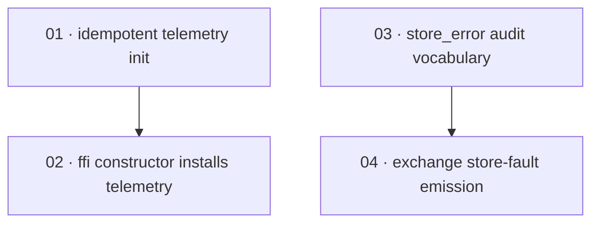

# Plan: Embedded telemetry install and the exchange store-fault audit record

**Status:** Done · **Layout:** kanban · **Date:** 2026-08-31 · **Owner:** Ant Stanley · **Source spec:** [.specs/changes/2026-08-31-embedded_telemetry_and_store_fault_audit.md](../../changes/2026-08-31-embedded_telemetry_and_store_fault_audit.md)

Four tasks in two independent two-task chains close GitHub issue #47's two gaps. The G1 chain
(01 → 02) makes `init_telemetry` idempotent and host-respecting via `try_init`, then installs it
at `OidcExchange` construction so every embedded deployment (Node, Lambda, Python — one FFI call
site, no binding changes) gets the 500 mapping's diagnostic log and the panic-boundary record on
the host's stdout under `RUST_LOG` control. The G2 chain (03 → 04) adds `StoreError` to the audit
vocabulary (enums plus the code-side `schemas/datamodel.schema.json`, mirror-test enforced), then
emits one best-effort operational `store_error` event from the exchange flow's previously silent
`StoreError` early return, discarding the emission result so the original error always reaches the
caller. The chains share no files and can proceed in parallel; within each chain the enabler leads
because the second task's tests pin exactly the behaviour the first creates. Canonical prose edits
and the `canonical-types.schema.json` fold-in stay with the change spec's own Merge plan.

---

## Source and definition-of-done baseline

- **Spec.** [2026-08-31-embedded_telemetry_and_store_fault_audit.md](../../changes/2026-08-31-embedded_telemetry_and_store_fault_audit.md) —
  the executable deltas G1 and G2 under its *The delta* section, including
  `schemas/datamodel.schema.json` (a code-side artifact, per the spec). Canonical targets whose
  prose the code makes true: [07-telemetry-and-audit](../../service/specs/07-telemetry-and-audit.md),
  [03-service-flows](../../service/specs/03-service-flows.md),
  [01-domain-model](../../service/specs/01-domain-model.md),
  [01-ffi-core](../../bindings/specs/01-ffi-core.md), and the
  [service canonical types](../../service/specs/canonical-types.schema.json) sidecar.
- **Already built.** Verified against this workspace (`main`, post-R2 commit `1c024aa`):
  `init_telemetry` (`crates/server/src/telemetry.rs:22-47`) installs via `.init()` at lines 37-40
  and has exactly one caller (`crates/server/src/main.rs:29`); `crates/ffi/src/lib.rs` installs no
  subscriber and `tracing-subscriber` is dev-only in `crates/ffi/Cargo.toml:29` while the FFI
  already depends on the server crate (`Cargo.toml:11`), which carries `tracing-subscriber` with
  `env-filter`/`json` (`crates/server/Cargo.toml:20`); the server crate exports `pub mod telemetry`
  (`crates/server/src/lib.rs:9`). The exchange `StoreError` arm
  (`crates/core/src/service/exchange.rs:158-162`) returns silently, and
  `crates/core/tests/exchange.rs:1282-1290` (the `events.is_empty()` assertion) pins that silence,
  which task 04 must invert. The R2 fixes are in: `ClientAddr` provenance is threaded through
  `ExchangeRequest`, and the S6 mirror guard (`crates/core/tests/datamodel_schema_mirror.rs`) holds
  exhaustive `all_event_types`/`all_failures` builders. Test infrastructure exists:
  `MockAuditLog` records events and injects failures (`crates/test-utils/src/lib.rs:743-782`),
  `FailingCreateUserRepository` produces `StoreError` (`crates/core/tests/exchange.rs:275-317`),
  and the FFI embedder fixture shape is `crates/ffi/src/lib.rs:620-671`.
- **Definition of done.** Every task inherits
  [development-guidelines.md](../../development-guidelines.md) §"Definition of done": the behaviour
  is exercised by a test, negative-space tests cover every new validation path, touched functions
  carry meaningful assertions, every new bound is a named constant, and `cargo fmt` /
  `cargo clippy --workspace -- -D warnings` / `cargo nextest run --workspace` pass. Each task file
  adds its task-specific acceptance and a reviewable result on top. Done certificates are authored
  one-per-task beside each task in `backlog/`.

---

## Task graph

The dependency table is the **source of truth**; the Mermaid graph visualizes it. If the two ever
disagree, the table wins.

| Task | Depends on | Edge kind | Produces (reviewable artifact) |
|---|---|---|---|
| 01 · idempotent telemetry init | — | — | `init_telemetry` called twice returns `Ok` both times; an already-set global dispatcher is retained with a debug note and no exporter fallback warning; the server binary's first-call behaviour is unchanged. |
| 02 · ffi constructor installs telemetry | 01 | build | Constructing `OidcExchange` installs the subscriber; a second instance neither panics nor fails; a host-owned subscriber is respected and captures the FFI's boundary diagnostics end to end. |
| 03 · store_error audit vocabulary | — | — | `AuditEventType::StoreError` and `AuditFailure::StoreError` exist (serialized `store_error`), mirrored into both `schemas/datamodel.schema.json` enums and enforced by the mirror test; `SecurityEvent` is unchanged. |
| 04 · exchange store-fault emission | 03 | build | An exchange against a failing store returns `StoreError` and the audit stream carries exactly one operational `store_error` event (Error severity, best-effort channel, `detail.store_detail` populated); emission failure never displaces the `StoreError`. |

Each row keys a task by **number and title**, not a path link — a task file is found by globbing
its number across the kanban subfolders (`*/NN-*.md`). Every `Depends on` references a **lower**
task number, the property of numbering in implementation order.

---

## Implementation order and milestones

**Order:** `01, 02, 03, 04`. The two chains are independent — 01/02 touch
`crates/server/src/telemetry.rs` and `crates/ffi`, 03/04 touch `crates/core` and `schemas/` — so a
builder may run them in parallel (01 ∥ 03, then 02 ∥ 04). G1 leads the numbering per the change
spec's implementation note: landing it first maximises diagnostic value while G2 is built, and 02's
tests are only safe once 01 makes a second install non-panicking. Within G2, 03 leads because 04's
emission constructs the very variants 03 introduces; 03 is separately reviewable through the mirror
test before any flow behaviour changes.

**Milestones:**

| Milestone | Tasks | Demonstrable when complete | Review gate |
|---|---|---|---|
| M1 — embedded diagnostics visible | 01, 02 | Constructing an embedded instance over the minimal SQLite config leaves `tracing::dispatcher::has_been_set()` true; a second construction serves `/health`; a host-installed subscriber survives construction and captures the deterministic `invalid request headers dropped at FFI boundary` warning during a real request. | The server telemetry binaries (double-init and retained-dispatcher) and both per-process FFI integration binaries green; existing FFI/server suites unchanged. |
| M2 — store fault on the audit stream | 03, 04 | An exchange against a failing session store returns `StoreError` while the recording sink holds exactly one `store_error` event with the specified shape; raising `emit_threshold` past `Error` suppresses it without changing the response; the mirror test proves the schema carries both new enum values. | Mirror test plus the new flow tests green; `exchange_mandatory_outcomes.rs` and the rest of the core suite unchanged. |

---

## Coverage index

| Source delta (change spec §The delta) | Task |
|---|---|
| G1 — `init_telemetry` becomes idempotent and host-respecting (`try_init`, retained-path debug, skipped fallback warning) + server-side double-init companion test | 01 |
| G1 — `OidcExchange::new_with_base_path` installs telemetry; residual error → `SERVICE_ERROR`; no dependency or binding changes; per-process FFI integration tests | 02 |
| G2 — `AuditEventType::StoreError` + `AuditFailure::StoreError`; `schemas/datamodel.schema.json` enums + mirror-test builders; `SecurityEvent` unchanged | 03 |
| G2 — the exchange `StoreError` arm emits one best-effort operational event and discards the emission result; flow tests including threshold, discard, and durability negative space | 04 |
| Canonical prose edits (nine Proposed-changes blocks) + `canonical-types.schema.json` fragment + shared-pen composition | change spec Merge plan — orchestrator-owned, not scheduled here |

---

## Assumptions and open questions

**Assumptions**

- The change spec's code anchors hold on this workspace — re-verified here: the `.init()` call
  sits at `telemetry.rs:37-40`, the silent arm at `exchange.rs:162`, the base-path override ends
  at `crates/ffi/src/lib.rs:126`, and `pub mod telemetry` makes
  `oidc_exchange::telemetry::init_telemetry` reachable from the FFI crate.
- `tracing::dispatcher::has_been_set()` exists on the pinned `tracing` 0.1, and
  `tracing_subscriber`'s `try_init` reports an already-set global dispatcher as its error case
  (the change spec's own assumption, relied on by tasks 01 and 02).
- Integration tests in `crates/ffi/tests/` and `crates/server/tests/` run under `cargo nextest`,
  which executes each `#[test]` in its own process, so per-test global-dispatcher isolation
  holds; global-dispatcher scenarios must not rely on tests in the same binary sharing (or not
  sharing) a process — under plain `cargo test` same-binary tests share one.
- The reviewer signs off per milestone; each milestone boundary is a reviewable state.

**Decisions**

- *Code deltas only; canonical prose edits stay orchestrator-owned.* The change spec's nine
  Proposed-changes blocks and its `canonical-types.schema.json` fragment are its own *Merge plan* —
  applied when the spec flips to Merged, with the shared-pen composition against the pending
  2026-08-25 and 2026-06-24 change specs — the same convention every prior plan in this repo
  follows. `schemas/datamodel.schema.json` is the one exception folded in (task 03) because the
  change spec classes it a code-side artifact, not a canonical page.
- *Two chains, four tasks, not two fat tasks.* Each goal split into enabler + consumer: 01 is
  reviewable without the FFI (a server-crate behaviour change with its own test binary), and 03 is
  reviewable without the flow change (the mirror test proves the vocabulary end to end). Folding
  each pair together would push both consumer tasks past a reviewable DoD size, and the enablers
  are exactly what the consumers' tests pin — a build edge worth keeping visible.
- *02 depends on 01, not merely ordered after it.* A constructor install over the panicking
  `.init()` would abort the process on the second instance and fight a host-owned subscriber —
  02's own DoD (second construction serves `/health`; host subscriber retained) is unsatisfiable
  until 01 lands. Build edge, not merely review preference.
- *Task 04 updates the existing silence assertion rather than adding a parallel test.* The
  `events.is_empty()` check at `crates/core/tests/exchange.rs:1282-1290` pins the exact behaviour G2
  removes; leaving it while adding a new test would make the suite self-contradictory. The updated
  assertion (exactly one `store_error` event, no terminal `SecurityEvent`) preserves the original
  test's intent — infrastructure faults are never client-attributed — under the new contract.

**Open questions**

- *(None at this stage.)* The change spec's own open questions — extending the operational
  `StoreError` record to refresh/revoke, and an FFI flush seam for buffering exporters — are
  follow-up scope by its explicit Decisions and do not block this plan.
