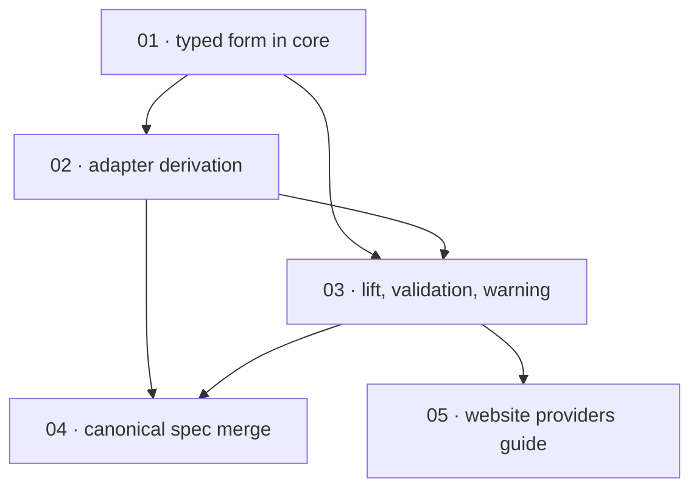

# Plan: Per-provider email-verification overrides for the generic OIDC adapter

**Status:** Done · **Layout:** kanban · **Date:** 2026-08-31 · **Owner:** Ant Stanley · **Source spec:** [changes/merged/2026-08-31-per_provider_email_verification_overrides.md](../../changes/merged/2026-08-31-per_provider_email_verification_overrides.md)

Five tasks build the opt-in per-provider email-verification overrides (issue #48) in
three code stages and two documentation stages. The typed form lands first (01), then the
adapter's derivation with its full precedence test matrix (02), then the config lift,
validation, and startup warning in the server bootstrap (03) — deliberately inverting the
change spec's suggested lift-before-adapter order so the boot warning never claims a
weakening the adapter does not yet enforce, and so the config wiring is reviewed
end to end through already-verified derivation behaviour. Once an Entra-shaped block
demonstrably resolves and boots, the canonical spec merge (04) and the website providers
guide (05) land against shipped, verifiable behaviour. The core registration-policy
predicate is out of scope on every task; with neither key set the system stays
byte-identical to 0.4.0 throughout.

---

## Source and definition-of-done baseline

- **Spec.** The change spec
  [changes/merged/2026-08-31-per_provider_email_verification_overrides.md](../../changes/merged/2026-08-31-per_provider_email_verification_overrides.md)
  (reviewed and remediated), targeting the service pages
  [01-domain-model.md](../../service/specs/01-domain-model.md),
  [03-service-flows.md](../../service/specs/03-service-flows.md),
  [05-provider-system.md](../../service/specs/05-provider-system.md),
  [06-configuration.md](../../service/specs/06-configuration.md), the service
  `canonical-types.schema.json` sidecar, and the website providers guide. In scope: the
  `EmailVerification` enum, the two `[providers.<name>]` keys, the adapter derivation,
  the `provider_config_to_oidc` lift and startup warning, tests, the canonical spec
  merge, and the website Entra recipe.
- **Already built.** A code read on the plan date confirmed the 0.4.0 state the spec
  describes: `OidcProviderConfig` carries no mode field
  (`crates/core/src/domain/provider.rs:8-35`), `validate_id_token` maps an absent
  `email_verified` claim to `None` (`crates/adapters/src/oidc/mod.rs:190`),
  `provider_config_to_oidc` lifts only `client_id`/`client_secret`/`scopes`/
  `endpoint_origins` (`crates/server/src/bootstrap.rs:1618-1714`), and the website Entra
  example documents a block that cannot admit a user. Preconditions reused, not rebuilt:
  the shared `coerce_bool` (`crates/adapters/src/shared/claims.rs:14`), the
  `resolve_config_toml` provider-block test pattern (`bootstrap.rs:1923`), the
  structured-warning precedent (`bootstrap.rs:566-590`), and the existing oidc wiremock
  harness (`crates/adapters/src/oidc/mod.rs:338-356`). `registration_policy_reason` and
  its three call sites are untouched by design and are a regression surface, not a task.
- **Definition of done.** Each task inherits
  [development-guidelines.md](../../development-guidelines.md) §Definition of done and
  §Limits and bounds: behaviour exercised by a test, negative-space tests for every new
  validation path, two meaningful assertions per touched function, every bound a named
  constant, and the per-language gates (`cargo fmt` / `cargo clippy --workspace -- -D
  warnings` / `cargo nextest run --workspace` for Rust; `pnpm format:check` / `lint` /
  `typecheck` for the website task). Task files add only task-specific acceptance on top.

---

## Task graph

The dependency table is the source of truth; the Mermaid graph visualizes it.

| Task | Depends on | Edge kind | Produces (reviewable artifact) |
|---|---|---|---|
| 01 · typed email-verification form in core | — | — | `EmailVerification` (default `Standard`) and the `email_verification` field exist in every constructor and the hand-written Debug; workspace green, behaviour byte-identical |
| 02 · adapter derivation with explicit-claim precedence | 01 | build | `validate_id_token` derives `email_verified` per configured mode; a ten-case wiremock matrix pins the precedence rule |
| 03 · config lift, validation, and startup warning | 01, 02 | build, review | an Entra-shaped block resolves and lifts to `Claim("xms_edov")`; mistyped or contradictory keys fail registry build; a non-Standard mode logs one structured boot warning |
| 04 · canonical spec merge | 02, 03 | review | pages 01/03/05/06 and the sidecar describe the shipped behaviour; the change spec is Merged and moved |
| 05 · website providers guide | 03 | review | the guide's field table and Entra recipe document the shipped keys; the recipe matches a passing boot fixture |

---

## Implementation order and milestones

**Order:** `01, 02, 03, 04, 05` — the typed form is the build enabler for everything;
the adapter derivation (02) precedes the config lift (03), departing from the change
spec's suggested order, because the derivation is the security-critical behaviour and
the lift's startup warning must never announce a weakening the adapter does not enforce.
Both documentation tasks follow 03 by review edges: each recipe and each republished
sentence must be checkable against shipped code before it is written down as canonical.

**Milestones:**

| Milestone | Tasks | Demonstrable when complete | Review gate |
|---|---|---|---|
| M1 — derivation works | 01, 02 | the adapter wiremock suite demonstrates the full precedence matrix (explicit claim wins both ways; overrides fill absence only); default mode pinned byte-identical to 0.4.0 | workspace gates and the ten-case wiremock suite green |
| M2 — configurable end to end | 03 | an Entra-shaped TOML block resolves through `resolve_config_toml`, lifts to `Claim("xms_edov")`, and a non-Standard provider logs one structured warning; both-keys and mistyped blocks fail registry build with a `ConfigError` naming the provider | bootstrap lift/validation tests and the Entra resolve test green |
| M3 — spec and docs merged | 04, 05 | canonical pages, sidecar, and the website guide describe the shipped behaviour; the change spec sits in `changes/merged/`; the documented Entra recipe is the same shape as a passing boot fixture | cross-link and JSON checks on the spec set; web-app gates for the guide |

---

## Assumptions and open questions

**Assumptions**

- The change spec is already reviewed and remediated; its `file:line` pointers were
  re-verified against this workspace on the plan date and all hold.
- Issue #48's empirical Entra claim set (an `email` claim, no `email_verified`,
  `xms_edov` optional and tenant-enabled) is inherited from the change spec and not
  re-verified by this plan.
- The FFI and Lambda entry points reach providers through
  `bootstrap::build_single_provider`, so task 03's lift, validation, and warning apply
  on every runtime without additional tasks (change spec §Assumptions).

**Decisions**

- *Adapter before lift.* **Task 02 (derivation) precedes task 03 (config lift), inverting
  the change spec's suggested order.** With the lift first, an operator-visible surface —
  the keys and the boot warning — would exist while the adapter still ignored the mode: a
  boot log claiming a weakening that is not active. Adapter-first keeps every
  intermediate state honest (the mode works but is unreachable from config) and lets the
  lift be reviewed end to end through already-verified derivation.
- *Tests live inside their tasks.* **The change spec's step-4 test list was distributed
  into tasks 02 and 03 rather than kept as a trailing test task.** The repo definition of
  done requires each change's behaviour to be exercised by a test in the same slice; a
  trailing test task would leave 02 and 03 unreviewable on their own.
- *Two documentation tasks, not one.* **The canonical spec merge (04) and the website
  guide (05) are separate packages.** They produce different artifacts with different
  gates (cross-link and JSON-validity checks versus the web-apps `pnpm` gates), share
  only the change spec as input, and can proceed in parallel once 03 lands.
- *Merge housekeeping inside task 04.* **The status flip, the move to `changes/merged/`,
  the link-path fixes, and the README row move ship with the page edits**, per the change
  spec's own Merge plan — a half-merged change spec is worse than an unmerged one.
- *Constructor sweep widened.* **Task 01 updates three `OidcProviderConfig` constructor
  sites the change spec did not enumerate** (`crates/providers/tests/
  cross_provider_corpus.rs:193`, `crates/providers/tests/upstream_error_leak_corpus.rs:50`
  and `:172`, `crates/server/tests/request_leak_oracle.rs:599`), found by a workspace
  grep — a non-optional field must land in every literal constructor in one slice.

**Open questions**

- (None at this stage.)
