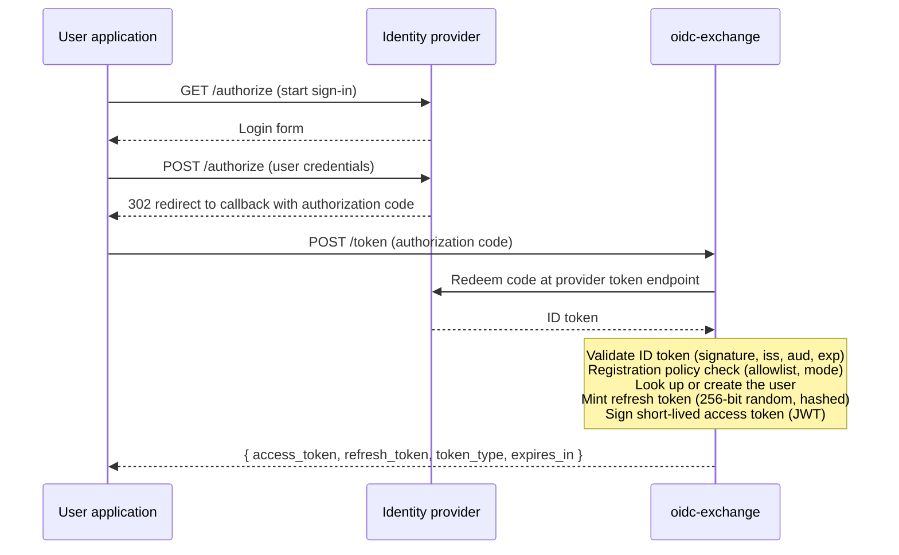

Let your users sign in with Google, Apple, or any OIDC provider, and give your API tokens you actually control. oidc-exchange turns a provider sign-in into your own access and refresh tokens: your token lifetimes, your custom claims, your signing keys, revocable on demand. Your API validates one token format no matter which provider a user chose, with no per-user fees and no call to a third party on every request. It runs as a single self-hosted binary.

Your client application handles the OAuth flow with the identity provider and sends the resulting authorization code to oidc-exchange. The service validates the upstream identity, creates or looks up the user, and returns a short-lived JWT access token and a long-lived refresh token. (A direct ID-token grant is also available but is disabled by default; see the flow below.)

## Token exchange flow

The diagram above shows the three participants in the exchange: your **User Application**, the **Identity Provider** (Google, Apple, etc.), and **oidc-exchange**.

1. **Initiate sign-in**: the user taps "Sign In" and your app redirects to the identity provider's `/authorize` endpoint.
2. **Authenticate with the provider**: the provider presents its login form. The user enters their credentials and submits them back to the provider via `POST /authorize`.
3. **Redirect with authorization code**: after successful authentication the provider issues a 302 redirect back to your app's callback URL, including an authorization code.
4. **Exchange the code**: your app sends a `POST /token` request to oidc-exchange with the authorization code. The service then:
   - Redeems the code with the provider and validates the returned ID token (signature, issuer, audience, expiry)
   - Applies registration policy checks (domain allowlist, open/existing-users mode)
   - Looks up or creates the user
   - Generates a refresh token (256-bit random, stored hashed)
   - Signs a short-lived JWT access token
5. **Receive credentials**: oidc-exchange responds with `{ access_token, refresh_token, token_type, expires_in }` and your app signs the user in.

The authorization-code exchange shown here is served by default. oidc-exchange also offers a direct ID-token grant (your app posts a provider ID token straight to `POST /token`), but it is disabled by default: enable it with `[grants] id_token = true`, and each exchange must first claim a nonce from `POST /nonce`.

## Features

- **Token Exchange**: accepts authorization codes from OIDC providers, validates ID tokens, issues short-lived JWTs (default 15min) and long-lived refresh tokens (default 30 days)
- **Pluggable Providers**: standard OIDC (Google, config-only), OIDC-with-quirks (Apple, ES256 client JWT), and non-OIDC (atproto, planned)
- **Hexagonal Architecture**: all infrastructure behind trait interfaces: database, key management, audit, user sync
- **Registration Policy**: open or existing-users-only mode with optional email domain/subdomain allowlists
- **Per-User Claims**: configurable custom JWT claims from TOML templates and per-user overrides via internal API
- **Audit Trail**: syslog severity levels, configurable blocking threshold, stdout/stderr or SQS integration
- **OpenTelemetry**: pluggable exporters (OTLP, X-Ray, stdout) via the `tracing` ecosystem
- **Written in Rust**: a single native binary with a small memory footprint, low request latency, and near-instant startup, well suited to serverless cold starts and dense container deployments
- **Dual Runtime**: same binary runs as an axum server or AWS Lambda function
- **Docker Images**: prebuilt images at `ghcr.io/antstanley/oidc-exchange` for instant container deployments
- **Node.js and Python Bindings**: install via `npm install @oidc-exchange/node` or `pip install oidc-exchange` to embed the service in your existing stack
- **Internal Admin API**: user CRUD and claims management, authenticated by operator token or mTLS (a legacy shared-secret mechanism is also available but discouraged)

## Performance

oidc-exchange compiles to a native binary with no garbage collector and no interpreter to warm up, so it stays small and starts fast. Once your API has fetched and cached the signing keys, it validates every token with a local signature check, so there is no call to oidc-exchange or the identity provider on the request path.

These numbers are indicative. They were measured on an Apple M2 (macOS, arm64) with a release build, a SQLite repository, and local Ed25519 keys, and will vary with your hardware, storage, and configuration.

| Metric | Measured |
| --- | --- |
| Binary size | about 40 MB, a single file with every adapter compiled in |
| Idle memory | about 11 MB resident |
| Startup to first request | about 15 ms warm, about 110 ms on a cold start |
| Request overhead (`/health`, `/keys`) | about 1.4 ms median, under 2.5 ms at p99, over localhost |

The small footprint and sub-second startup suit serverless cold starts (AWS Lambda) and dense container packing.

## Next steps

- [Quick Start](/getting-started/quick-start/): build and run in 5 minutes
- [Why oidc-exchange?](/getting-started/why-oidc-exchange/): comparison with alternatives
- [Deployment guides](/deployment/overview/): choose your infrastructure
