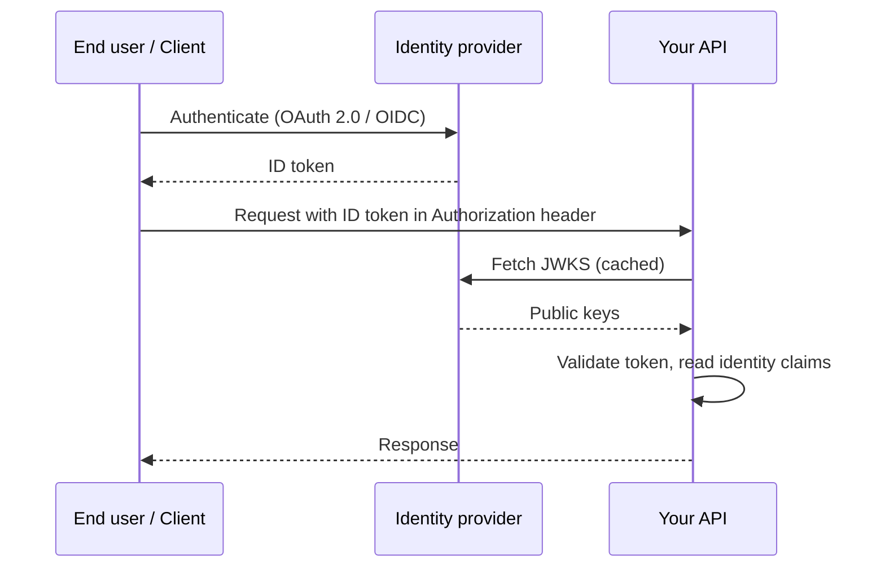
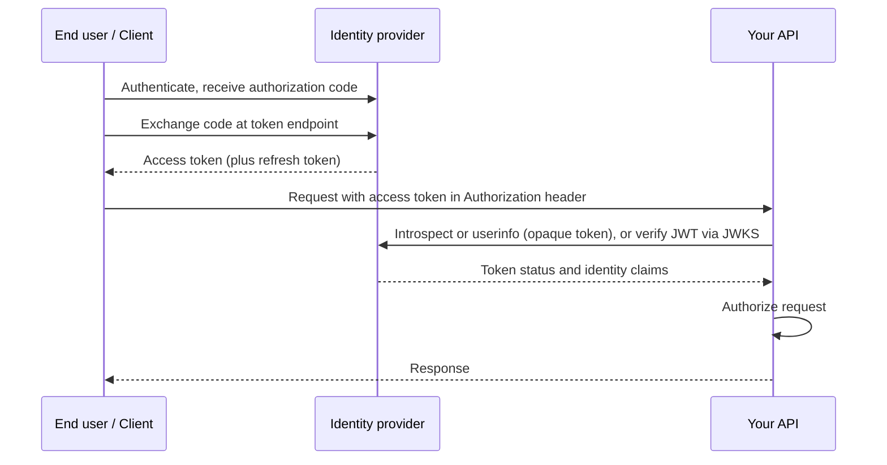
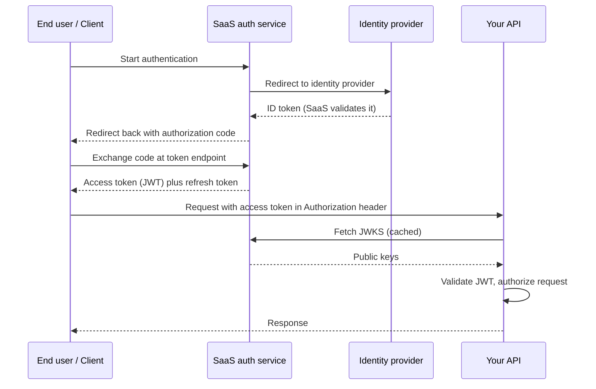
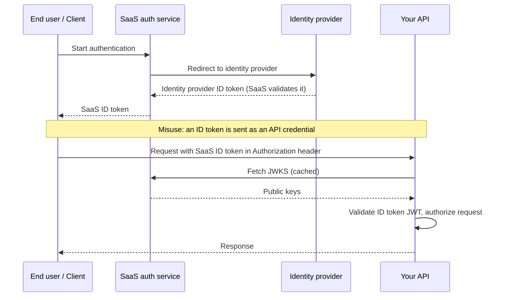
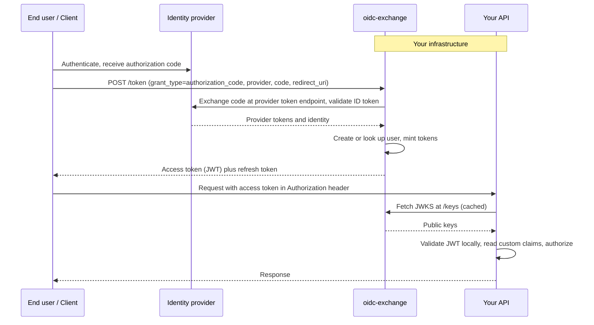

If your application needs to authenticate users via Google, Apple, or other OIDC providers, you have several architectural choices for how your API verifies identity and authorizes requests. Each approach involves different trust boundaries, operational trade-offs, and failure modes.

This page walks through the most common patterns, explains the pros and cons of each, and shows where oidc-exchange fits.

## Common authentication architectures

### 1. Using identity provider ID tokens directly

The simplest possible approach. Your client authenticates with Google, Apple, or another OIDC provider and receives an ID token. The client sends that ID token directly to your API in the Authorization header. Your API validates the token by fetching the provider's public keys (JWKS) and checking the signature, expiry, and audience.

**Pros:**
- Minimal moving parts - no token exchange service, no extra infrastructure
- Fast to implement for a single provider
- No secrets to manage on the backend beyond the JWKS endpoint

**Cons:**
- **No control over token lifetime** - you are bound by the provider's ID token expiry (typically 1 hour for Google), with no ability to revoke access earlier
- **No custom claims** - your API cannot embed application-specific roles, permissions, or user metadata in the token; this information must be fetched separately on every request
- **Multi-provider complexity** - each provider uses different token formats, signing algorithms, and claim structures; your API must handle all of them
- **No refresh flow** - ID tokens are not refreshable; when they expire, the user must re-authenticate with the provider
- **Tight coupling** - your API's authorization logic is coupled to the identity provider's token format; switching providers requires rewriting validation logic

### 2. Using identity provider access tokens directly

A variation where the client uses the provider's access token instead of the ID token. Your API validates the access token by calling the provider's introspection or userinfo endpoint, or by checking it against the provider's JWKS if the access token is a JWT.

**Pros:**
- Access tokens can be refreshed via the provider's refresh token flow, so users stay authenticated longer
- The provider's userinfo endpoint gives you a standardized way to fetch identity claims

**Cons:**
- **Runtime dependency on the provider** - every API request may require a call to the provider's introspection/userinfo endpoint, adding latency and a point of failure
- **Opaque tokens** - many providers issue opaque (non-JWT) access tokens that cannot be validated locally, forcing a network round-trip on every request
- **Still no custom claims** - the tokens carry the provider's claims, not your application's
- **Provider rate limits** - high-traffic APIs can hit the provider's rate limits on introspection/userinfo calls
- **Same multi-provider problem** - each provider's access token format and validation mechanism differs

### 3. SaaS auth service issuing its own tokens

The client authenticates through a hosted auth service (Auth0, Cognito, Clerk, Firebase Auth). The SaaS service handles the upstream identity provider flow, then issues its own access token and refresh token. Your API validates tokens using the SaaS service's JWKS endpoint.

**Pros:**
- Managed infrastructure - the auth service handles provider integrations, token issuance, and key rotation
- Custom claims and roles can be embedded in the token via the service's rules/actions/hooks
- Built-in refresh token flow with configurable lifetimes
- Admin dashboards, user management, and compliance features included
- Fast to get started for common use cases

**Cons:**
- **Per-MAU pricing** - costs scale with your user base, which can become significant at scale
- **Vendor lock-in** - your token format, claims structure, and user data model are tied to the service; migration is painful
- **Opaque behavior** - token issuance rules, rate limits, and security policies are configured through a web console, not version-controlled code
- **Latency** - token validation may require calls to the SaaS service, and the initial auth flow adds network hops through the service's infrastructure
- **Availability dependency** - if the SaaS service goes down, your users cannot authenticate

### 4. SaaS auth service using ID tokens for API authorization

The SaaS auth service handles the upstream identity provider flow and issues its own ID token back to the client. The client then sends that ID token to your API in the Authorization header, and your API validates it against the SaaS service's JWKS endpoint.

This is a misuse of ID tokens. ID tokens are intended for the client application to learn the user's identity. They are not designed to be sent as bearer credentials to APIs. Access tokens are the correct token type for API authorization, as defined by OAuth 2.0.

**Pros:**
- The SaaS service unifies multiple identity providers behind a single token format
- Token validation is a local JWT signature check against the SaaS service's JWKS

**Cons:**
- **Wrong token type** - ID tokens are meant for the client, not for APIs; they lack the scoping and audience restrictions that access tokens provide, and using them this way violates the OAuth 2.0 / OIDC specification
- **No revocation** - ID tokens are typically short-lived and non-revocable; if a user's access needs to be cut immediately, there is no mechanism to invalidate an already-issued ID token
- **No refresh flow** - ID tokens cannot be refreshed; when they expire, the user must re-authenticate through the SaaS service
- **Limited claims control** - ID tokens carry identity claims (who the user is), not authorization claims (what they can do); embedding roles or permissions requires non-standard extensions
- **Per-MAU pricing** - you still pay the SaaS service per user, despite using the token in a way the service was not designed for

### 5. Issuing your own tokens with oidc-exchange

The client authenticates with the identity provider and sends the resulting authorization code or ID token to oidc-exchange. The service validates the upstream identity, creates or looks up the user, and issues its own access token (JWT) and refresh token. Your API validates tokens using oidc-exchange's JWKS endpoint - no network calls to external services at request time.

**Pros:**
- **Full control over token lifetime** - configure access token and refresh token expiry to match your security requirements, and revoke tokens at any time
- **Custom claims** - embed application-specific roles, permissions, and metadata directly in the JWT; your API has everything it needs without extra lookups
- **Provider-agnostic API** - your API validates one token format regardless of whether the user authenticated with Google, Apple, or any other provider; switching or adding providers requires zero API changes
- **No runtime external dependencies** - token validation is a local signature check against cached keys; no calls to identity providers or SaaS services on the hot path
- **No per-user pricing** - runs on your infrastructure; costs scale with compute, not user count
- **Auditable and version-controlled** - every configuration decision is in a TOML file in your repo; no web console toggles to discover in production
- **Self-hosted** - your user data stays in your database, tokens are signed with your keys, and there is no third-party availability dependency

**Cons:**
- **Infrastructure to operate** - you run and monitor the service yourself (though it is a single binary with minimal dependencies)
- **Not a full authorization server** - does not support OAuth 2.0 client credentials, scopes, consent screens, or multi-tenant organization management
- **No managed login UI** - your client must implement the identity provider's OAuth redirect flow (oidc-exchange handles everything after the redirect)

## Summary

| Approach | Custom claims | Token control | Provider-agnostic |
|-|-|-|-|
| Provider ID tokens | No | No | No |
| Provider access tokens | No | No | No |
| SaaS auth service | Yes | Partial | Yes |
| SaaS ID tokens | No | No | Yes |
| **oidc-exchange** | **Yes** | **Yes** | **Yes** |

| Approach | No external runtime deps | No per-user cost |
|-|-|-|
| Provider ID tokens | Yes | Yes |
| Provider access tokens | No | Yes |
| SaaS auth service | No | No |
| SaaS ID tokens | Yes | No |
| **oidc-exchange** | **Yes** | **Yes** |

## When to use something else

oidc-exchange is not a general-purpose authorization server. Choose a different tool if you need:

- **Password-based authentication** - oidc-exchange delegates authentication entirely to upstream providers.
- **OAuth 2.0 authorization server** - if you need to issue tokens to third-party clients with scopes and consent, use a full OIDC server.
- **Multi-tenant SaaS auth** - if you need organization management, RBAC, or SCIM provisioning, a hosted service like Auth0 or WorkOS is better suited.
- **Federation between internal services** - if you need service-to-service authentication (mTLS, SPIFFE), oidc-exchange is the wrong layer.
